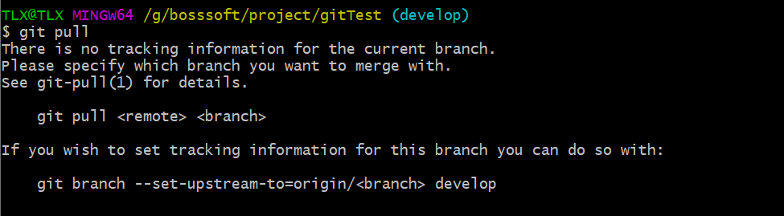
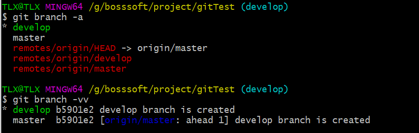
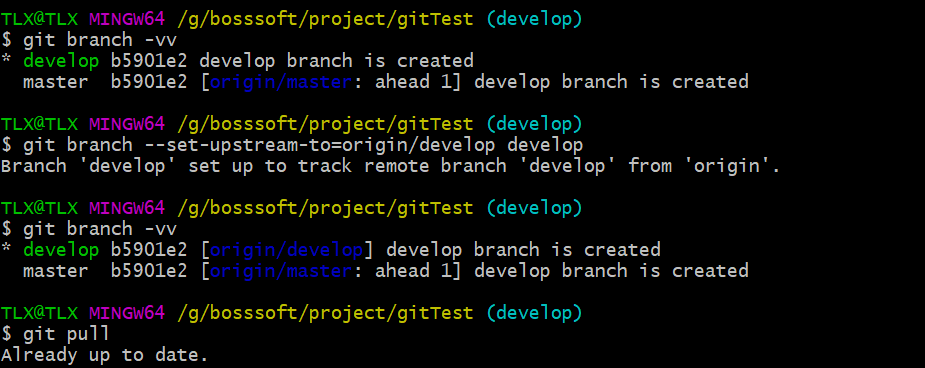

## git pull报错：There is no tracking information for the current branch

#### 报错信息如下：

```bash
There is no tracking information for the current branch.

Please specify which branch you want to merge with.

See git-pull(1) for details

git pull <remote> <branch>
If you wish to set tracking information for this branch you can do so with:

git branch --set-upstream-to=origin/<branch>
```



#### 原因：

本地分支和远程分支没有建立联系，可以使用下面命令查看本地分支和远程分支的关联关系。

```bash
git branch -vv
```



从图中可以看出，本地分支master和远程分支origin/master已经建立了联系，但是本地分支develop和远程分支origin/develop还未建立联系。

#### 解决方法：

```bash
git branch --set-upstream-to=origin/远程分支的名字  本地分支的名字
# 或
git branch --set-upstream 本地分支名字 origin/远程分支名字
```




