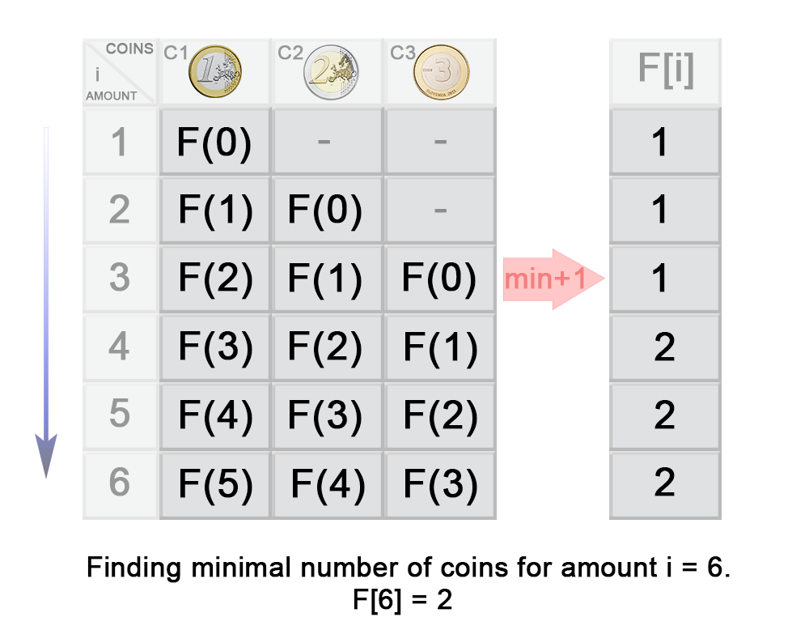

# [322. Coin Change][1]

> You are given coins of different denominations and a total amount of money *amount*. Write a function to compute the fewest number of coins that you need to make up that amount. If that amount of money cannot be made up by any combination of the coins, return `-1`.
>
> **Example 1:**
>
> ```
> Input: coins = [1, 2, 5], amount = 11
> Output: 3 
> Explanation: 11 = 5 + 5 + 1
> ```
>
> **Example 2:**
>
> ```
> Input: coins = [2], amount = 3
> Output: -1
> ```
>
> **Note**:
> You may assume that you have an infinite number of each kind of coin.


用给定面值的硬币凑成给定的整数，并且所使硬币的数量最少。


## 方法一：动态规划（top-down）

* 设$F(S)$是使用给定硬币$[c_0, ...,c_{n-1}]$凑成$S$所使用的硬币最少数量

* 设$C$是最后一枚加入的硬币的面值，则有：$F(S) = F(S - C)  + 1$

* 由于不知道哪个是最后加入的，所以计算所有的可能：$F(S) = F(S - C_i) + 1\qquad i = 0,...,n-1$

* 所以最后的递推关系式：

  * $F(S)=min_{i=0...n−1}F(S−ci)+1 \quad \text{并且} S−C_i≥0$
  * $F(S) = 0 , \text{when} \,S = 0 \\ F(S) = -1 , \text{when}\, n = 0$

* 由于使用递归，会有大量的重复计算，所以选择回溯法

* 递归树如下：

  

代码如下：

```java
class Solution {
    public int coinChange(int[] coins, int amount) {
        if (amount < 1) return 0;
        return coinChange(coins, amount, new int[amount]);
    }
    
    private int coinChange(int[] coins, int rem, int[] count) {
        if (rem < 0) return -1;
        if (rem == 0) return 0;
        // 前面已经计算过，直接取值即可
        if (count[rem - 1] != 0) return count[rem - 1];
        int min = Integer.MAX_VALUE;
        for (int coin : coins) {
            int res = coinChange(coins, rem - coin, count);
            if (res >= 0 && res < min)
                min = res + 1;
        }
        count[rem - 1] = (min == Integer.MAX_VALUE)? -1: min;
        return count[rem - 1];
    }
}
```


## 方法二：动态规划（bottom-up）

* 完全背包问题

* 对于迭代的方法，在我们计算$F(i)$之前，比i小的都需要计算出来
* $F(i)=min_{j=0...n−1}F(i−c_j)+1$



* 从上述例子可以看到：

  $\begin{align}F(3)&=min\{F(3−c_1),F(3−c_2),F(3−c_3)\}+1 \\&=min\{F(3−1),F(3−2),F(3−3)\}+1 \\&=min\{F(2),F(1),F(0)\}+1 \\&=min\{1,1,0\}+1\\&=1\end{align}$


代码如下：

```java
class Solution {
    public int coinChange(int[] coins, int amount) {
        int max = amount + 1;
        int[] dp = new int[amount + 1];
        Arrays.fill(dp, max);
        dp[0] = 0;
        for (int i = 0; i < max; i++) {
            for (int j = 0; j < coins.length; j++) {
                if (coins[j] <= i) {
                    dp[i] = Math.min(dp[i], dp[i - coins[j]] + 1);
                }
            }
        }
        return dp[amount] > amount? -1: dp[amount];     
    }
}
```

* 上面代码内外层循环好像是反的

```java
public int coinChange(int[] coins, int amount) {
    if (amount == 0 || coins == null || coins.length == 0) {
        return 0;
    }
    int[] dp = new int[amount + 1];
    for (int coin : coins) {
        for (int i = coin; i <= amount; i++) { //将逆序遍历改为正序遍历
            if (i == coin) {
                dp[i] = 1;
            } else if (dp[i] == 0 && dp[i - coin] != 0) {
                dp[i] = dp[i - coin] + 1;
            } else if (dp[i - coin] != 0) {
                dp[i] = Math.min(dp[i], dp[i - coin] + 1);
            }
        }
    }
    return dp[amount] == 0 ? -1 : dp[amount];
}

```


[1]: https://leetcode.com/problems/coin-change/