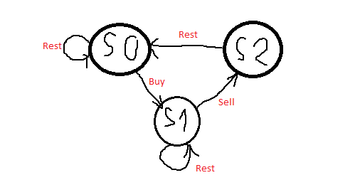

# [309. Best Time to Buy and Sell Stock with Cooldown][1]

> Say you have an array for which the *i*th element is the price of a given stock on day *i*.
>
> Design an algorithm to find the maximum profit. You may complete as many transactions as you like (ie, buy one and sell one share of the stock multiple times) with the following restrictions:
>
> - You may not engage in multiple transactions at the same time (ie, you must sell the stock before you buy again).
> - After you sell your stock, you cannot buy stock on next day. (ie, cooldown 1 day)
>
> **Example:**
>
> ```
> Input: [1,2,3,0,2]
> Output: 3 
> Explanation: transactions = [buy, sell, cooldown, buy, sell]
> ```


求股票的最大利润，每次sell之后，要休息一天。


## 方法一：DP

* 根据题中描述，可以画出如下状态图：



* 所以，三个状态的状态转移方程如下：

  ```java
  s0[i] = max(s0[i - 1], s2[i - 1]); // Stay at s0, or rest from s2
  
  s1[i] = max(s1[i - 1], s0[i - 1] - prices[i]); // Stay at s1, or buy from s0
  
  s2[i] = s1[i - 1] + prices[i]; // Only one way from s1
  ```

* 最大值应该在`s0[n]`和`s2[n]`中产生

* 初始值：

  ```java
  s0[0] = 0; // At the start, you don't have any stock if you just rest
  
  s1[0] = -prices[0]; // After buy, you should have -prices[0] profit. Be positive!
  
  s2[0] = INT_MIN; // Lower base case
  ```


代码如下：

```java
class Solution {
    public int maxProfit(int[] prices) {
        if (prices.length <= 1)
            return 0;
        int n = prices.length;
        int[] s0 = new int[n];
        int[] s1 = new int[n];
        int[] s2 = new int[n];
        
        s0[0] = 0;
        s1[0] = -prices[0];
        s2[0] = Integer.MIN_VALUE;
        
        for (int i = 1; i < n; i++) {
            s0[i] = Math.max(s0[i-1], s2[i-1]);
            s1[i] = Math.max(s1[i-1], s0[i-1] - prices[i]);
            s2[i] = s1[i-1] + prices[i];
        }
        return Math.max(s0[n-1], s2[n-1]);
    }
}
```


[1]: https://leetcode.com/problems/best-time-to-buy-and-sell-stock-with-cooldown/