## vmware安装centos

### 一、下载centos7.x的镜像包

进入官网：https://www.centos.org/

找到下载位置后，发现只提供了最新的centos8的镜像包，找到页面最下面的 `full list of mirrors`：

https://www.centos.org/download/mirrors/

进入后，通过国家找到中国的镜像源站点，进入[清华大学开源镜像站](https://mirrors.tuna.tsinghua.edu.cn/centos/)，在其中找到centos7的镜像包进行下载。

### 二、vmware新建虚拟机

正常配置即可，注意配置一下显示器的分辨率，不然可能会出现显示不全的问题。

### 三、安装centos

点击开启虚拟机，出现选项，用上下键选择第一个选项进行安装。

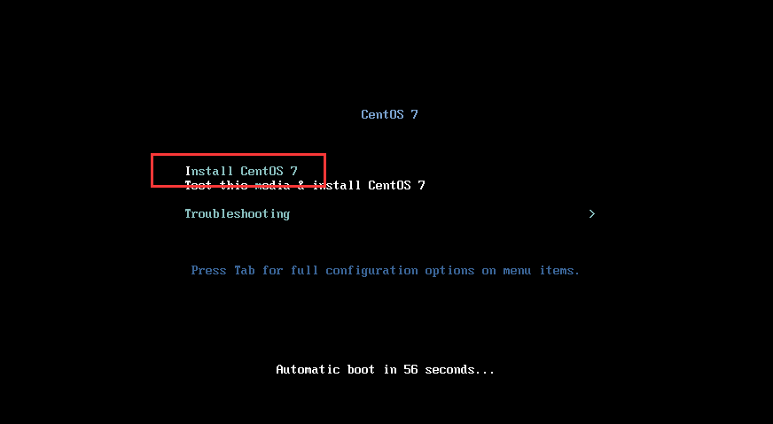

选择安装过程中使用的语言，中文英文都可以。

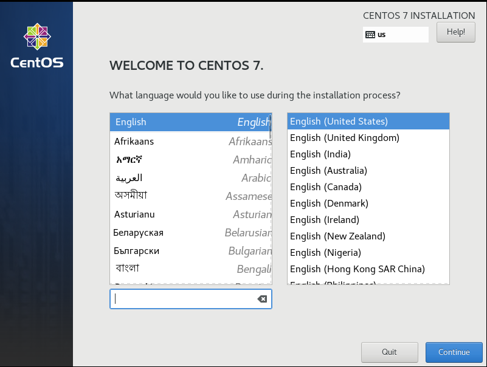

之后弹出的安装配置。

选择安装的软件，左边点上图形桌面，不然安装后只有命令行，这里选择的是GNOME Desktop。

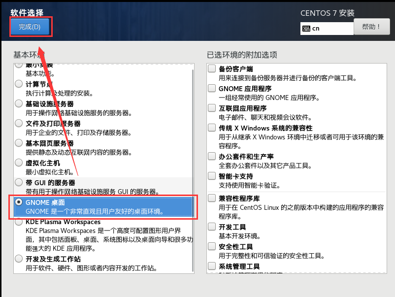

选择安装位置，进行磁盘划分。

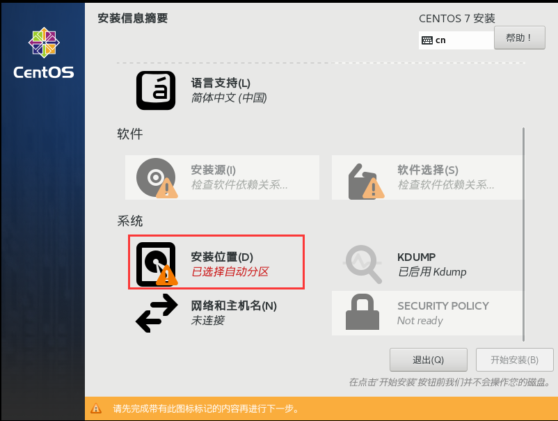

选择自定义配置分区。

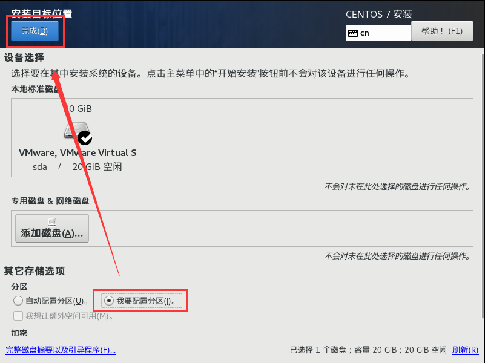

点击自动划分。

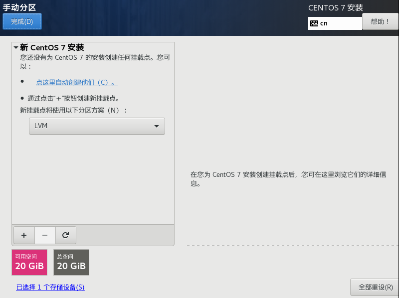

不用动，直接点完成。

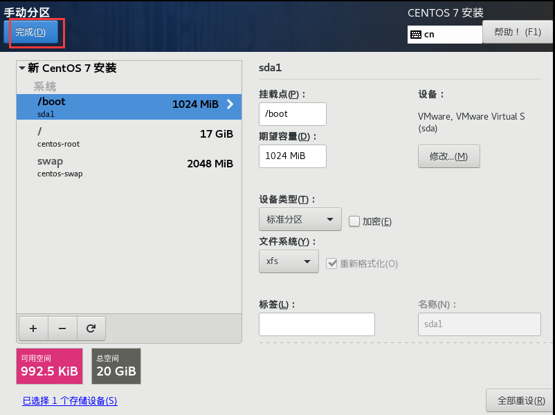

弹出的对话框，选择接受更改。

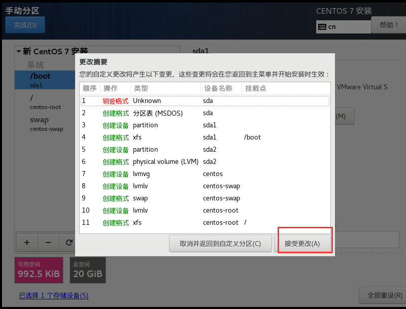

选择KDUMP，将其关闭。

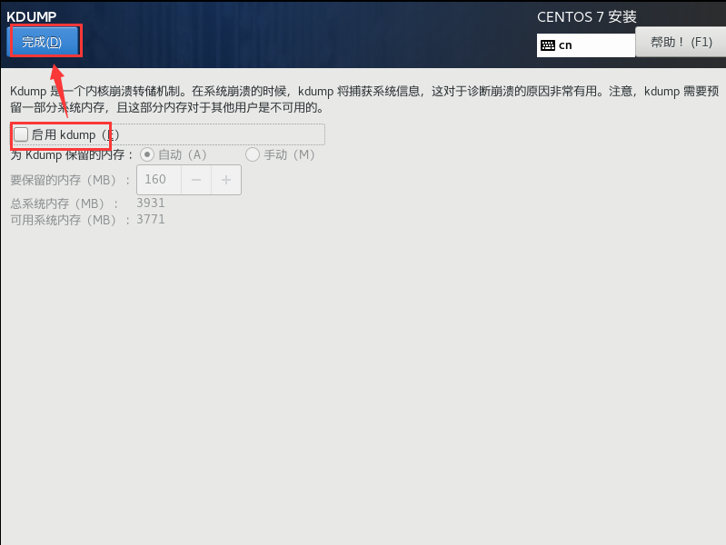

选择网络，将网络开关打开，会自动联网。

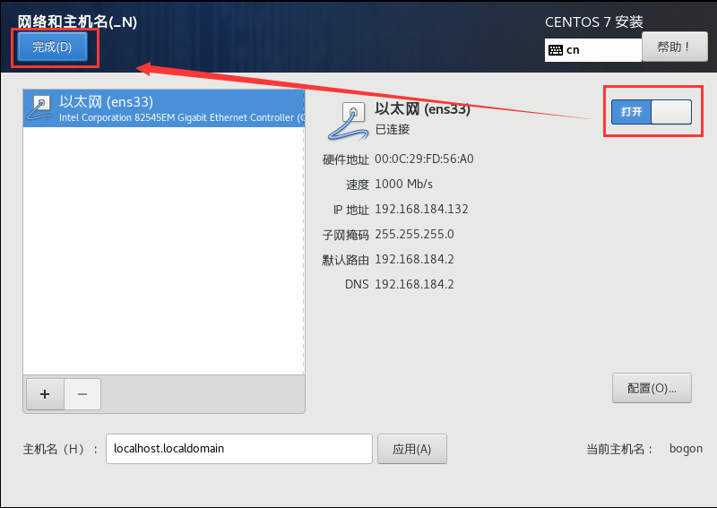

点击开始安装，在安装界面设置root密码，建立账户（设为管理员记得打勾）。

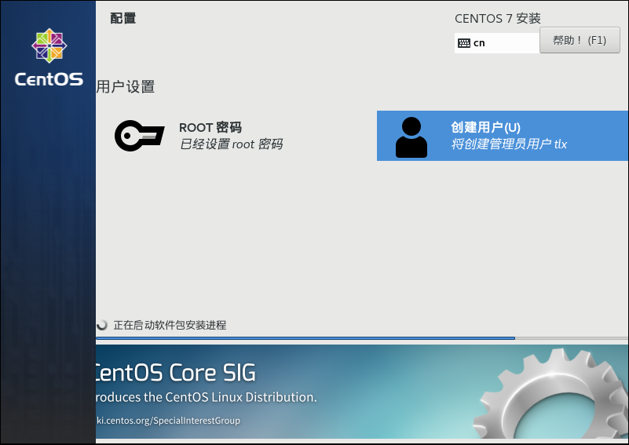

等待安装完成即可。


由于centos没有默认的打开终端的快捷键，所以需要自己配置。

打开终端，输入下面命令，找到终端的命令所在：

```bash
which gnome-terminal
```

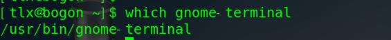

设置 - 设备 - keyboard，拉到最下面，点击加号，进行配置即可。

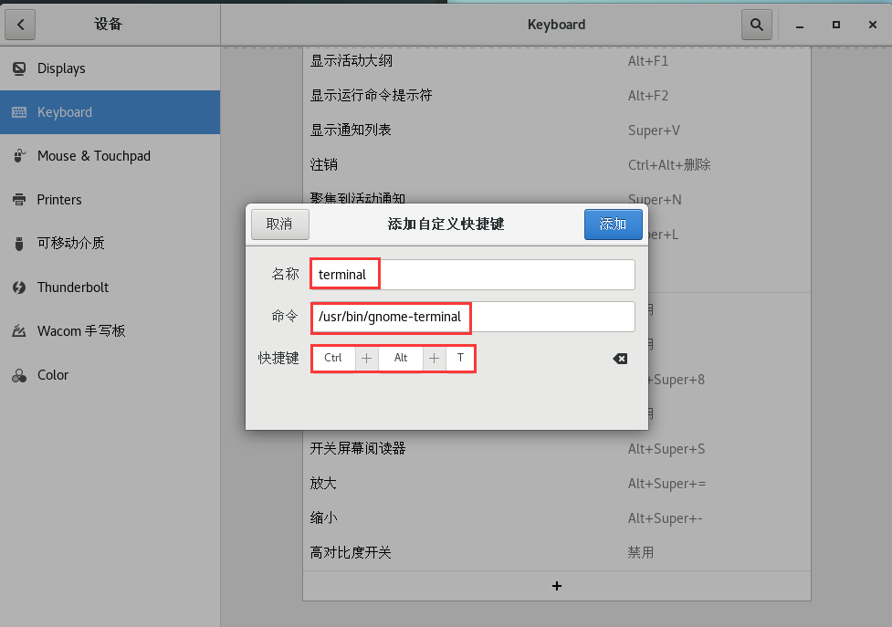


## centos安装jdk

centOS上自带open JDK，最好还是卸载了自带的open JDK，再去安装sun JDK。


### 一、卸载系统自带的openJDK以及相关的java文件

#### 1. 查看系统自带的openJDK版本信息

```bash
java -version
```

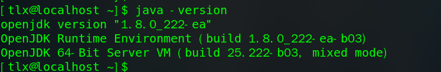


#### 2. 查看相关的安装包

```bash
rpm -qa | grep java
```

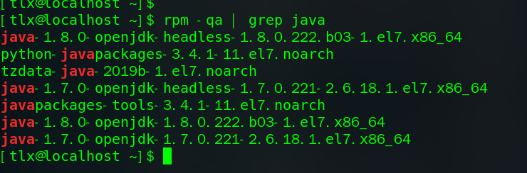

以上文件中，

下面这几个可以删除：

```bash
java-1.8.0-openjdk-headless-1.8.0.222.b03-1.el7.x86_64
java-1.7.0-openjdk-headless-1.7.0.221-2.6.18.1.el7.x86_64
java-1.8.0-openjdk-1.8.0.222.b03-1.el7.x86_64
java-1.7.0-openjdk-1.7.0.221-2.6.18.1.el7.x86_64
```

#### 3. 删除查找出来的安装包

```bash
su root
rpm -e --nodeps java-1.8.0-openjdk-headless-1.8.0.222.b03-1.el7.x86_64
rpm -e --nodeps java-1.7.0-openjdk-headless-1.7.0.221-2.6.18.1.el7.x86_64
rpm -e --nodeps java-1.8.0-openjdk-1.8.0.222.b03-1.el7.x86_64
rpm -e --nodeps java-1.7.0-openjdk-1.7.0.221-2.6.18.1.el7.x86_64
```

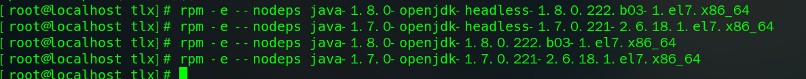

#### 4. 验证是否删除成功

```bash
java -version
```

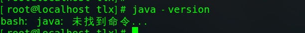

出现上图中情形，则表示已经成功删除。


### 二、安装sun JDK

#### 1. 官网下载jdk 

下载地址：https://www.oracle.com/technetwork/java/javase/downloads/ 

下载linux的tar.gz包

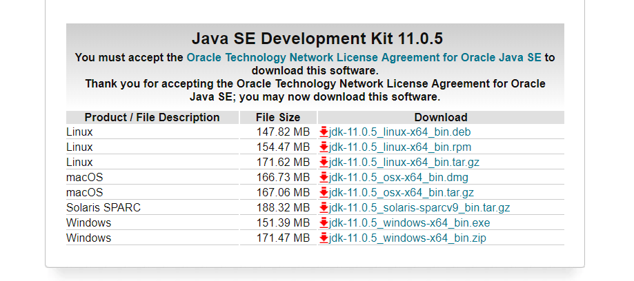

#### 2. 解压压缩包

```bash
# 在/usr/local目录下新建java文件夹
mkdir /usr/local/java
# 将下载的jdk压缩包解压到上述目录
tar -zxvf jdk-11.0.3_linux-x64_bin.tar.gz -C /usr/local/java/
```


### 三、配置环境变量

#### 1. 编辑配置文件

```bash
# 编辑 /etc/profile
vim /etc/profile

# 最后一行插入以下内容
# java environment
export JAVA_HOME=/usr/local/java/jdk-11.0.3
export CLASSPATH=.:$JAVA_HOME/jre/lib/rt.jar:$JAVA_HOME/lib/dt.jar:$JAVA_HOME/lib/tools.jar
export PATH=$PATH:$JAVA_HOME/bin
```

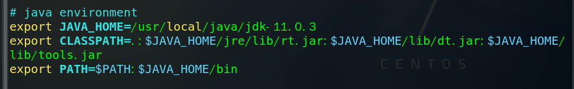

#### 2. 使配置的环境变量生效

```bash
source /etc/profile
```

#### 3. 查看是否配置成功

```bash
java -version
javac
```

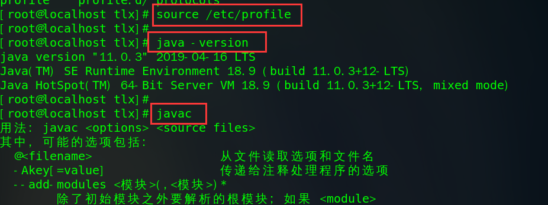

出现上图，则表示配置成功。


## centos安装mysql5.7

参考链接：https://www.cnblogs.com/bigbrotherer/p/7241845.html

#### 1. 下载并安装MySQL官方的 Yum Repository

使用下面的命令就直接下载了安装用的Yum Repository，大概25KB的样子，然后就可以直接yum安装了。

```bash
[root@localhost ~]# wget -i -c http://dev.mysql.com/get/mysql57-community-release-el7-10.noarch.rpm
```

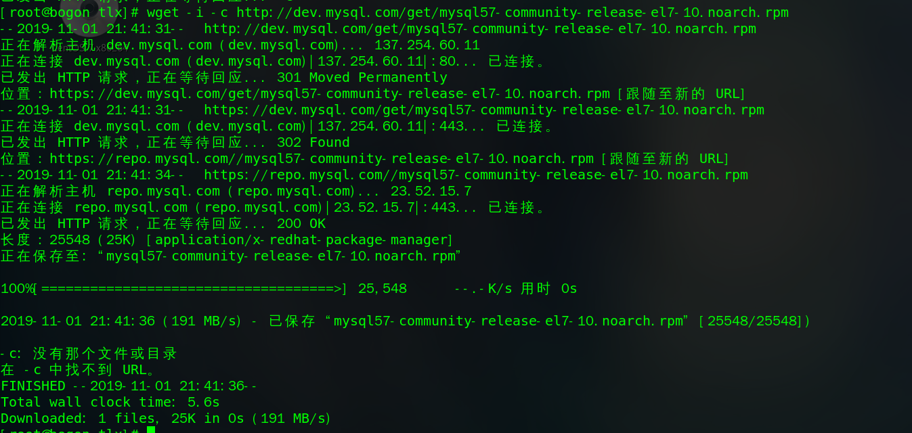

直接使用yum安装。

```bash
[root@localhost ~]# yum -y install mysql57-community-release-el7-10.noarch.rpm
```

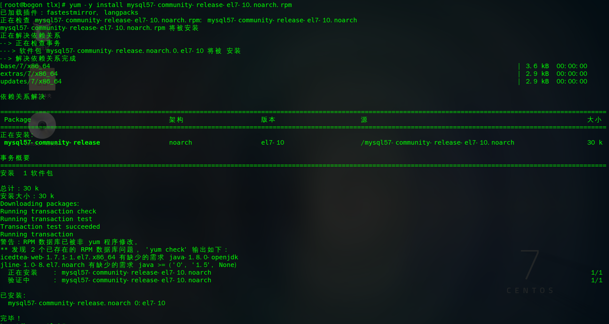

之后安装MySQL服务器。

```bash
[root@localhost ~]# yum -y install mysql-community-server
```

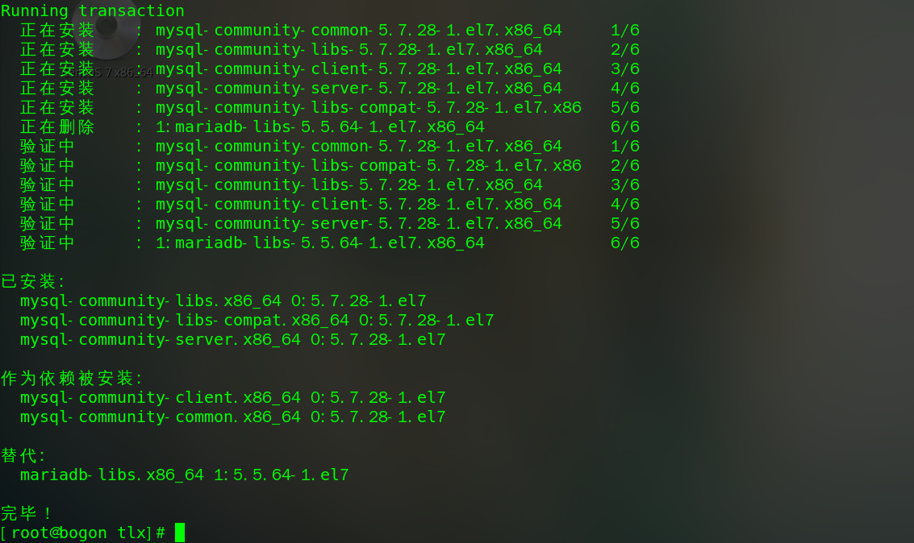


##### **注：**由于上面步骤下载速度过慢，所以需要更新一下镜像源。

步骤如下：

```bash
# 1、首先备份系统自带yum源配置文件/etc/yum.repos.d/CentOS-Base.repo
[root@localhost ~]# mv /etc/yum.repos.d/CentOS-Base.repo /etc/yum.repos.d/CentOS-Base.repo.backup

# 2、查看CentOS系统版本
[root@localhost ~]# lsb_release -a

# 3、下载ailiyun的yum源配置文件到/etc/yum.repos.d/CentOS7
[root@localhost ~]# wget -O /etc/yum.repos.d/CentOS-Base.repo http://mirrors.aliyun.com/repo/Centos-7.repo

# 4、运行yum makecache生成缓存
[root@localhost ~]# yum makecache

# 如果第4步报404，那么执行下面两条命令，再去执行第4步
yum clean all
rpm --rebuilddb
```


### 2. MySQL数据库设置

首先启动Mysql

```bash
[root@localhost ~]# systemctl start  mysqld.service
```

查看mysql运行状态

```bash
[root@localhost ~]# systemctl status mysqld.service
```

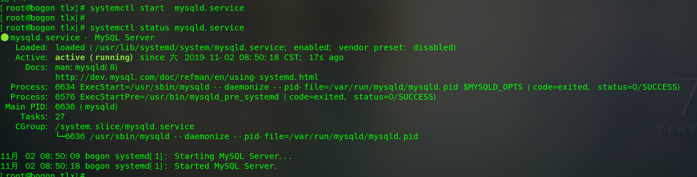

可以看到，mysql已经正常运行了，想要进入数据库，需要知道root密码。

通过下面命令可以在日志文件中找出密码：

```bash
[root@localhost ~]# grep "password" /var/log/mysqld.log
```

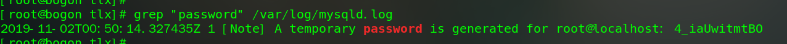


如下命令进入数据库，输入密码：

```bash
[root@localhost ~]# mysql -uroot -p
```

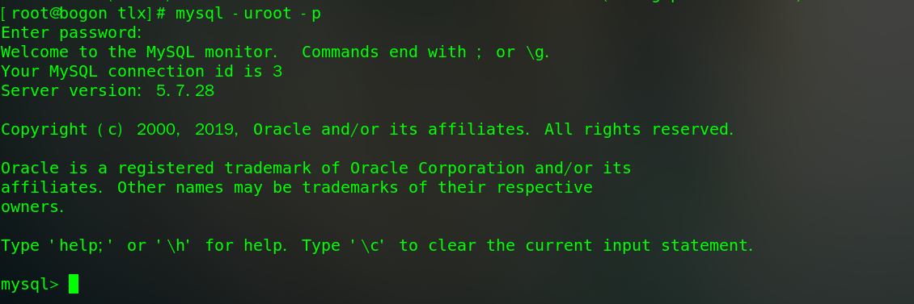


此时不能做任何事情，因为MySQL默认必须修改密码之后才能操作数据库：

```mysql
mysql> ALTER USER 'root'@'localhost' IDENTIFIED BY 'new password';
```

新密码设置的过于简单会报错：

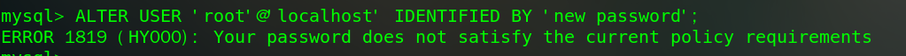


mysql密码设置有自己的规范，具体是与`validate_password_policy`有关。

修改：密码最小长度策略

```mysql
mysql> set global validate_password_length=1;
```

修改：密码强度检查等级策略，0/LOW、1/MEDIUM、2/STRONG

```mysql
mysql> set global validate_password_policy=0;
```

mysql完整的初始密码规则可以通过如下命令查看：

```mysql
mysql> SHOW VARIABLES LIKE 'validate_password%';
```

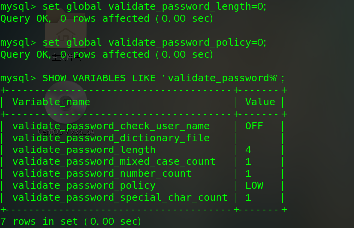

修改密码：

```mysql
mysql> set password for 'root'@'localhost' = password('root');
# 或者
mysql> ALTER USER 'root'@'localhost' IDENTIFIED BY 'root';
```

至此，密码修改成功。

但此时还有一个问题，就是因为安装了Yum Repository，以后每次yum操作都会自动更新，需要把这个卸载掉：

```bash
[root@localhost ~]# yum -y remove mysql57-community-release-el7-10.noarch
```

至此，安装完成。


## centos7安装nginx

### 一、安装编译工具及库文件

#### 1. gcc安装

安装 nginx 需要先将官网下载的源码进行编译，编译依赖 gcc 环境，如果没有 gcc 环境，则需要安装：

```bash
yum install -y gcc-c++
```

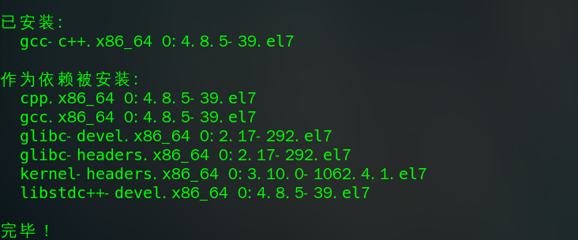


#### 2. PCRE pcre-devel 安装

PCRE（Perl Compatible Regular Expressions） 是一个Perl库，包括 perl 兼容的正则表达式库。

nginx 的 http 模块使用 pcre 来解析正则表达式，所以需要在 linux 上安装 pcre 库。

pcre-devel 是使用 pcre 开发的一个二次开发库，nginx也需要此库。

```bash
yum install -y pcre pcre-devel
```


#### 3. zlib安装

zlib 库提供了很多种压缩和解压缩的方式， nginx 使用 zlib 对 http 包的内容进行 gzip ，所以需要在 Centos 上安装 zlib 库。

```bash
yum install -y zlib zlib-devel
```


#### 4. OpenSSL安装

OpenSSL 是一个强大的安全套接字层密码库，囊括主要的密码算法、常用的密钥和证书封装管理功能及 SSL 协议，并提供丰富的应用程序供测试或其它目的使用。

nginx 不仅支持 http 协议，还支持 https（即在ssl协议上传输http），所以需要在 Centos 安装 OpenSSL 库。

```bash
yum install -y openssl openssl-devel
```

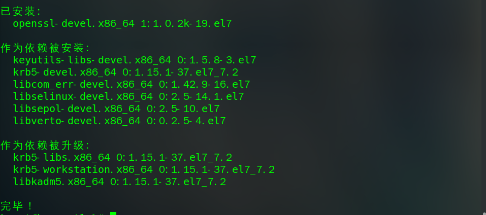


### 二、下载Nginx安装包

#### 1. 第一种方式：官网下载压缩包

地址：https://nginx.org/en/download.html

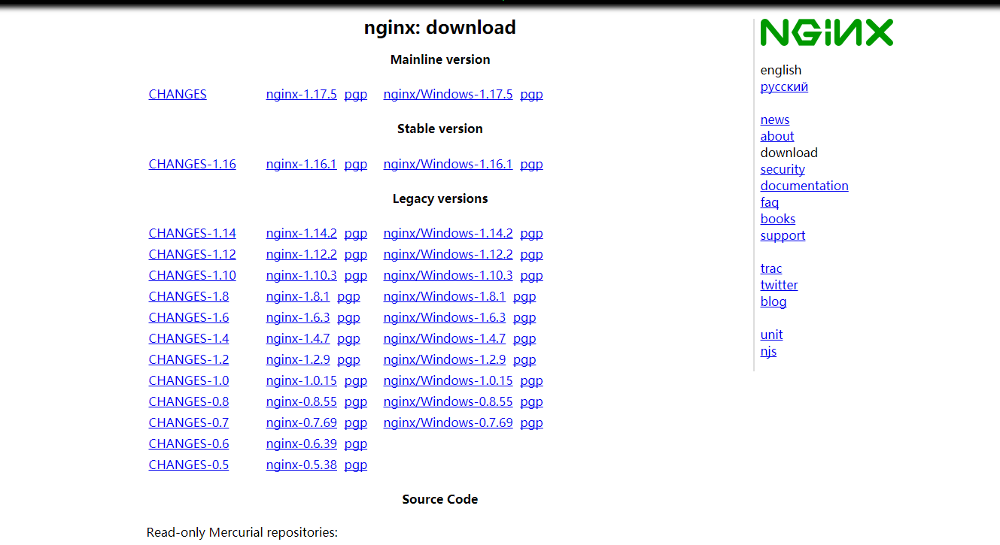

#### 2. 第二种方式：使用wget命令下载（推荐）

```bash
wget -c https://nginx.org/download/nginx-1.16.1.tar.gz
```

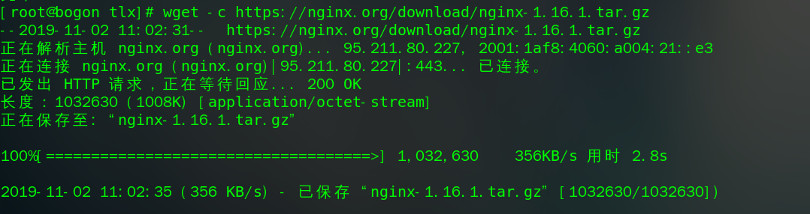


### 三、安装nginx

#### 1. 解压安装包

```bash
tar -zxvf nginx-1.16.1.tar.gz

cd nginx-1.16.1/
```

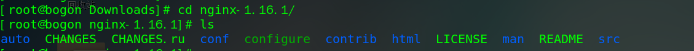


#### 2. 配置

使用默认配置就可以

```bash&#39;
./configure
```


也可以自定义配置（不推荐）

```bash
./configure \
--prefix=/usr/local/nginx \
--conf-path=/usr/local/nginx/conf/nginx.conf \
--pid-path=/usr/local/nginx/conf/nginx.pid \
--lock-path=/var/lock/nginx.lock \
--error-log-path=/var/log/nginx/error.log \
--http-log-path=/var/log/nginx/access.log \
--with-http_gzip_static_module \
--http-client-body-temp-path=/var/temp/nginx/client \
--http-proxy-temp-path=/var/temp/nginx/proxy \
--http-fastcgi-temp-path=/var/temp/nginx/fastcgi \
--http-uwsgi-temp-path=/var/temp/nginx/uwsgi \
--http-scgi-temp-path=/var/temp/nginx/scgi
```


#### 3. 编译安装

```bash
make
make install
```

```bash
# 查找安装目录
whereis nginx
```


#### 4. 启动、停止nginx

要启动nginx，进入目录，运行可执行文件即可。

```bash
cd /usr/local/nginx/sbin/
./nginx
```

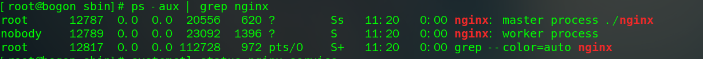

一旦启动nginx后，就可以通过使用参数调用可执行文件来对其进行控制，使用下面语法：

```bash
nginx -s 信号
```

信号是以下之一：

* `stop` —快速停止（相当于先查出nginx进程id再使用kill命令强制杀掉进程）
* `quit` —正常停止（待nginx进程处理任务完毕进行停止）
* `reload` —重新加载配置文件
* `reopen` - 重新打开日志文件

例如，要在等待工作进程完成对当前请求的服务的过程中停止nginx进程，可以执行以下命令：

```bash
nginx -s stop
```


启动成功后，在浏览器地址栏中访问：localhost

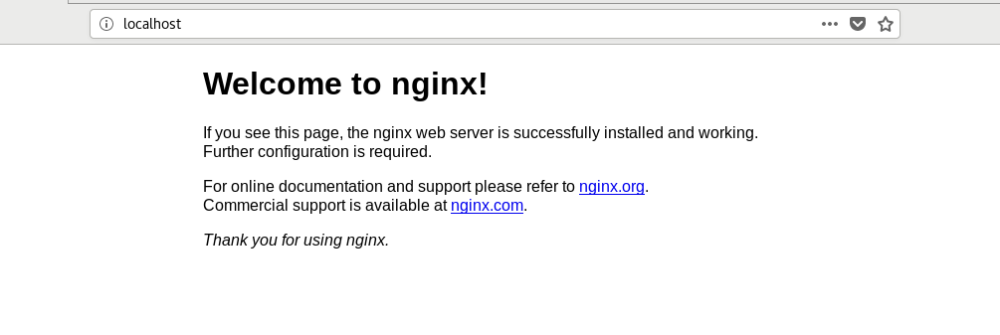


## centos7配置vim插件

### 一、更新vim到8.0版本

由于centos7中自带的vim是vim7.4版本，而许多插件对vim的要求都是8.0，所以先要更新一下vim。

#### 1. 卸载老版的vim

```bash
yum remove vim-* -y
```

#### 2. 下载第三方yum源

```bash
wget -P /etc/yum.repos.d/  https://copr.fedorainfracloud.org/coprs/lbiaggi/vim80-ligatures/repo/epel-7/lbiaggi-vim80-ligatures-epel-7.repo
```

#### 3. 安装vim

```bash
yum  install vim-enhanced sudo -y
```

#### 4. 查看vim版本

```bash
rpm -qa | grep vim
```

