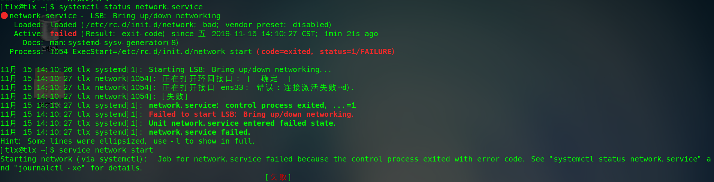
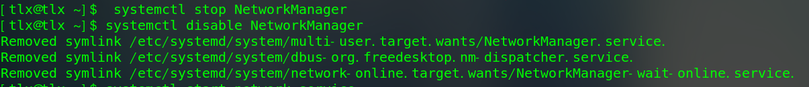
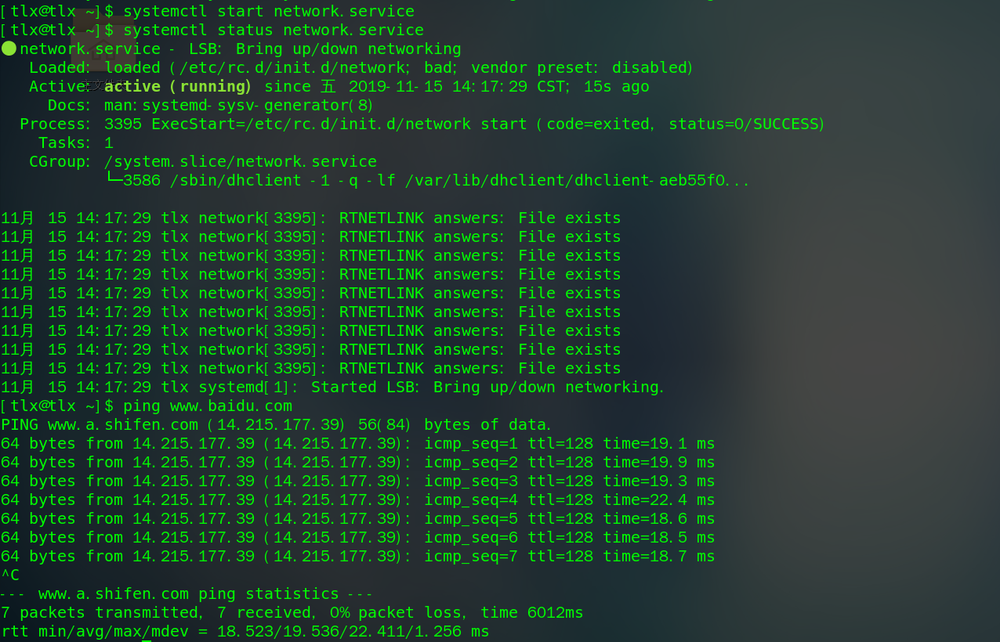
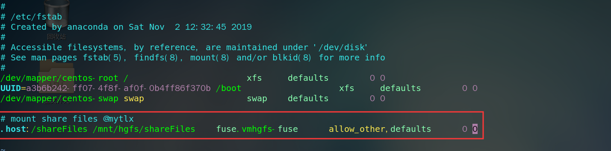

### centos重启后无法联网

无法启动网络服务，查看网络状态如下：

```bash
systemctl status network.service
```



 解决方式：

#### 1. 禁用NetworkManager 

```bash
systemctl stop NetworkManager
systemctl disable NetworkManager
```



#### 2. 重启网络服务

```bash
systemctl start network.service
```

#### 3. 查看网络状态

```bash
systemctl status network.service
```




### centos挂载共享文件夹

#### 1. 在vmware中正常添加共享文件夹

#### 2. 查看共享目录是否设置是成功

```bash
vmware-hgfsclient
```


#### 3. 手动挂载共享目录

```bash
vmhgfs-fuse .host:/shareFiles /mnt/hgfs
```


至此，挂载成功，但是重启后会失效。

#### 4. 自动挂载共享目录

```bash
vim /etc/fstab

# 文件中添加下面一行信息
.host:/VMShare /mnt/hgfs fuse.vmhgfs-fuse allow_other,defaults 0 0
```



让刚刚写入的挂载信息立即生效

```bash
mount -a
```


#### 5. 卸载挂载目录	

```bash
umount /mnt/hgfs
```

