## 命令行创建maven项目

### 方法一：互动模式

#### 1. 用骨架创建项目

切换到项目目录，输入命令：

```powershell
mvn archetype:generate
```

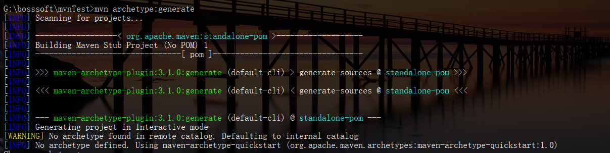

#### 2. 选择骨架

输入对应号码即可。

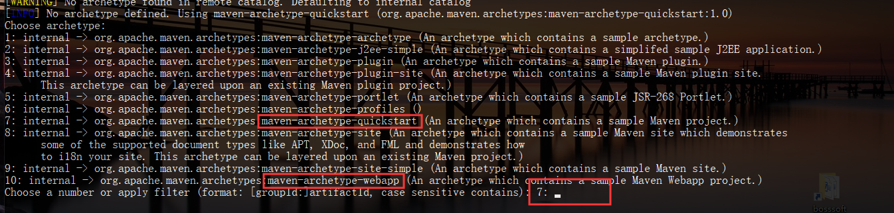

#### 3. 输入坐标

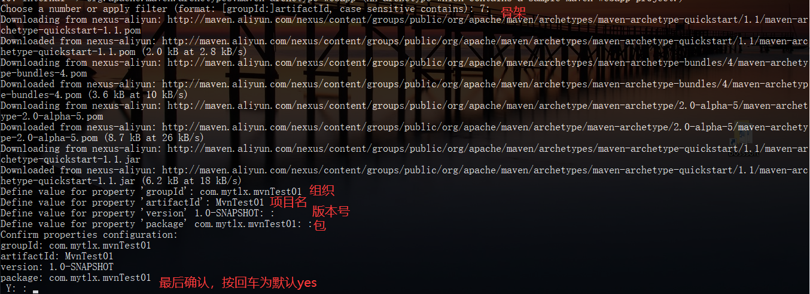

#### 4. 创建成功

确认后，创建成功会输出成功信息。

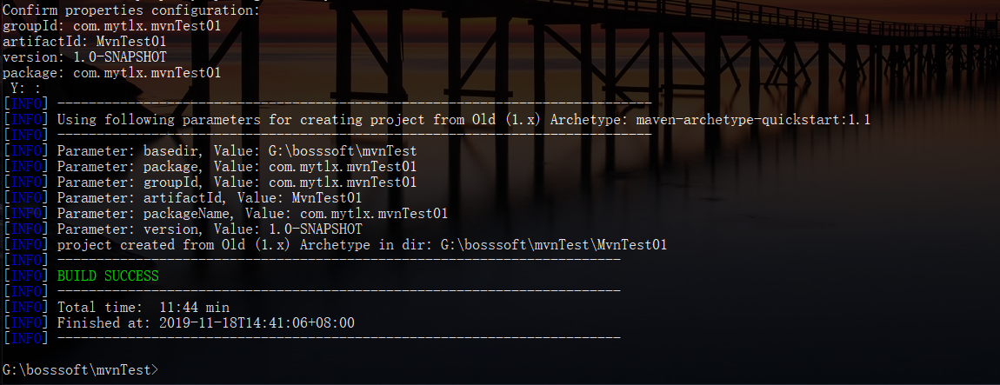

#### 5. 将项目转化为idea项目

```powershell
# 先进入项目目录
cd MvnTest01
# 转为idea项目
mvn idea:idea
```

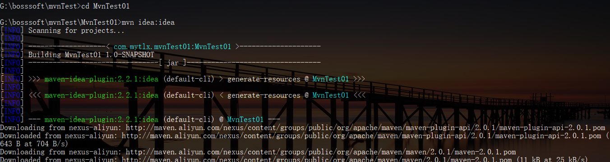

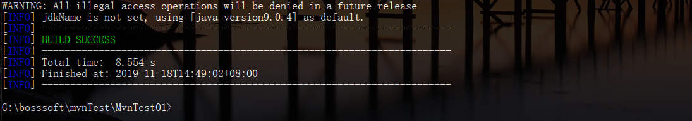

可以看到目录中增加了项目信息

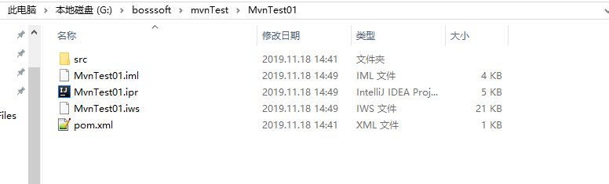

在idea中，可以直接打开

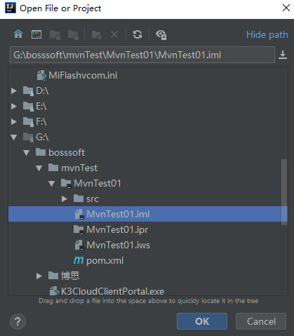


## 命令行中其他的一些mvn命令

#### 1. 编译,将Java 源程序编译成 class 字节码文件 

```powershell
mvn compile
```

如果出现以下错误，那么可以在项目的pom.xml文件中添加如下几行。

```xml
<properties>
    <project.build.sourceEncoding>UTF-8</project.build.sourceEncoding>

    <maven.compiler.source>1.8</maven.compiler.source>
    <maven.compiler.target>1.8</maven.compiler.target>
</properties>
```

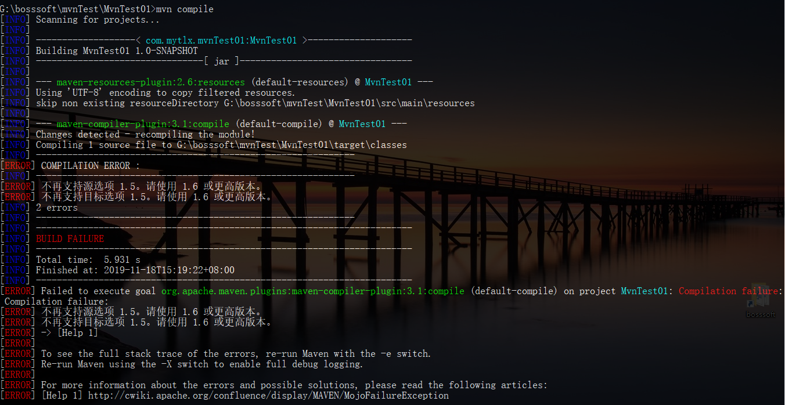

修改完文件后，重新编译。

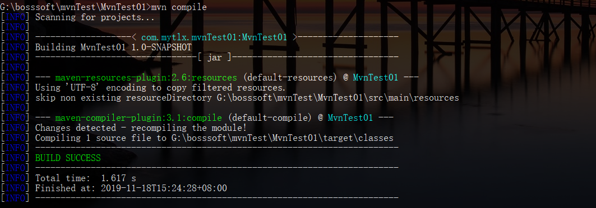


#### 2.  测试，并生成测试报告 

导入到idea中，添加测试用例。

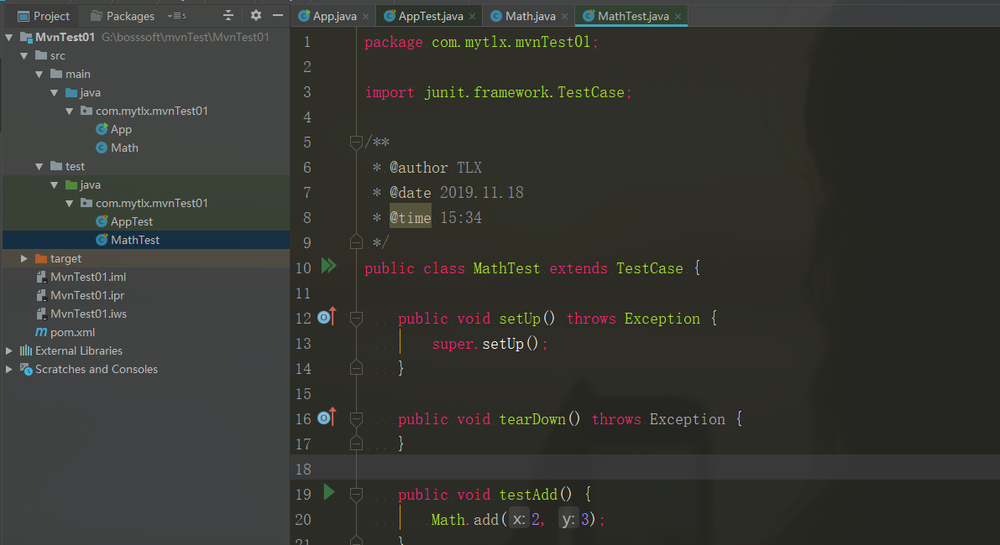

命令行执行测试命令。

```powershell
mvn test
```

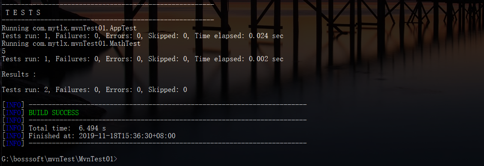


#### 3.  将以前编译得到的旧的 class 字节码文件删除 

```powershell
mvn clean
```

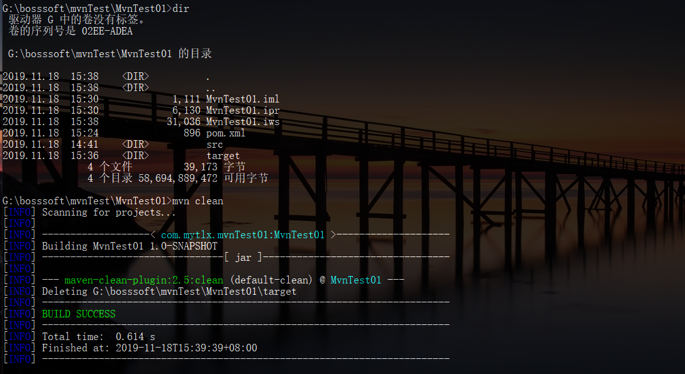

可以看到，target文件夹没了。


#### 4.  打包，动态 web工程打 war包，Java工程打 jar 包 

```
mvn package
```

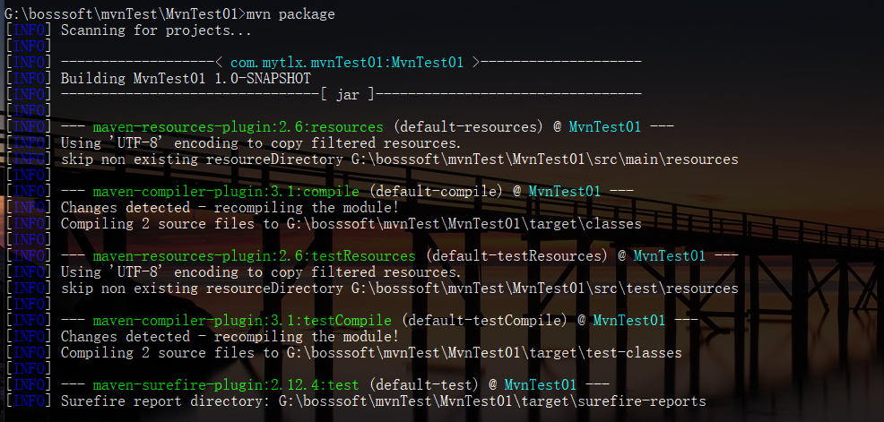

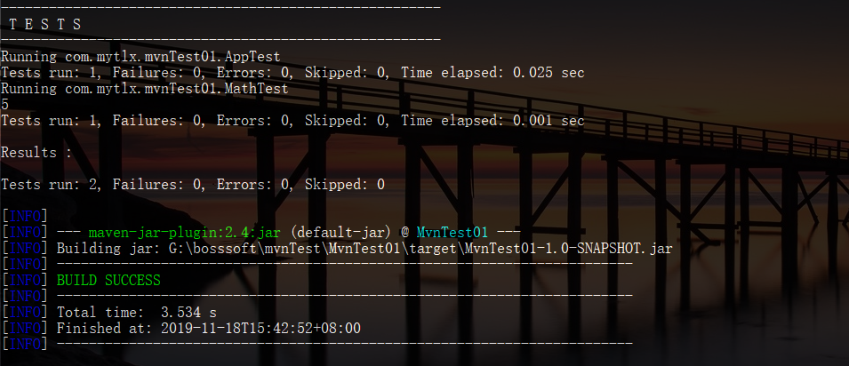

成功生成了jar包。

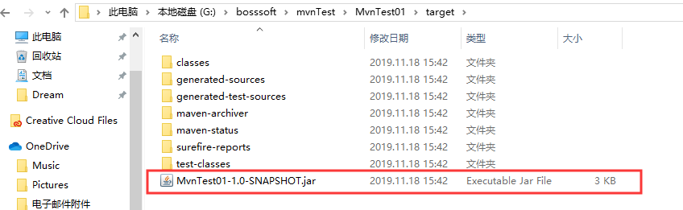


#### 5.  将项目生成 jar 包放在仓库中，以便别的模块调用，安装到本地 

```
mvn install
```

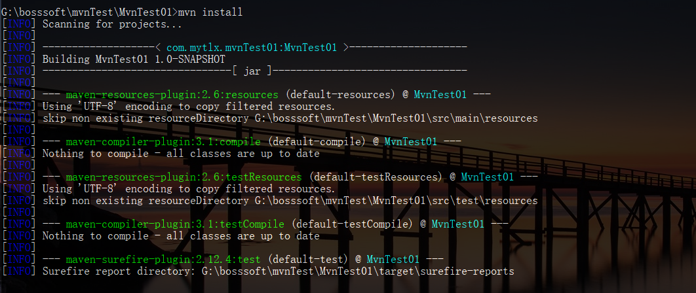

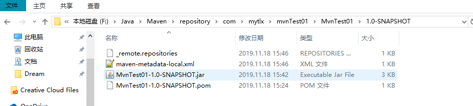