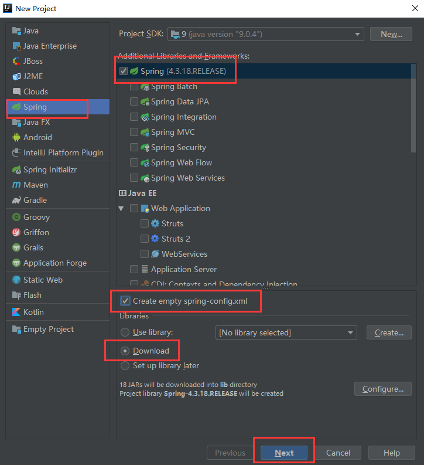
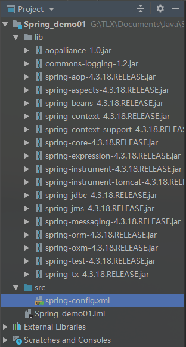
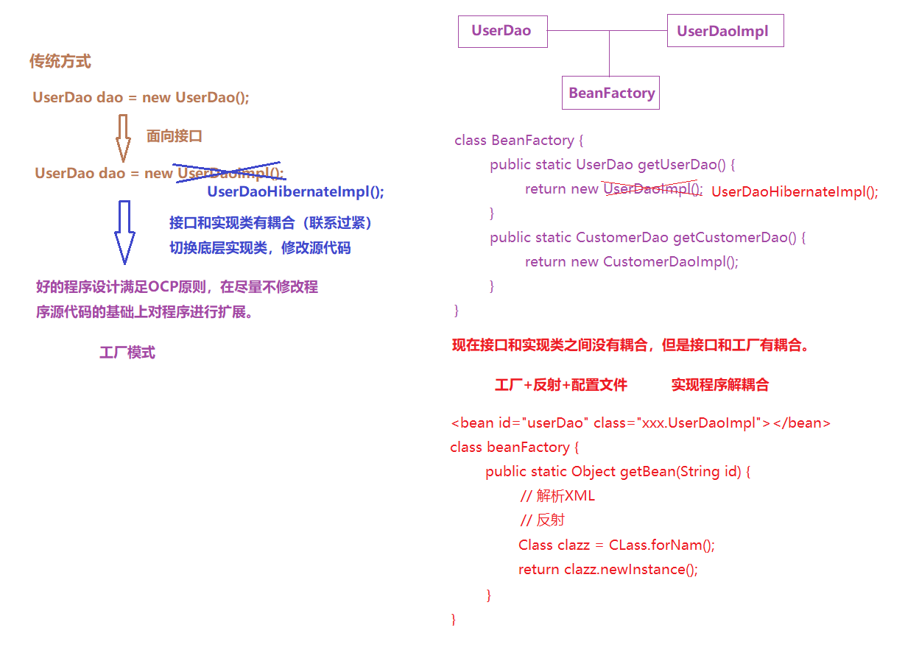
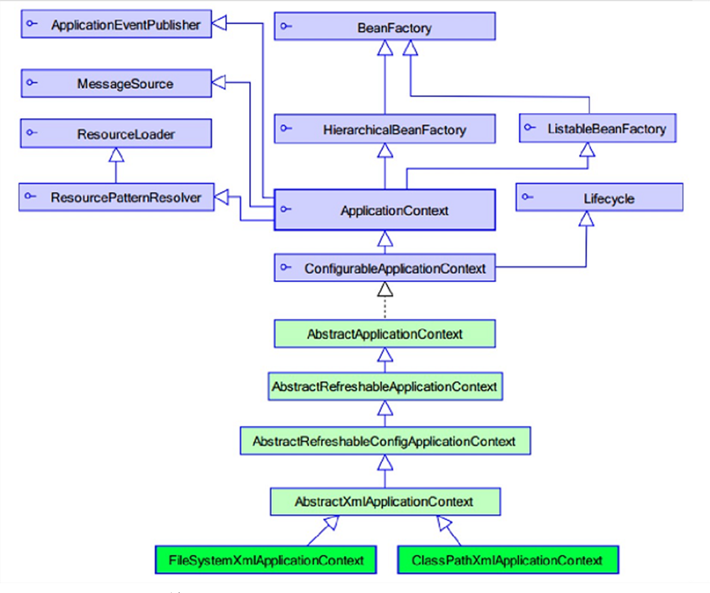

# Spring的概述

## 什么是Spring

Spring是一个开放源代码的设计层面框架，它解决的是业务逻辑层和其他各层的松耦合问题，因此它将面向接口的编程思想贯穿整个系统应用。Spring是于2003 年兴起的一个轻量级的Java 开发框架，由Rod Johnson创建。简单来说，Spring是一个分层的JavaSE/EE **full-stack(一站式)** 轻量级开源框架。

* Spring：SE/EE 开发的**一站式（full-stack）**框架
  * 一站式框架：有EE开发的每一层解决方案。
    * WEB层：SpringMVC
    * Service层：Spring的Bean管理，Spring声明式事务
    * DAO层：Spring的jdbc模板，Spring的ORM模块


## Spring的特点

**1.方便解耦，简化开发**

通过Spring提供的IoC容器，我们可以将对象之间的依赖关系交由Spring进行控制，避免硬编码所造成的过度程序耦合。有了Spring，用户不必再为单实例模式类、属性文件解析等这些很底层的需求编写代码，可以更专注于上层的应用。

**2.AOP编程的支持**

通过Spring提供的**AOP**功能，方便进行面向切面的编程，许多不容易用传统OOP实现的功能可以通过AOP轻松应付。

**3.声明式事务的支持**

在Spring中，我们可以从单调烦闷的事务管理代码中解脱出来，通过声明式方式灵活地进行事务的管理，提高开发效率和质量。

**4.方便程序的测试**

可以用非容器依赖的编程方式进行几乎所有的测试工作，在Spring里，测试不再是昂贵的操作，而是随手可做的事情。例如：Spring对Junit4支持，可以通过注解方便的测试Spring程序。

**5.方便集成各种优秀框架**

Spring不排斥各种优秀的开源框架，相反，Spring可以降低各种框架的使用难度，Spring提供了对各种优秀框架（如Struts,Hibernate、Hessian、Quartz）等的直接支持。

**6.降低Java EE API的使用难度**

Spring对很多难用的Java EE API（如JDBC，JavaMail，远程调用等）提供了一个薄薄的封装层，通过Spring的简易封装，这些Java EE API的使用难度大为降低。

**7.Java 源码是经典学习范例**

Spring的源码设计精妙、结构清晰、匠心独运，处处体现着大师对**Java设计模式**灵活运用以及对Java技术的高深造诣。Spring框架源码无疑是Java技术的最佳实践范例。如果想在短时间内迅速提高自己的Java技术水平和应用开发水平，学习和研究Spring源码将会使你收到意想不到的效果。


## Spring的入门（IOC）

* IOC：Inversion of Control，控制反转
  * 将对象的创建权反转给（文档）Spring

  * DI：依赖注入，前提必须有IOC的环境，Spring管理这个类的时候将类的依赖的属性注入（设置）进来。

* 面向对象的时候

  * 依赖

  ```java
  Class A{
  }
  
  Class B{
      public void xxx(A a){
      }
  }
  ```

  * 继承:is a

  ```java
  Class A{
  }
  
  Class B extends A{
  }
  ```
  * 聚合:has a

  ```java
  Class A{
  }
  
  Class B{
      private A a;
  }
  ```


## idea创建Spring

1. create new project

   

2. 输入项目名称，选择项目位置

   

3. 之后会自动下载需要的jar包，创建成功

   

4. 创建接口和类

   ```java
   public interface UserDao {
       public void save();
   }
   ```

   ```java
   public class UserDaoImpl implements UserDao {
       @Override
       public void save() {
           System.out.println("=========UserDaoImpl===========");
       }
   }
   ```

   ```java
   public class test {
       @Test
       public void test01() {
           UserDao dao = new UserDaoImpl();
           dao.save();
       }
   }
   ```

   * 问题：如果底层的实现切换了，需要修改源代码，能不能不修改程序源代码对程序进行扩展？

     

5. 将实现类交给Spring管理

   ```xml
   <?xml version="1.0" encoding="UTF-8"?>
   <beans xmlns="http://www.springframework.org/schema/beans"
          xmlns:xsi="http://www.w3.org/2001/XMLSchema-instance"
          xsi:schemaLocation="http://www.springframework.org/schema/beans 
             http://www.springframework.org/schema/beans/spring-beans.xsd">
   
       <bean id="useDao" class="demo01.UserDaoImpl"></bean>
   </beans>
   ```

6. 测试代码

   ```java
   @Test
   public void test02() {
       ApplicationContext applicationContext = new ClassPathXmlApplicationContext("applicationContext.xml");
       UserDao userDao = (UserDao) applicationContext.getBean("userDao");
       userDao.save();
   }
   ```


# Spring的工厂类

## Spring工厂类的结构图



* ApplicationContext继承BeanFactory

## BeanFactory：老版本的工厂类

* BeanFactory：调用getBean的时候，才会生成类的实例。

<h2 style="color:red">ApplicationContext：新版本的工厂类</h2>

* ApplicationContext：加载配置文件的时候，就会将Spring管理的类都实例化。
* ApplicationContext有两个实现类
  * **ClassPathXmlApplicationContext：加载类路径下的配置文件**
  * FileSystemXMLApplicationContext：加载文件系统下的配置文件


# Spring的配置

## Bean相关的配置

### \<bean\>标签的id和name的配置

* id：使用了约束中的唯一约束，里面不能出现特殊字符。
* name：没有使用约束中的唯一约束理论上可以出现重复的，但是实际开发不能出现的，里面可以出现特殊字符。
  * Spring和Struts1框架整合的时候
  * `<bean name="/user" class=""/>`

### Bean的生命周期的配置（了解）

* init-method：Bean被初始化的时候执行的方法
* destory-method：Bean被销毁的时候执行的方法（Bean是单例创建，工厂关闭）

<h3 style="color:red">Bean的作用范围的配置（重点）</h3>

* scope：Bean的作用范围

  * **singleton：默认的，Spring会采用单例模式创建这个对象**
  * **prototype：多例模式，（Stucts2和Spring整合一定会用到）**
  * request：应用在web项目中，Spring创建这个类后，将这个类存入到request范围中
  * session：应用在web项目中，Spring创建这个类以后，将这个类存入到session范围中
  * globalsession：应用在web项目中，必须在porlet环境下使用。但是如果没有这种环境，相对于session


# Spring的Bean管理（xml方式）

## Spring的Bean的实例化方式（了解）

Bean已经都交给Spring管理，Spring创建这些类的时候，有几种方式：

<h3 style="color:red">无参构造方法的方式（默认）</h3>

```java
public class Bean1 {
    public Bean1() {
        super();
        System.out.println("=======Bean1 constructor========");
    }
}
```

```xml
<!-- 无参数构造方法 -->
<bean id="bean1" class="demo02.Bean1"></bean>
```

```java
@Test
public void test01() {
    ApplicationContext applicationContext = new ClassPathXmlApplicationContext("applicationContext.xml");
    Bean1 bean1 = (Bean1) applicationContext.getBean("bean1");
}
```

### 静态工厂实例化的方式

* 编写Bean2的静态工厂

```java
public class Bean2Factory {
    public static Bean2 createBean2() {
        System.out.println("=======Bean2Factory==========");
        return new Bean2();
    }
}
```

```java
public class Bean2 {
}
```

```xml
<!-- 静态工厂实例化 -->
<bean id="bean2" class="demo02.Bean2Factory" factory-method="createBean2"></bean>
```

```java
@Test
public void test02() {
    ApplicationContext applicationContext = new ClassPathXmlApplicationContext("applicationContext.xml");
    Bean2 bean2 = (Bean2) applicationContext.getBean("bean2");
    System.out.println(bean2);
}
```

### 实例工厂实例化的方式

```java
public class Bean3Factory {
    public Bean3 createBean3() {
        System.out.println("=========Bean3Factory=======");
        return new Bean3();
    }
}
```

```xml
<!-- 实例工厂实例化 -->
<bean id="bean3Factory" class="demo02.Bean3Factory"></bean>
<bean id="bean3" factory-bean="bean3Factory" factory-method="createBean3"></bean>
```

```java
public class Bean3 {
}
```

```java
@Test
public void test03() {
    ApplicationContext applicationContext = new ClassPathXmlApplicationContext("applicationContext.xml");
    Bean3 bean3 = (Bean3) applicationContext.getBean("bean3");
    System.out.println(bean3);
}
```


## Spring属性注入

### 构造方法的方式的属性注入

* 构造方法的属性注入，需要对应的构造方法

```xml
<!--构造方法注入-->
<bean id="car" class="demo03.Car">
    <constructor-arg name="name" value="宝马"/>
    <constructor-arg name="price" value="100000"/>
</bean>
```

### set方法的方式的属性注入

* set方法的属性注入，需要对应的set方法

```xml
<!--set方法方式-->
<bean id="car2" class="demo03.Car">
    <property name="name" value="奔驰"/>
    <property name="price" value="200000"/>
</bean>
```

* set方法设置对象类型的属性

```xml
<bean id="emloyee" class="demo03.Employee">
    <!--value：设置普通类型的值  ref：设置其他类的id或name-->
    <property name="name" value="mary"/>
    <property name="car" ref="car2"/>
</bean>
```

### P名称空间的属性注入（Spring2.5以后）

* 通过引入p名称空间完成属性的注入
  * 普通属性
    * p：属性名=“值”
  * 对象属性
    * p：属性名-ref=“值”
* p名称空间的引入

```xml
<beans xmlns="http://www.springframework.org/schema/beans"
       <!-- 加上下面这行 -->
       xmlns:p="http://www.springframework.org/schema/p"
       xmlns:xsi="http://www.w3.org/2001/XMLSchema-instance"
       xsi:schemaLocation="http://www.springframework.org/schema/beans 
		http://www.springframework.org/schema/beans/spring-beans.xsd">
```

* 使用p名称空间

```xml
<!--p名称空间-->
<bean id="car3" class="demo03.Car" p:name="byd" p:price="20000"/>
<bean id="employee2" class="demo03.Employee" p:name="xiaoming" p:car-ref="car3"/>
```

### SpEL的属性注入（Spring3.0以后）

* SpEL：Spring Expression Language， Spring的表达式语言。
  * 语法：#{SpEL}

```xml
<!--SpEL的属性注入-->
<bean id="carInfo" class="demo03.CarInfo"/>
<bean id="car4" class="demo03.Car">
    <property name="name" value="#{carInfo.name}"/>
    <property name="price" value="#{carInfo.calculatorPrice()}"/>
</bean>
<bean id="employee3" class="demo03.Employee">
    <property name="name" value="#{'xiaoming'}"/>
    <property name="car" value="#{car2}"/>
</bean>
```


## 集合类型属性注入（了解）

### 配置

```xml
<!-- Spring的集合属性的注入 -->
<!-- 注入数组类型 -->
<bean id="collectionBean"
      class="demo03.CollecitonBean">
    <!-- 数组类型 -->
    <property name="arrs">
        <list>
            <value>王东</value>
            <value>赵洪</value>
            <value>李冠希</value>
        </list>
    </property>

    <!-- 注入list集合 -->
    <property name="list">
        <list>
            <value>李兵</value>
            <value>赵如何</value>
            <value>邓凤</value>
        </list>
    </property>

    <!-- 注入set集合 -->
    <property name="set">
        <set>
            <value>aaa</value>
            <value>bbb</value>
            <value>ccc</value>
        </set>
    </property>

    <!-- 注入Map集合 -->
    <property name="map">
        <map>
            <entry key="aaa" value="111"/>
            <entry key="bbb" value="222"/>
            <entry key="ccc" value="333"/>
        </map>
    </property>
</bean>
```


# Spring的分模块开发配置

* 在加载配置文件的时候，加载多个

```java
ApplicationContext applicationContext = new
    ClassPathXmlApplicationContext("applicationContext.xml", "spring-config.xml");
```

* 在一个配置文件中引入多个配置文件

```xml
<import resource="spring-config.xml"/>
```

