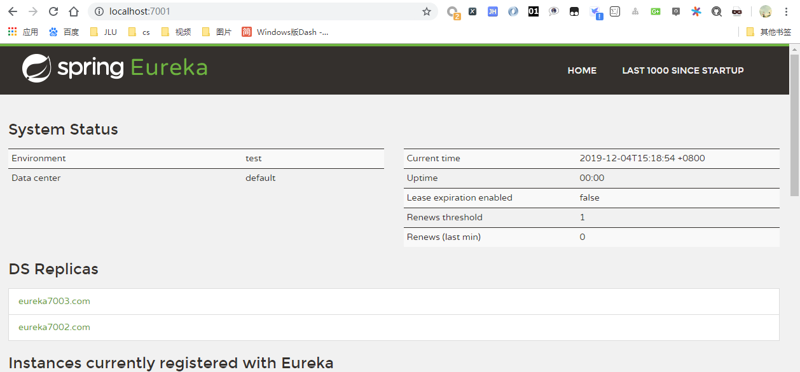
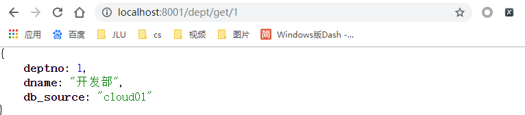

# Rest环境搭建

#### 1. 新建一个maven项目


#### 2. 作为父工程，删除无用的src


#### 3. pom.xml

```xml
<?xml version="1.0" encoding="UTF-8"?>
<project xmlns="http://maven.apache.org/POM/4.0.0"
         xmlns:xsi="http://www.w3.org/2001/XMLSchema-instance"
         xsi:schemaLocation="http://maven.apache.org/POM/4.0.0 http://maven.apache.org/xsd/maven-4.0.0.xsd">
    <modelVersion>4.0.0</modelVersion>

    <groupId>com.mytlx</groupId>
    <artifactId>springcloud</artifactId>
    <version>1.0-SNAPSHOT</version>

    <!--打包方式 pom-->
    <packaging>pom</packaging>

    <properties>
        <project.build.sourceEncoding>UTF-8</project.build.sourceEncoding>
        <maven.compiler.source>1.8</maven.compiler.source>
        <maven.compiler.target>1.8</maven.compiler.target>
        <juint.version>4.12</juint.version>
        <lombok.version>1.18.10</lombok.version>
        <log4j.version>1.2.17</log4j.version>
    </properties>

    <dependencyManagement>
        <dependencies>
            <!--springCloud依赖-->
            <dependency>
                <groupId>org.springframework.cloud</groupId>
                <artifactId>spring-cloud-dependencies</artifactId>
                <version>Greenwich.SR1</version>
                <type>pom</type>
                <scope>import</scope>
            </dependency>
            <!--springboot依赖-->
            <dependency>
                <groupId>org.springframework.boot</groupId>
                <artifactId>spring-boot-dependencies</artifactId>
                <version>2.1.4.RELEASE</version>
                <type>pom</type>
                <scope>import</scope>
            </dependency>
            <!--数据库-->
            <dependency>
                <groupId>mysql</groupId>
                <artifactId>mysql-connector-java</artifactId>
                <version>8.0.13</version>
            </dependency>
            <dependency>
                <groupId>com.alibaba</groupId>
                <artifactId>druid</artifactId>
                <version>1.1.21</version>
            </dependency>
            <!--springboot启动器-->
            <dependency>
                <groupId>org.mybatis.spring.boot</groupId>
                <artifactId>mybatis-spring-boot-starter</artifactId>
                <version>2.1.1</version>
            </dependency>
            <!--日志和测试-->
            <dependency>
                <groupId>junit</groupId>
                <artifactId>junit</artifactId>
                <version>${juint.version}</version>
            </dependency>
            <dependency>
                <groupId>org.projectlombok</groupId>
                <artifactId>lombok</artifactId>
                <version>${lombok.version}</version>
            </dependency>
            <dependency>
                <groupId>log4j</groupId>
                <artifactId>log4j</artifactId>
                <version>${log4j.version}</version>
            </dependency>
            <dependency>
                <groupId>ch.qos.logback</groupId>
                <artifactId>logback-core</artifactId>
                <version>1.2.3</version>
            </dependency>

        </dependencies>

    </dependencyManagement>

</project>
```


创建数据库 `cloud01`，建表如下：

```sql
create table dept
(
  deptno    bigint auto_increment
    primary key,
  dname     varchar(60) null,
  db_source varchar(60) null
)
```

添加数据：

```sql
insert into dept(dname, db_source) values ("开发部",DATABASE());
insert into dept(dname, db_source) values ("人事部",DATABASE());
insert into dept(dname, db_source) values ("财务部",DATABASE());
insert into dept(dname, db_source) values ("市场部",DATABASE());
insert into dept(dname, db_source) values ("运维部",DATABASE());
```


新建module，springcloud-api，提供api接口。

pom.xml

```xml
<?xml version="1.0" encoding="UTF-8"?>
<project xmlns="http://maven.apache.org/POM/4.0.0"
         xmlns:xsi="http://www.w3.org/2001/XMLSchema-instance"
         xsi:schemaLocation="http://maven.apache.org/POM/4.0.0 http://maven.apache.org/xsd/maven-4.0.0.xsd">
    <parent>
        <artifactId>springcloud</artifactId>
        <groupId>com.mytlx</groupId>
        <version>1.0-SNAPSHOT</version>
    </parent>
    <modelVersion>4.0.0</modelVersion>

    <artifactId>springcloud-api</artifactId>
    <version>1.0-SNAPSHOT</version>

    <!--当前的module自己需要的依赖，如果父依赖中已经配置了版本，这里就不用写了-->
    <dependencies>
        <dependency>
            <groupId>org.projectlombok</groupId>
            <artifactId>lombok</artifactId>
        </dependency>
    </dependencies>

</project>
```


添加数据库表对应的pojo：

```java
package com.mytlx.springcloud.pojo;

import lombok.Data;
import lombok.NoArgsConstructor;
import lombok.experimental.Accessors;

import java.io.Serializable;

/**
 * @author TLX
 * @date 2019.12.2
 * @time 13:56
 */
@Data
@NoArgsConstructor
@Accessors(chain = true)    // 链式写法
public class Dept implements Serializable {

    private Long deptno;
    private String dname;
    // 这个数据存在哪个数据库的字段
    // 微服务，一个服务对应一个数据库，同一个信息可能存在不同数据库
    private String db_source;

    public Dept(String dname) {
        this.dname = dname;
    }
}
```


## 服务提供者

建立module，springcloud-provider-dept-8081


pom.xml

```xml
<?xml version="1.0" encoding="UTF-8"?>
<project xmlns="http://maven.apache.org/POM/4.0.0"
         xmlns:xsi="http://www.w3.org/2001/XMLSchema-instance"
         xsi:schemaLocation="http://maven.apache.org/POM/4.0.0 http://maven.apache.org/xsd/maven-4.0.0.xsd">
    <parent>
        <artifactId>springcloud</artifactId>
        <groupId>com.mytlx</groupId>
        <version>1.0-SNAPSHOT</version>
    </parent>
    <modelVersion>4.0.0</modelVersion>

    <artifactId>springcloud-provider-dept-8001</artifactId>
    <version>1.0-SNAPSHOT</version>

    <dependencies>
        <!--我们需要拿到实体类，所以要配置api module-->
        <dependency>
            <groupId>com.mytlx</groupId>
            <artifactId>springcloud-api</artifactId>
            <version>1.0-SNAPSHOT</version>
        </dependency>
        <dependency>
            <groupId>junit</groupId>
            <artifactId>junit</artifactId>
        </dependency>
        <dependency>
            <groupId>mysql</groupId>
            <artifactId>mysql-connector-java</artifactId>
        </dependency>
        <dependency>
            <groupId>com.alibaba</groupId>
            <artifactId>druid</artifactId>
        </dependency>
        <dependency>
            <groupId>ch.qos.logback</groupId>
            <artifactId>logback-core</artifactId>
        </dependency>
        <dependency>
            <groupId>org.mybatis.spring.boot</groupId>
            <artifactId>mybatis-spring-boot-starter</artifactId>
        </dependency>

        <dependency>
            <groupId>org.springframework.boot</groupId>
            <artifactId>spring-boot-test</artifactId>
        </dependency>
        <dependency>
            <groupId>org.springframework.boot</groupId>
            <artifactId>spring-boot-starter-web</artifactId>
        </dependency>
        <dependency>
            <groupId>org.springframework.boot</groupId>
            <artifactId>spring-boot-starter-jetty</artifactId>
        </dependency>
        <!--热部署工具-->
        <dependency>
            <groupId>org.springframework.boot</groupId>
            <artifactId>spring-boot-devtools</artifactId>
        </dependency>

    </dependencies>

</project>
```


application.yml

```yaml
server:
  port: 8081

# mybatis配置
mybatis:
  type-aliases-package: com.mytlx.springcloud.pojo
  config-location: classpath:mybatis/mybatis-config.xml
  mapper-locations: classpath:mybatis/mapper/*.xml

# spring配置
spring:
  application:
    name: springcloud-provider-dept
  datasource:
    type: com.alibaba.druid.pool.DruidDataSource
    driver-class-name: com.mysql.cj.jdbc.Driver
    url: jdbc:mysql://localhost:3306/cloud01?useUnicode=true&characterEncoding=utf-8&serverTimezone=GMT
    username: root
    password: 8372


# Eureka的配置，服务注册到哪里
eureka:
  client:
    service-url:
     defaultZone: http://localhost:7001/eureka/
  instance:
    instance-id: springcloud-provider-dep8081     # 修改eureka上的默认描述信息

info:
  app.name: mytlx-springcloud
  company.name: mytlx
```


正常编写，sevice层，dao如下：

```java
package com.mytlx.springcloud.dao;

import com.mytlx.springcloud.pojo.Dept;
import org.apache.ibatis.annotations.Mapper;
import org.springframework.stereotype.Repository;

import java.util.List;

/**
 * @author TLX
 * @date 2019.12.2
 * @time 14:42
 */
@Mapper
@Repository
public interface DeptDao {

    boolean addDept(Dept dept);

    Dept queryById(Long id);

    List<Dept> queryAll();
    
}
```

mapper：

```xml
<?xml version="1.0" encoding="UTF-8" ?>
<!DOCTYPE mapper
        PUBLIC "-//mybatis.org//DTD Mapper 3.0//EN"
        "http://mybatis.org/dtd/mybatis-3-mapper.dtd">

<mapper namespace="com.mytlx.springcloud.dao.DeptDao">

    <insert id="addDept">
        INSERT INTO cloud01.dept (dname, db_source)
        VALUES (#{dname}, DATABASE());
    </insert>

    <select id="queryById" resultType="Dept" parameterType="Long">
        SELECT *
        FROM cloud01.dept
        WHERE deptno = #{deptno};
    </select>

    <select id="queryAll" resultType="Dept">
        SELECT *
        FROM dept;
    </select>

</mapper>
```

controller:

```java
package com.mytlx.springcloud.controller;

import com.mytlx.springcloud.pojo.Dept;
import com.mytlx.springcloud.service.DeptService;
import org.springframework.beans.factory.annotation.Autowired;
import org.springframework.cloud.client.ServiceInstance;
import org.springframework.cloud.client.discovery.DiscoveryClient;
import org.springframework.web.bind.annotation.*;

import java.util.List;

/**
 * @author TLX
 * @date 2019.12.2
 * @time 14:53
 */
@RestController
public class DeptController {

    @Autowired
    private DeptService deptService;

    @PostMapping("/dept/add")
    public boolean addDept(Dept dept) {
        return deptService.addDept(dept);
    }

    @GetMapping("/dept/get/{id}")
    public Dept get(@PathVariable("id") Long id) {
        return deptService.queryById(id);
    }

    @GetMapping("/dept/list")
    public List<Dept> queryAll() {
        return deptService.queryAll();
    }

}
```


## 服务消费者

新建module，springcloud-consumer-dept-80

pom.xml

```xml
<?xml version="1.0" encoding="UTF-8"?>
<project xmlns="http://maven.apache.org/POM/4.0.0"
         xmlns:xsi="http://www.w3.org/2001/XMLSchema-instance"
         xsi:schemaLocation="http://maven.apache.org/POM/4.0.0 http://maven.apache.org/xsd/maven-4.0.0.xsd">
    <parent>
        <artifactId>springcloud</artifactId>
        <groupId>com.mytlx</groupId>
        <version>1.0-SNAPSHOT</version>
    </parent>
    <modelVersion>4.0.0</modelVersion>

    <artifactId>springcloud-consumer-dept-80</artifactId>
    <version>1.0-SNAPSHOT</version>

    <!--实体类 + web-->
    <dependencies>
        <dependency>
            <groupId>com.mytlx</groupId>
            <artifactId>springcloud-api</artifactId>
            <version>1.0-SNAPSHOT</version>
        </dependency>
        <dependency>
            <groupId>org.springframework.boot</groupId>
            <artifactId>spring-boot-starter-web</artifactId>
        </dependency>
        <dependency>
            <groupId>org.springframework.boot</groupId>
            <artifactId>spring-boot-devtools</artifactId>
        </dependency>
    </dependencies>
</project>
```


application.yml

```yaml
server:
  port: 80
```


编写配置类，目的是将 RestTemplate 交给spring管理

```java
package com.mytlx.springcloud.config;

import org.springframework.context.annotation.Bean;
import org.springframework.context.annotation.Configuration;
import org.springframework.web.client.RestTemplate;

/**
 * @author TLX
 * @date 2019.12.2
 * @time 15:43
 */
@Configuration
public class ConfigBean {

    @Bean
    public RestTemplate getRestTemplate() {
        return new RestTemplate();
    }

}
```


编写controller，利用 RestTemplate访问远程http服务的方法

```java
package com.mytlx.springcloud.controller;

import com.mytlx.springcloud.pojo.Dept;
import org.springframework.beans.factory.annotation.Autowired;
import org.springframework.web.bind.annotation.PathVariable;
import org.springframework.web.bind.annotation.RequestMapping;
import org.springframework.web.bind.annotation.RestController;
import org.springframework.web.client.RestTemplate;

import java.util.List;

/**
 * @author TLX
 * @date 2019.12.2
 * @time 15:28
 */
@RestController
public class DeptConsumerController {

    // 消费者，不应该有service层
    // RestTemplate，供我们直接调用就可以了，注册到spring中
    // (url, 实体：map，Class<T> responseType)
    // 提供多种便捷访问远程http服务的方法，简单的restful服务模板
    @Autowired
    private RestTemplate restTemplate;

    private static final String REST_URL_PREFIX = "http://localhost:8081";

    @RequestMapping("/consumer/dept/add")
    public boolean add(Dept dept) {
        return restTemplate.postForObject(REST_URL_PREFIX + "/dept/add", dept, Boolean.class);
    }

    @RequestMapping("/consumer/dept/get/{id}")
    public Dept get(@PathVariable("id") Long id) {
        return restTemplate.getForObject(REST_URL_PREFIX + "/dept/get/" + id, Dept.class);
    }

    @RequestMapping("/consumer/dept/list")
    public List<Dept> list() {
        return restTemplate.getForObject(REST_URL_PREFIX + "/dept/list", List.class);
    }
}
```


先启动服务提供者，再启动服务消费者，可以在消费者一方成功调用到提供者一方的服务。


# Eureka

**自我保护机制：好死不如赖活着**

一句话总结：某时刻某一个微服务不可以用了，eureka 不会立刻清理，依旧会对该微服务的信息进行保存! 

* 默认情况下，如果 EurekaServer 在一 定时间内没有接收到某个微服务实例的心跳，EurekaServer 将会注销该实例(默认90秒) 。但是当网络分区故障发生时，微服务与 Eureka 之间无法正常通行，以上行为可能变得非
  常危险了 -- 因为微服务本身其实是健康的，**此时本不应该注销这个服务**。Eureka 通过**自我保护机制**来解决这
  个问题--当 EurekaServer 节点在短时间内丢失过多客户端时(可能发生了网络分区故障) ，那么这个节点就会
  进入自我保护模式。一旦进入该模式，EurekaServer 就会保护服务注册表中的信息，不再删除服务注册表中
  的数据(也就是不会注销任何微服务)。当网络故障恢复后，该 EurekaServer 节点会自动退出自我保护模式。
* 在自我保护模式中，EurekaServer 会保护服务注册表中的信息，不再注销任何服务实例。当它收到的心跳数
  重新恢复到阈值以上时，该 EurekaServer 节 点就会自动退出自我保护模式。它的设计哲学就是宁可保留错误
  的服务注册信息，也不盲目注销任何可能健康的服务实例。一句话：好死不如赖活着
* 综上，自我保护模式是一 种应对网络异常的安全保护措施。它的架构哲学是宁可同时保留所有微服务(健康的
  微服务和不健康的微服务都会保留)，也不盲目注销任何健康的微服务。使用自我保护模式，可以让 Eureka
  集群更加的健壮和稳定
* 在SpringCloud中， 可以使用`eureka.server.enable-self-preservation = false` 禁用自我保护模式【不推荐关闭自我保护机制】


## server端

新建module，pom.xml如下：

```xml
<?xml version="1.0" encoding="UTF-8"?>
<project xmlns="http://maven.apache.org/POM/4.0.0"
         xmlns:xsi="http://www.w3.org/2001/XMLSchema-instance"
         xsi:schemaLocation="http://maven.apache.org/POM/4.0.0 http://maven.apache.org/xsd/maven-4.0.0.xsd">
    <parent>
        <artifactId>springcloud</artifactId>
        <groupId>com.mytlx</groupId>
        <version>1.0-SNAPSHOT</version>
    </parent>
    <modelVersion>4.0.0</modelVersion>

    <artifactId>springcloud-eureka-7001</artifactId>
    <version>1.0-SNAPSHOT</version>

    <dependencies>
        <dependency>
            <groupId>org.springframework.cloud</groupId>
            <artifactId>spring-cloud-starter-eureka-server</artifactId>
            <version>1.4.6.RELEASE</version>
        </dependency>
        <dependency>
            <groupId>org.springframework.boot</groupId>
            <artifactId>spring-boot-devtools</artifactId>
        </dependency>
        <!--解决报错问题-->
        <!--begin-->
        <dependency>
            <groupId>javax.xml.bind</groupId>
            <artifactId>jaxb-api</artifactId>
        </dependency>
        <dependency>
            <groupId>com.sun.xml.bind</groupId>
            <artifactId>jaxb-impl</artifactId>
            <version>2.3.0</version>
        </dependency>
        <dependency>
            <groupId>org.glassfish.jaxb</groupId>
            <artifactId>jaxb-runtime</artifactId>
            <version>2.3.0</version>
        </dependency>
        <dependency>
            <groupId>javax.activation</groupId>
            <artifactId>activation</artifactId>
            <version>1.1.1</version>
        </dependency>
       <!--end-->
    </dependencies>
</project>
```


配置文件：application.yml

```yaml
server:
  port: 7001

# Eureka配置
eureka:
  instance:
    hostname: localhost     # Eureka服务端的实例名称
  client:
    register-with-eureka: false     # 表示是否向Eureka注册中心注册自己
    fetch-registry: false     # fetch-registry如果为false，则表示自己是注册中心
    service-url:    # 监控页面
      defaultZone: http://${eureka.instance.hostname}:${server.port}/eureka/
```


启动类添加注解：

```java
package com.mytlx.springcloud;

import org.springframework.boot.SpringApplication;
import org.springframework.boot.autoconfigure.SpringBootApplication;
import org.springframework.cloud.netflix.eureka.server.EnableEurekaServer;

/**
 * @author TLX
 * @date 2019.12.2
 * @time 16:37
 */
@SpringBootApplication
@EnableEurekaServer     // 服务端的启动类，可以接受别人注册进来
public class EurekaServer_7001 {
    public static void main(String[] args) {
        SpringApplication.run(EurekaServer_7001.class, args);
    }
}
```


## client端

pom.xml

```xml
<?xml version="1.0" encoding="UTF-8"?>
<project xmlns="http://maven.apache.org/POM/4.0.0"
         xmlns:xsi="http://www.w3.org/2001/XMLSchema-instance"
         xsi:schemaLocation="http://maven.apache.org/POM/4.0.0 http://maven.apache.org/xsd/maven-4.0.0.xsd">
    <parent>
        <artifactId>springcloud</artifactId>
        <groupId>com.mytlx</groupId>
        <version>1.0-SNAPSHOT</version>
    </parent>
    <modelVersion>4.0.0</modelVersion>

    <artifactId>springcloud-provider-dept-8001</artifactId>
    <version>1.0-SNAPSHOT</version>

    <dependencies>
        <!-- 有这个一个jar包即可 -->
        <dependency>
            <groupId>org.springframework.cloud</groupId>
            <artifactId>spring-cloud-starter-eureka</artifactId>
            <version>1.4.7.RELEASE</version>
        </dependency>

        <!--我们需要拿到实体类，所以要配置api module-->
        <dependency>
            <groupId>com.mytlx</groupId>
            <artifactId>springcloud-api</artifactId>
            <version>1.0-SNAPSHOT</version>
        </dependency>
        <dependency>
            <groupId>junit</groupId>
            <artifactId>junit</artifactId>
        </dependency>
        <dependency>
            <groupId>mysql</groupId>
            <artifactId>mysql-connector-java</artifactId>
        </dependency>
        <dependency>
            <groupId>com.alibaba</groupId>
            <artifactId>druid</artifactId>
        </dependency>
        <dependency>
            <groupId>ch.qos.logback</groupId>
            <artifactId>logback-core</artifactId>
        </dependency>
        <dependency>
            <groupId>org.mybatis.spring.boot</groupId>
            <artifactId>mybatis-spring-boot-starter</artifactId>
        </dependency>

        <dependency>
            <groupId>org.springframework.boot</groupId>
            <artifactId>spring-boot-test</artifactId>
        </dependency>
        <dependency>
            <groupId>org.springframework.boot</groupId>
            <artifactId>spring-boot-starter-web</artifactId>
        </dependency>
        <dependency>
            <groupId>org.springframework.boot</groupId>
            <artifactId>spring-boot-starter-jetty</artifactId>
        </dependency>
        <!--热部署工具-->
        <dependency>
            <groupId>org.springframework.boot</groupId>
            <artifactId>spring-boot-devtools</artifactId>
        </dependency>

    </dependencies>

</project>
```


application.yml

```yaml
server:
  port: 8081
  
# Eureka的配置，服务注册到哪里
eureka:
  client:
    service-url:
     defaultZone: http://localhost:7001/eureka/
  instance:
    instance-id: springcloud-provider-dep8081     # 修改eureka上的默认描述信息

info:
  app.name: mytlx-springcloud
  company.name: mytlx
```


启动类添加注解：

```java
package com.mytlx.springcloud;

import org.springframework.boot.SpringApplication;
import org.springframework.boot.autoconfigure.SpringBootApplication;
import org.springframework.cloud.client.discovery.EnableDiscoveryClient;
import org.springframework.cloud.netflix.eureka.EnableEurekaClient;

/**
 * @author TLX
 * @date 2019.12.2
 * @time 14:58
 */
@SpringBootApplication
@EnableEurekaClient         // 在服务启动后自动注册到eureka中
@EnableDiscoveryClient      // 服务发现
public class DeptProvider_8081 {
    public static void main(String[] args) {
        SpringApplication.run(DeptProvider_8081.class, args);
    }
}
```


上面的服务发现注解，用于获取注册进来的微服务的一些信息，

需要在controller中编写：

```java
package com.mytlx.springcloud.controller;

import com.mytlx.springcloud.pojo.Dept;
import com.mytlx.springcloud.service.DeptService;
import org.springframework.beans.factory.annotation.Autowired;
import org.springframework.cloud.client.ServiceInstance;
import org.springframework.cloud.client.discovery.DiscoveryClient;
import org.springframework.web.bind.annotation.*;

import java.util.List;

/**
 * @author TLX
 * @date 2019.12.2
 * @time 14:53
 */
@RestController
public class DeptController {

    // 获取一些配置的信息，得到具体的微服务
    @Autowired
    private DiscoveryClient client;

    // 注册进来的微服务，获取一些消息
    @RequestMapping("/dept/discovery")
    public Object discovery() {
        // 获取微服务列表的清单
        List<String> services = client.getServices();
        System.out.println("discovery=>services: " + services);

        // 得到一个具体的微服务信息，通过具体的微服务id，applicationName
        List<ServiceInstance> instances = client.getInstances("SPRINGCLOUD-PROVIDER-DEPT");

        for (ServiceInstance instance : instances) {
            System.out.println("Host === " + instance.getHost());
            System.out.println("Port === " + instance.getPort());
            System.out.println("Uri === " + instance.getUri());
            System.out.println("ServiceId === " + instance.getServiceId());
        }
        return this.client;
    }
}
```


## 集群【图片未保存】

建立3个module，作为三个注册中心，端口分别为7001,7002,7003，其余与server配置相同。

配置host文件，C:\Windows\System32\drivers\etc\host


​	

更改3个module中的 defaultZone，使其与另外两个关联，实现上图中的效果

```yaml
server:
  port: 7003

# Eureka配置
eureka:
  instance:
    hostname: localhost     # Eureka服务端的实例名称
  client:
    register-with-eureka: false     # 表示是否向Eureka注册中心注册自己
    fetch-registry: false     # fetch-registry如果为false，则表示自己是注册中心
    service-url:    # 监控页面
      defaultZone: http://eureka7001.com:7001/eureka/, http://eureka7002.com:7002/eureka/
```


配置发布地址，发布到上面的三个地址中，如下 defaultZone

```yaml
server:
  port: 8081

# mybatis配置
mybatis:
  type-aliases-package: com.mytlx.springcloud.pojo
  config-location: classpath:mybatis/mybatis-config.xml
  mapper-locations: classpath:mybatis/mapper/*.xml

# spring配置
spring:
  application:
    name: springcloud-provider-dept
  datasource:
    type: com.alibaba.druid.pool.DruidDataSource
    driver-class-name: com.mysql.cj.jdbc.Driver
    url: jdbc:mysql://localhost:3306/cloud01?useUnicode=true&characterEncoding=utf-8&serverTimezone=GMT
    username: root
    password: 8372


# Eureka的配置，服务注册到哪里
eureka:
  client:
    service-url:
     defaultZone: http://eureka7001.com:7001/eureka/, http://eureka7002.com:7002/eureka/, http://eureka7003.com:7003/eureka/
  instance:
    instance-id: springcloud-provider-dep8081     # 修改eureka上的默认描述信息

info:
  app.name: mytlx-springcloud
  company.name: mytlx
```


将三个注册中心都启动，可以在访问任意一个的页面中，看到另外两个


启动服务，可以看到，该服务同时挂载到了3个注册中心上


这样，当一个注册中心崩了的时候，另外两个可以不受影响继续使用，不会影响服务。


**回顾CAP原则**

RDBMS (Mysql、 Oracle、 sqlServer) ===>ACID

NoSQL (redis、 mongdb) ===> CAP

**ACID是什么?**

* A（Atomicity）原子性
* C（Consistency）一致性
* I（Isolation）隔离性
* D（Durability）持久性

**CAP是什么?**

* C（Consistency）强一致性
* A（Availability）可用性
* P（Partition tolerance）分区容错性

CAP的三进二：CA、AP、CP

==CAP理论的核心==

* 一个分布式系统不可能同时很好的满足一致性，可用性和分区容错性这三个需求
* 根据CAP原理，将NoSQL数据库分成了满足CA原则，满足CP原则和满足AP原则三大类：
  * CA：单点集群，满足一致性，可用性的系统，通常可扩展性较差
  * CP：满足一致性，分区容错性的系统，通常性能不是特别高
  * AP：满足可用性，分区容错性的系统，通常可能对一-致性要求低一些


### 作为服务注册中心，Eureka比Zookeeper好在哪里?

著名的CAP理论指出，一个分布式系统不可能同时满足C (一致性)、A (可用性)、P (容错性)。

由于分区容错性 P 在分布式系统中是必须要保证的，因此我们只能在 A 和 C 之间进行权衡。

* Zookeeper 保证的是 CP;
* Eureka 保证的是 AP;

#### Zookeeper保证的是CP

​	当向注册中心查询服务列表时，我们可以容忍注册中心返回的是几分钟以前的注册信息，但不能接受服务直接down 掉不可用。也就是说，**服务注册功能对可用性的要求要高于一致性**。但是 zk 会出现这样一种情况， 当master 节点因为网络故障与其他节点失去联系时，剩余节点会重新进行 leader 选举。问题在于，选举 leader 的时间太长，30~120s，且选举期间整个 zk 集群都是不可用的，这就导致在选举期间注册服务瘫痪。在云部署的环境下，因为网络问题使得 zk 集群失去 master 节点是较大概率会发生的事件，虽然服务最终能够恢复,但是漫长的选举时间导致的注册长期不可用是不能容忍的。

#### Eureka保证的是AP

​	Eureka 看明白了这一点， 因此在设计时就优先保证可用性。**Eureka 各个节点都是平等的**，几个节点挂掉不会影响正常节点的工作，剩余的节点依然可以提供注册和查询服务。而 Eureka 的客户端在向某个 Eureka 注册时，如果发现连接失败，则会自动切换至其他节点，只要有一台Eureka还在，就能保住注册服务的可用性，只不过查到的信息可能不是最新的，除此之外，Eureka 还有一种自我保护机制，如果在 15 分钟内超过 85% 的节点都没有正常的心跳，那么 Eureka 就认为客户端与注册中心出现了网络故障，此时会出现以下几种情况：

1. Eureka 不再从注册列表中移除因为长时间没有收到心跳而应该过期的服务
2. Eureka 仍然能够接受新服务的注册和查询请求，但是不会被同步到其他节点上（即保证当前节点依然可用）
3. 当网络稳定时，当前实例新的注册信息会被同步到其他节点中


==因此，Eureka 可以很好的应对因网络故障导致部分节点失去联系的情况，而不会像 zookeeper 那样使整个注册服务瘫痪。==


# ribbon

### ribbon是什么?

* Spring Cloud Ribbon 是基于 Netflix Ribbon 实现的一套**客户端负载均衡的工具**。
* 简单的说，Ribbon 是 Netflix 发布的开源项目，主要功能是提供客户端的软件负载均衡算法，将 NetFlix 的中间层服务连接在一起。Ribbon 的客户端组件提供一系列完整的配置项如：连接超时、重试等等。简单的说，就是在配置文件中列出 LoadBalancer（简称LB：负载均衡）后面所有的机器，Ribbon 会自动的帮助你基于某种规则（如简单轮询，随机连接等等）去连接这些机器。我们也很容易使用 Ribbon 实现自定义的负载均衡算法!

#### ribbon能干嘛?

* LB，即负载均衡(Load Balance) ，在微服务或分布式集群中经常用的一种应用。

* **负载均衡**简单的说就是**将用户的请求平摊的分配到多个服务上，从而达到系统的HA (高可用)。**
* 常见的负载均衡软件有 Nginx, Lvs 等等
* dubbo、SpringCloud 中均给我们提供 了负载均衡，**SpringCloud 的负载均衡算法可以自定义**
* 负载均衡简单分类：
  * 集中式 LB
    * 即在服务的消费方和提供方之间使用独立的 LB 设施，如 Nginx（反向代理服务器），由该设施负责把访问请求通过某种策略转发至服务的提供方
  * 进程式 LB
    * 将LB逻辑集成到消费方，消费方从服务注册中心获知有哪些地址可用，然后自己再从这些地址中选出一个合适的服务器。
    * **Ribbon就属于进程内 LB**，它只是一个类库，集成于消费方进程，消费方通过它来获取到服务提供方的地址。


## 在消费者模块module集成ribbon

消费者模块：springcloud-consumer-dept-80

添加依赖：

```xml
<!--ribbon-->
<dependency>
    <groupId>org.springframework.cloud</groupId>
    <artifactId>spring-cloud-starter-ribbon</artifactId>
    <version>1.4.6.RELEASE</version>
</dependency>
<!--eureka-->
<dependency>
    <groupId>org.springframework.cloud</groupId>
    <artifactId>spring-cloud-starter-eureka</artifactId>
    <version>1.4.7.RELEASE</version>
</dependency>
```

写配置文件 application.yml

```yaml
server:
  port: 80

# Eureka配置
eureka:
  client:
    register-with-eureka: false     # 不向eureka注册自己
    service-url:
      defaultZone: http://eureka7001.com:7001/eureka/, http://eureka7002.com:7002/eureka/, http://eureka7003.com:7003/eureka/
```

启动类添加eureka注解：

```java
package com.mytlx.springcloud;

import org.springframework.boot.SpringApplication;
import org.springframework.boot.autoconfigure.SpringBootApplication;
import org.springframework.cloud.netflix.eureka.EnableEurekaClient;

/**
 * @author TLX
 * @date 2019.12.2
 * @time 16:03
 */
@SpringBootApplication
@EnableEurekaClient
public class DeptConsumer_80 {
    public static void main(String[] args) {
        SpringApplication.run(DeptConsumer_80.class, args);
    }
}
```

Eureka至此配置完毕。

之后，配置负载均衡。

配置负载均衡实现RestTemplate，只需添加一个注解即可：

```java
package com.mytlx.springcloud.config;

import org.springframework.cloud.client.loadbalancer.LoadBalanced;
import org.springframework.context.annotation.Bean;
import org.springframework.context.annotation.Configuration;
import org.springframework.web.client.RestTemplate;

/**
 * @author TLX
 * @date 2019.12.2
 * @time 15:43
 */
@Configuration
public class ConfigBean {

    @Bean
    @LoadBalanced       // 配置负载均衡实现RestTemplate
    public RestTemplate getRestTemplate() {
        return new RestTemplate();
    }

}
```

更改 controller 中服务访问地址，通过服务名来访问，此服务在三台机器上有，有三种选择，通过某一种LoadBalance 机制进行选择，这是纯客户端行为，与服务端没有关系

```java
package com.mytlx.springcloud.controller;

import com.mytlx.springcloud.pojo.Dept;
import org.springframework.beans.factory.annotation.Autowired;
import org.springframework.web.bind.annotation.PathVariable;
import org.springframework.web.bind.annotation.RequestMapping;
import org.springframework.web.bind.annotation.RestController;
import org.springframework.web.client.RestTemplate;

import java.util.List;

/**
 * @author TLX
 * @date 2019.12.2
 * @time 15:28
 */
@RestController
public class DeptConsumerController {

    // 消费者，不应该有service层
    // RestTemplate，供我们直接调用就可以了，注册到spring中
    // (url, 实体：map，Class<T> responseType)
    // 提供多种便捷访问远程http服务的方法，简单的restful服务模板
    @Autowired
    private RestTemplate restTemplate;

    // private static final String REST_URL_PREFIX = "http://localhost:8081";

    // ribbon，这里的地址应该是一个变量，通过服务名来访问
    private static final String REST_URL_PREFIX = "http://SPRINGCLOUD-PROVIDER-DEPT";

    @RequestMapping("/consumer/dept/add")
    public boolean add(Dept dept) {
        return restTemplate.postForObject(REST_URL_PREFIX + "/dept/add", dept, Boolean.class);
    }

    @RequestMapping("/consumer/dept/get/{id}")
    public Dept get(@PathVariable("id") Long id) {
        return restTemplate.getForObject(REST_URL_PREFIX + "/dept/get/" + id, Dept.class);
    }

    @RequestMapping("/consumer/dept/list")
    public List<Dept> list() {
        return restTemplate.getForObject(REST_URL_PREFIX + "/dept/list", List.class);
    }
}
```

运行三个注册中心，以及服务提供者，服务成功注册。


再运行服务消费者，可以成功访问服务。


但是此时并不能区分到底运行的是哪个服务。

不过可以得出一个结论：**ribbon和eureka整合以后，客户端可以直接调用，不用关心ip地址和端口号。**


## 使用ribbon实现负载均衡


再创建两个数据库：`cloud02` 和 `cloud03`。

建表语句和数据如下：

```sql
DROP TABLE IF EXISTS `dept`;
CREATE TABLE `dept` (
  `deptno` bigint(20) NOT NULL AUTO_INCREMENT,
  `dname` varchar(60) DEFAULT NULL,
  `db_source` varchar(60) DEFAULT NULL,
  PRIMARY KEY (`deptno`)
) ENGINE=InnoDB DEFAULT CHARSET=utf8 COMMENT='部门表';

insert into dept(dname, db_source) values ("开发部",DATABASE());
insert into dept(dname, db_source) values ("人事部",DATABASE());
insert into dept(dname, db_source) values ("财务部",DATABASE());
insert into dept(dname, db_source) values ("市场部",DATABASE());
insert into dept(dname, db_source) values ("运维部",DATABASE());
```


再创建两个服务提供者：`springcloud-provider-dept-8002` 和 `springcloud-provider-dept-8003`

复制 8001 的 pom依赖。

复制 resources 中文件，并做修改：

* 端口号
* 数据库
* instance-id
* 3个服务的名称要一致（spring.application.name）

复制 java 中的文件，并做修改：

* 启动类名称


启动三个注册中心 `7001, 7002, 7003`，

启动三个provider `8001, 8002, 8003`


可以看到，三个服务都已经注册到注册中心中，并且三个注册中心互相关联。

启动consumer `80`，访问服务，可以看到，每次刷新都会走不同的服务，从`db_source`可以看出。

可以看出，默认的 LB 算法为**轮询**算法。


## ribbon：自定义负载均衡算法

LoadBalance 算法都需要实现 IRule 接口，常见的几个实现类：

* RoundRobinRule：轮询
* RandomRule：随机
* AvailabilityFilteringRule： 会先过滤掉，跳闸、访问故障的服务，对剩下的进行轮询
* RetryRule：回先按照轮询获取服务，如果服务获取失败，则会在指定的时间内进行重试


在**启动类的上级目录**建包，写自定义的规则：

```java
package com.mytlx.myrule;

import com.netflix.loadbalancer.IRule;
import com.netflix.loadbalancer.RandomRule;
import org.springframework.context.annotation.Bean;
import org.springframework.context.annotation.Configuration;

/**
 * @author TLX
 * @date 2019.12.3
 * @time 11:48
 */
@Configuration
public class MyRule {

    @Bean
    public IRule myRule() {
        return new RandomRule();
    }

}
```

启动类上加注解 @RibbonClient，自定义配置文件：

```java
package com.mytlx.springcloud;

import com.mytlx.myrule.MyRule;
import org.springframework.boot.SpringApplication;
import org.springframework.boot.autoconfigure.SpringBootApplication;
import org.springframework.cloud.netflix.eureka.EnableEurekaClient;
import org.springframework.cloud.netflix.ribbon.RibbonClient;

/**
 * @author TLX
 * @date 2019.12.2
 * @time 16:03
 */
// ribbon和eureka整合以后，客户端可以直接调用，不用关心ip地址和端口号
@SpringBootApplication
@EnableEurekaClient
@RibbonClient(name = "SPRINGCLOUD-PROVIDER-DEPT", configuration = MyRule.class)
public class DeptConsumer_80 {
    public static void main(String[] args) {
        SpringApplication.run(DeptConsumer_80.class, args);
    }
}
```


至于为什么要在启动类的上级目录建包，[文档](https://www.springcloud.cc/spring-cloud-dalston.html#spring-cloud-ribbon)中提到：


// to complete


# Feign负载均衡


feign 是声明式的 web service 客户端，它让微服务之间的调用变得更简单了，类似 controller 调用 service。 Spring Cloud 集成了 Ribbon 和 Eureka，可在使用 Feign 时提供负载均衡的 http 客户端。

只需要创建一个接口，然后添加注解即可。

feign，主要是社区，大家都习惯面向接口编程。这个是很多开发人员的规范。调用微服务访问两种方法：

1. 微服务名字【ribbon】
2. 接口和注解【feign】


#### Feign能干什么?

* Feign 旨在使编写 Java Http 客户端变得更容易
* 前面在使用 Ribbon + RestTemplate 时，利用 RestTemplate 对 Http 请求的封装处理， 形成了一套模板化的调用方法。但是在实际开发中，由于对服务依赖的调用可能不止一处，往往一个接口会被多处调用,，所以通常都会针对每个微服务自行封装一些客户端类来包装这些依赖服务的调用。 所以，Feign在此基础上做了进一步封装，由他来帮助我们定义和实现依赖服务接口的定义，==在 Feign 的实现下，我们只需要创建一个接口并使用注解的方式来配置它（类似于以前 Dao 接口上标注 Mapper 注解，现在是一个微服务接口上面标注一个 Feign 注解即可）==即可完成对服务提供方的接口绑定，简化了使用 Spring Cloud Ribbon 时，自动封装服务调用客户端的开发量。

#### Feign集成了Ribbon

* 利用Ribbon维护 MicroServiceCloud-Dept 的服务列表信息，并且通过轮询实现了客户端的负载均衡，而与Ribbon不同的是，通过Feign只需要定义服务绑定接口且以声明式的方法，优雅而且简单的实现了服务调用。


## 使用Feign

新建 module， `springcloud-consumer-dept-feign`，将模块 `springcloud-consumer-dept-80` 中的文件复制到此，同时添加 feign 依赖

```xml
<dependency>
    <groupId>org.springframework.cloud</groupId>
    <artifactId>spring-cloud-starter-feign</artifactId>
    <version>1.4.6.RELEASE</version>
</dependency>
```


在 `springcloud-api` 模块中，添加 feign 依赖，新建 service 包。

添加 `DeptClientService` 接口：

```java
package com.mytlx.springcloud.service;

import com.mytlx.springcloud.pojo.Dept;
import org.springframework.cloud.openfeign.FeignClient;
import org.springframework.web.bind.annotation.GetMapping;
import org.springframework.web.bind.annotation.PathVariable;
import org.springframework.web.bind.annotation.PostMapping;

/**
 * @author TLX
 * @date 2019.12.3
 * @time 14:16
 */
@Component
@FeignClient(value = "SPRINGCLOUD-PROVIDER-DEPT")
public interface DeptClientService {

    @GetMapping("/dept/get/{id}")
    Dept queryById(@PathVariable("id") Long id);

    @GetMapping("/dept/list")
    Dept queryAll();

    @PostMapping("/dept/add")
    boolean addDept(Dept dept);
}
```

更改controller内容，将接口注入，调用方法即可

```java
package com.mytlx.springcloud.controller;

import com.mytlx.springcloud.pojo.Dept;
import com.mytlx.springcloud.service.DeptClientService;
import org.springframework.beans.factory.annotation.Autowired;
import org.springframework.web.bind.annotation.PathVariable;
import org.springframework.web.bind.annotation.RequestMapping;
import org.springframework.web.bind.annotation.RestController;
import org.springframework.web.client.RestTemplate;

import java.util.List;

/**
 * @author TLX
 * @date 2019.12.2
 * @time 15:28
 */
@RestController
public class DeptConsumerController {

    @Autowired
    private DeptClientService service;

    @RequestMapping("/consumer/dept/add")
    public boolean add(Dept dept) {
        return service.addDept(dept);
    }

    @RequestMapping("/consumer/dept/get/{id}")
    public Dept get(@PathVariable("id") Long id) {
        return service.queryById(id);
    }

    @RequestMapping("/consumer/dept/list")
    public List<Dept> list() {
        return service.queryAll();
    }
}
```

启动类添加注解，并配置扫描包

```java
package com.mytlx.springcloud;

import org.springframework.boot.SpringApplication;
import org.springframework.boot.autoconfigure.SpringBootApplication;
import org.springframework.cloud.netflix.eureka.EnableEurekaClient;
import org.springframework.cloud.openfeign.EnableFeignClients;
import org.springframework.context.annotation.ComponentScan;

/**
 * @author TLX
 * @date 2019.12.2
 * @time 16:03
 */
// ribbon和eureka整合以后，客户端可以直接调用，不用关心ip地址和端口号
@SpringBootApplication
@EnableEurekaClient
@EnableFeignClients(basePackages = "com.mytlx.springcloud")
public class DeptConsumer_feign {
    public static void main(String[] args) {
        SpringApplication.run(DeptConsumer_feign.class, args);
    }
}
```


启动后，可以正常访问，由于并未设置 LB 规则，所以用的是默认的轮询规则。


# Hystrix

#### 分布式系统面临的问题

复杂分布式体系结构中的应用程序有数十个依赖关系，每个依赖关系在某些时候将不可避免的失败。

#### 服务雪崩

​	多个微服务之间调用的时候，假设微服务 A 调用微服务 B 和微服务 C，微服务 B 和微服务 C 又调用其他的微服务，这就是所谓的“扇出”、如果扇出的链路上某个微服务的调用响应时间过长或者不可用，对微服务 A 的调用就会占用越来越多的系统资源，进而引起系统崩溃，所谓的“雪崩效应”。

​	对于高流量的应用来说，单一的后端依赖可能会导致所有服务器上的所有资源都在几秒中内饱和。比失败更糟
糕的是，这些应用程序还可能导致服务之间的延迟增加，备份队列，线程和其他系统资源紧张，导致整个系统发生
更多的级联故障，这些都表示需要对故障和延迟进行隔离和管理，以便单个依赖关系的失败，不能取消整个应用程
序或系统。

我们需要：弃车保帅

#### 什么是Hystrix

​	Hystrix是一个用于处理分布式系统的延迟和容错的开源库，在分布式系统里，许多依赖不可避免的会调用失败，比如超时，异常等，Hystrix能够保证在一 个依赖出问题的情况下，不会导致整体服务失败，避免级联故障，
以提高分布式系统的弹性。

​	“断路器”本身是一种开关装置，当某个服务单元发生故障之后，通过断路器的故障监控（类似熔断保险丝），**向调用方返回一个服务预期的，可处理的备选响应(FallBack) ，而不是长时间的等待或者抛出调用方法无法处理**
**的异常，这样就可以保证了服务调用方的线程不会被长时间**，不必要的占用，从而避免了故障在分布式系统中的蔓延，乃至雪崩。


**能干嘛：**

* 服务降级
* 服务熔断
* 服务限流
* 接近实时的监控
* ... ...


官网资料：

https://github.com/Netflix/hystrix/wiki


## 服务熔断

* 熔断机制是对应雪崩效应的一种微服务链路保护机制。
* 当扇出链路的某个微服务不可用或者响应时间太长时，会进行服务的降级，==进而熔断该节点微服务的调用，快速返回错误的响应信息==。当检测到该节点微服务调用响应正常后恢复调用链路。在SpringCloud框架里熔断机制通过 Hystrix 实现。Hystrix 会监控微服务间调用的状况，当失败的调用到一定阈值，缺省是 5 秒内 20 次调用失败就会启动熔断机制。
* 熔断机制的注解是 @HystrixCommand


新建module，`springcloud-provider-dept-hystrix-8001`，复制模块 `springcloud-provider-dept-8001` 中的文件到其中。

添加依赖：

```xml
<dependency>
    <groupId>org.springframework.cloud</groupId>
    <artifactId>spring-cloud-starter-hystrix</artifactId>
    <version>1.4.7.RELEASE</version>
</dependency>
```

配置文件 `application.yml`：

```yaml
server:
  port: 8001

# mybatis配置
mybatis:
  type-aliases-package: com.mytlx.springcloud.pojo
  config-location: classpath:mybatis/mybatis-config.xml
  mapper-locations: classpath:mybatis/mapper/*.xml

# spring配置
spring:
  application:
    name: springcloud-provider-dept
  datasource:
    type: com.alibaba.druid.pool.DruidDataSource
    driver-class-name: com.mysql.cj.jdbc.Driver
    url: jdbc:mysql://localhost:3306/cloud01?useUnicode=true&characterEncoding=utf-8&serverTimezone=GMT
    username: root
    password: 8372


# Eureka的配置，服务注册到哪里
eureka:
  client:
    service-url:
     defaultZone: http://eureka7001.com:7001/eureka/, http://eureka7002.com:7002/eureka/, http://eureka7003.com:7003/eureka/
  instance:
    instance-id: springcloud-provider-dept-hystrix-8001     # 修改eureka上的默认描述信息
    prefer-ip-address: true     # 为true，显示服务的ip地址
info:
  app.name: mytlx-springcloud
  company.name: mytlx
```

编写 controller ：

```java
package com.mytlx.springcloud.controller;

import com.mytlx.springcloud.pojo.Dept;
import com.mytlx.springcloud.service.DeptService;
import com.netflix.hystrix.contrib.javanica.annotation.HystrixCommand;
import org.springframework.beans.factory.annotation.Autowired;
import org.springframework.cloud.client.ServiceInstance;
import org.springframework.cloud.client.discovery.DiscoveryClient;
import org.springframework.web.bind.annotation.*;

import java.util.List;

/**
 * @author TLX
 * @date 2019.12.2
 * @time 14:53
 */
@RestController
public class DeptController {

    @Autowired
    private DeptService deptService;

    @GetMapping("/dept/get/{id}")
    @HystrixCommand(fallbackMethod = "hystrixGet")
    public Dept get(@PathVariable("id") Long id) {
        Dept dept = deptService.queryById(id);
        if (dept == null) {
            throw new RuntimeException("id=>" + id + ", 不存在该用户，或者信息无法找到");
        }
        return dept;
    }

    // 备选方法
    public Dept hystrixGet(@PathVariable("id") Long id) {
        return new Dept()
                .setDname("id=>" + id + ", 没有对应信息--@Hystrix")
                .setDb_source("no such database");
    }
}
```

---

#### 注：idea 中的 lombok 注解不生效的解决方法

1. 安装 lombok 插件

2. 手动设置支持注解

   

3. 导入lombok依赖

4. 重启软件

---

启动类添加注解：

```java
package com.mytlx.springcloud;

import org.springframework.boot.SpringApplication;
import org.springframework.boot.autoconfigure.SpringBootApplication;
import org.springframework.cloud.client.circuitbreaker.EnableCircuitBreaker;
import org.springframework.cloud.client.discovery.EnableDiscoveryClient;
import org.springframework.cloud.netflix.eureka.EnableEurekaClient;

/**
 * @author TLX
 * @date 2019.12.2
 * @time 14:58
 */
@SpringBootApplication
@EnableEurekaClient         // 在服务启动后自动注册到eureka中
@EnableDiscoveryClient      // 服务发现
@EnableCircuitBreaker       // 添加对熔断的支持
public class DeptProviderHystrix_8001 {
    public static void main(String[] args) {
        SpringApplication.run(DeptProviderHystrix_8001.class, args);
    }
}
```


启动注册中心，启动 `provider-hystrix`，启动 `consumer`。


访问到数据库中没有的信息时，不会出现异常，会走 hystrix 的备用方法，并且不影响后续继续访问。


后续访问正常。


## 服务降级

api 模块下 service 包中，新建 `DeptClientServiceFallbackFactory` 类

```java
package com.mytlx.springcloud.service;

import com.mytlx.springcloud.pojo.Dept;
import feign.hystrix.FallbackFactory;
import org.springframework.stereotype.Component;

import java.util.List;

/**
 * @author TLX
 * @date 2019.12.3
 * @time 19:23
 */
// 降级
@Component
public class DeptClientServiceFallbackFactory implements FallbackFactory {
    @Override
    public DeptClientService create(Throwable throwable) {
        return new DeptClientService() {
            @Override
            public Dept queryById(Long id) {
                return new Dept()
                        .setDeptno(id)
                        .setDname("id=>" + id + "没有对应的信息，客户端提供了降级的信息，这个服务现在已经关闭")
                        .setDb_source("没有数据");
            }

            @Override
            public List<Dept> queryAll() {
                return null;
            }

            @Override
            public boolean addDept(Dept dept) {
                return false;
            }
        };
    }
}
```

`DeptClientService` 接口中添加注解

```java
package com.mytlx.springcloud.service;

import com.mytlx.springcloud.pojo.Dept;
import org.springframework.cloud.openfeign.FeignClient;
import org.springframework.stereotype.Component;
import org.springframework.web.bind.annotation.GetMapping;
import org.springframework.web.bind.annotation.PathVariable;
import org.springframework.web.bind.annotation.PostMapping;

import java.util.List;

/**
 * @author TLX
 * @date 2019.12.3
 * @time 14:16
 */
@Component
@FeignClient(value = "SPRINGCLOUD-PROVIDER-DEPT",
        fallbackFactory = DeptClientServiceFallbackFactory.class)
public interface DeptClientService {

    @GetMapping("/dept/get/{id}")
    Dept queryById(@PathVariable("id") Long id);

    @GetMapping("/dept/list")
    List<Dept> queryAll();

    @PostMapping("/dept/add")
    boolean addDept(Dept dept);

}
```

`provider-dept-feign` 的配置文件 `application.yml` 中添加开启降级配置

```yaml
server:
  port: 80


# Eureka配置
eureka:
  client:
    register-with-eureka: false     # 不向eureka注册自己
    service-url:
      defaultZone: http://eureka7001.com:7001/eureka/, http://eureka7002.com:7002/eureka/, http://eureka7003.com:7003/eureka/

# 开启降级feign.hystrix
feign:
  hystrix:
    enabled: true

```


开启 7001 注册中心，开启 8001 服务，开启 `consumer-dept-feign`。

可以正常访问数据。


关闭 8001，再次访问，可以看到设置的服务降级提示。


## 服务熔断和服务降级的对比：

服务熔断：

* 服务器端
* 某个服务超时或者异常，引起中断，保险丝

服务降级：

* 客户端
* 从整体网站请求负载考虑
* 当某个服务熔断或者关闭之后，服务将不再被调用，此时在客户端，我们可以准备一个 FallbackFactory，返回一个默认的值
* 整体服务水平下降了，但是，好歹能用，比直接挂掉强


## DashBoard流监控

#### 写监控页面

新建 module，`springcloud-consumer-hystrix-dashboard`。

复制 `consumer-dept-80` 的依赖，并添加 hystrix 的依赖

```xml
<?xml version="1.0" encoding="UTF-8"?>
<project xmlns="http://maven.apache.org/POM/4.0.0"
         xmlns:xsi="http://www.w3.org/2001/XMLSchema-instance"
         xsi:schemaLocation="http://maven.apache.org/POM/4.0.0 http://maven.apache.org/xsd/maven-4.0.0.xsd">
    <parent>
        <artifactId>springcloud</artifactId>
        <groupId>com.mytlx</groupId>
        <version>1.0-SNAPSHOT</version>
    </parent>
    <modelVersion>4.0.0</modelVersion>

    <artifactId>springcloud-consumer-hystrix-dashboard</artifactId>
    <version>1.0-SNAPSHOT</version>

    <dependencies>
        <!--hystrix-->
        <dependency>
            <groupId>org.springframework.cloud</groupId>
            <artifactId>spring-cloud-starter-hystrix</artifactId>
            <version>1.4.6.RELEASE</version>
        </dependency>
        <dependency>
            <groupId>org.springframework.cloud</groupId>
            <artifactId>spring-cloud-starter-hystrix-dashboard</artifactId>
            <version>1.4.6.RELEASE</version>
        </dependency>

        <!--ribbon-->
        <dependency>
            <groupId>org.springframework.cloud</groupId>
            <artifactId>spring-cloud-starter-ribbon</artifactId>
            <version>1.4.6.RELEASE</version>
        </dependency>
        <!--eureka-->
        <dependency>
            <groupId>org.springframework.cloud</groupId>
            <artifactId>spring-cloud-starter-eureka</artifactId>
            <version>1.4.7.RELEASE</version>
        </dependency>


        <dependency>
            <groupId>com.mytlx</groupId>
            <artifactId>springcloud-api</artifactId>
            <version>1.0-SNAPSHOT</version>
        </dependency>
        <dependency>
            <groupId>org.springframework.boot</groupId>
            <artifactId>spring-boot-starter-web</artifactId>
        </dependency>
        <dependency>
            <groupId>org.springframework.boot</groupId>
            <artifactId>spring-boot-devtools</artifactId>
        </dependency>
    </dependencies>
</project>
```

配置文件：

```yaml
server:
  port: 9001
```

 编写启动类，添加注解

```java
package com.mytlx.springcloud;

import org.springframework.boot.SpringApplication;
import org.springframework.boot.autoconfigure.SpringBootApplication;
import org.springframework.cloud.netflix.hystrix.dashboard.EnableHystrixDashboard;

/**
 * @author TLX
 * @date 2019.12.3
 * @time 20:59
 */
@SpringBootApplication
@EnableHystrixDashboard     // 开启监控页面
public class DeptConsumerDashboard_9001 {

    public static void main(String[] args) {
        SpringApplication.run(DeptConsumerDashboard_9001.class, args);
    }

}
```


启动 9001，进入：http://localhost:9001/hystrix 可以看到监控页面


#### 安装服务监控配置

服务端 `8001, 8002, 8003` 添加监控依赖：

```xml
<!--actuator完善监控信息-->
<dependency>
    <groupId>org.springframework.boot</groupId>
    <artifactId>spring-boot-starter-actuator</artifactId>
</dependency>
```


hystrix-8001 启动类增加一个servlet：（需要熔断器支持的注解）

```java
package com.mytlx.springcloud;

import com.netflix.hystrix.contrib.metrics.eventstream.HystrixMetricsStreamServlet;
import org.springframework.boot.SpringApplication;
import org.springframework.boot.autoconfigure.SpringBootApplication;
import org.springframework.boot.web.servlet.ServletRegistrationBean;
import org.springframework.cloud.client.circuitbreaker.EnableCircuitBreaker;
import org.springframework.cloud.client.discovery.EnableDiscoveryClient;
import org.springframework.cloud.netflix.eureka.EnableEurekaClient;
import org.springframework.context.annotation.Bean;

/**
 * @author TLX
 * @date 2019.12.2
 * @time 14:58
 */
@SpringBootApplication
@EnableEurekaClient         // 在服务启动后自动注册到eureka中
@EnableDiscoveryClient      // 服务发现
@EnableCircuitBreaker       // 添加对熔断的支持
public class DeptProviderHystrix_8001 {
    public static void main(String[] args) {
        SpringApplication.run(DeptProviderHystrix_8001.class, args);
    }

    @Bean
    public ServletRegistrationBean hystrixMetricsStreamServlet() {
        ServletRegistrationBean registrationBean = new ServletRegistrationBean(new HystrixMetricsStreamServlet());
        registrationBean.addUrlMappings("/actuator/hystrix.stream");
        return registrationBean;
    }
}
```


开启 7001, 9001， hystrix-8001。

http://localhost:8001/actuator/hystrix.stream 可以看到流存在


进入监控页面： http://localhost:9001/hystrix 


填写刚刚访问的流地址，以及延迟和title等，进入监控页面。

可以看到，没提交一次请求，都会有记录，圆球对应健康程度，曲线对应心跳


# Zuul路由网关

​	zuul 包含了对请求的**路由**和**过滤**两个最主要的功能：

​	其中路由功能负责将外部的请求转发到具体的微服务实例上，是实现外部访问统一入口的基础，而过滤器功能则负责对请求的处理过程进行干预，是实现请求校验，服务聚合等功能的基础。zuul 和 eureka 进行整合，将 zuul 自身注册为 eureka 服务治理下的应用，同时从 eureka 中获得其他微服务的消息，也即以后的访问微服务都是通过 zuul 跳转后获得。

​	注：zuul 服务最终还是会注册进 eureka

​	提供： **代理 + 路由 + 过滤** 三大功能


**zuul 能干嘛**

* 路由
* 过滤


官方文档：https://github.com/Netflix/zuul


新建 module，`springcloud-zuul-9527`。

添加依赖：

```xml
<?xml version="1.0" encoding="UTF-8"?>
<project xmlns="http://maven.apache.org/POM/4.0.0"
         xmlns:xsi="http://www.w3.org/2001/XMLSchema-instance"
         xsi:schemaLocation="http://maven.apache.org/POM/4.0.0 http://maven.apache.org/xsd/maven-4.0.0.xsd">
    <parent>
        <artifactId>springcloud</artifactId>
        <groupId>com.mytlx</groupId>
        <version>1.0-SNAPSHOT</version>
    </parent>
    <modelVersion>4.0.0</modelVersion>

    <artifactId>springcloud-zuul-9527</artifactId>
    <version>1.0-SNAPSHOT</version>

    <dependencies>
        <!--zuul-->
        <dependency>
            <groupId>org.springframework.cloud</groupId>
            <artifactId>spring-cloud-starter-zuul</artifactId>
            <version>1.4.6.RELEASE</version>
        </dependency>

        <!--hystrix-->
        <dependency>
            <groupId>org.springframework.cloud</groupId>
            <artifactId>spring-cloud-starter-hystrix</artifactId>
            <version>1.4.6.RELEASE</version>
        </dependency>
        <dependency>
            <groupId>org.springframework.cloud</groupId>
            <artifactId>spring-cloud-starter-hystrix-dashboard</artifactId>
            <version>1.4.6.RELEASE</version>
        </dependency>

        <!--ribbon-->
        <dependency>
            <groupId>org.springframework.cloud</groupId>
            <artifactId>spring-cloud-starter-ribbon</artifactId>
            <version>1.4.6.RELEASE</version>
        </dependency>
        <!--eureka-->
        <dependency>
            <groupId>org.springframework.cloud</groupId>
            <artifactId>spring-cloud-starter-eureka</artifactId>
            <version>1.4.7.RELEASE</version>
        </dependency>

        <dependency>
            <groupId>com.mytlx</groupId>
            <artifactId>springcloud-api</artifactId>
            <version>1.0-SNAPSHOT</version>
        </dependency>
        <dependency>
            <groupId>org.springframework.boot</groupId>
            <artifactId>spring-boot-starter-web</artifactId>
        </dependency>
        <dependency>
            <groupId>org.springframework.boot</groupId>
            <artifactId>spring-boot-devtools</artifactId>
        </dependency>
    </dependencies>
</project>
```

application.yml

```yaml
server:
  port: 9527

spring:
  application:
    name: springcloud-zuul
eureka:
  client:
    service-url:
      defaultZone: http://eureka7001.com:7001/eureka/, http://eureka7002.com:7002/eureka/, http://eureka7003.com:7003/eureka/
  instance:
    instance-id: zuul9527.com
    prefer-ip-address: true

info:
  app.name: mytlx-springcloud
  company.name: mytlx
```

启动类：

```java
package com.mytlx.springcloud;

import org.springframework.boot.SpringApplication;
import org.springframework.boot.autoconfigure.SpringBootApplication;
import org.springframework.cloud.netflix.zuul.EnableZuulProxy;

/**
 * @author TLX
 * @date 2019.12.4
 * @time 9:33
 */
@SpringBootApplication
@EnableZuulProxy        
public class ZuulApplication_9527 {
    public static void main(String[] args) {
        SpringApplication.run(ZuulApplication_9527.class, args);
    }
}
```


将 www.mytlx.com 加入host文件中，与 127.0.0.1 对应。


通过真实的ip地址可以直接访问服务


通过域名也可以访问，可以将真实地址隐藏起来。


虽然，可以将真实地址隐藏，但是，微服务的名字还是暴露了出来，所以，接下来要将名字隐藏或者说换一个名字。

更改配置，添加 zuul 相关的路由配置

```yaml
server:
  port: 9527

spring:
  application:
    name: springcloud-zuul
eureka:
  client:
    service-url:
      defaultZone: http://eureka7001.com:7001/eureka/, http://eureka7002.com:7002/eureka/, http://eureka7003.com:7003/eureka/
  instance:
    instance-id: zuul9527.com
    prefer-ip-address: true

info:
  app.name: mytlx-springcloud
  company.name: mytlx
zuul:
  routes:
    mydept.serviceId: springcloud-provider-dept
    mydept.path: /mydept/**
```

通过配置的路径 `mydept` 即可访问，从了隐藏了真实的微服务名。

 http://www.mytlx.com:9527/mydept/dept/get/1 


不过此时，用原路径（ http://www.mytlx.com:9527/springcloud-provider-dept/dept/get/1 ）依然可以访问，所以需要配置不能用原路径，只能通过新路径访问服务。


更改 zuul 的配置：

```yaml
zuul:
  routes:
    mydept.serviceId: springcloud-provider-dept
    mydept.path: /mydept/**
  ignored-services: springcloud-provider-dept     # 不能再使用这个路径访问了
  #  ignored-services: "*"      # 隐藏全部的真实服务
  #  prefix: /mytlx      # 配置统一前缀
```


此时，可以看到，使用原路径访问会报 404，而使用配置的新路径仍然可以访问。

原路径： http://www.mytlx.com:9527/springcloud-provider-dept/dept/get/1 

新路径： http://www.mytlx.com:9527/mydept/dept/get/1  


# SpringCloud config 分布式配置

#### 分布式系统面临的--配置文件的问题

​	微服务意味着要将单体应用中的业务拆分成一个个子服务，每个服务的粒度相对较小，因此系统中会出现大量的服务，由于每个服务都需要必要的配置信息才能运行，所以一套集中式的，动态的配置管理设施是必不可少的。SpringCloud 提供了 ConfigServer 来解决这个问题，我们每一个微服务自己带着一个 `application.yml`，那上百的的配置文件要修改起来，岂不是要发疯。


#### 什么是 SpringCloud config 分布式配置中心


​	Spring Cloud Config 为微服务架构中的微服务提供集中化的外部配置支持，配置服务器为**各个不同微服务应用**
的所有环节提供了一个**中心化的外部配置**。

​	Spring Cloud Config 分为**服务端**和**客户端**两部分。

​	服务端也称为**分布式配置中心**，它是一 个独立的微服务应用，用来连接配置服务器并为客户端提供获取配置信
息，加密，解密信息等访问接口。

​	客户端则是通过指定的配置中心来管理应用资源，以及与业务相关的配置内容，并在启动的时候从配置中心获
取和加载配置信息。配置服务器默认采用git来存储配置信息，这样就有助于对环境配置进行版本管理。并且可以
通过git客户端工具来方便的管理和访问配置内容。


#### SpringCloud config分布式配置中心能干嘛

* 集中管理配置文件
* 不同环境，不同配置，动态化的配置更新，分环境部署，比如 `/dev /test /prod /beta /release`
* 运行期间动态调整配置，不再需要在每个服务部署的机器上编写配置文件，服务会向配置中心统-拉取配置自
  己的信息。
* 当配置发生变动时，服务不需要重启，即可感知到配置的变化，并应用新的配置
* 将配置信息以REST接口的形式暴露


#### SpringCloud config 分布式配置中心与 github 整合

​	由于 Spring Cloud Config 默认使用 Git 来存储配置文件（也有其他方式，比如支持 SVN 和本地文件）， 但是最推荐的还是 Git，而且使用的是 http/https 访问的形式。


## Config Server

github 创建一个库，上传编写的 `application.yml` 

```yaml
spring:
  profiles:
    active: dev
    
---
spring: dev
  profiles:
  applicatoin:
    name: springcloud-config-dev
    
---
spring:
  profiles: test
  applicatoin:
    name: springcloud-config-test
```

创建 module，`springcloud-config-server-3344`。

导入依赖：

```xml
<?xml version="1.0" encoding="UTF-8"?>
<project xmlns="http://maven.apache.org/POM/4.0.0"
         xmlns:xsi="http://www.w3.org/2001/XMLSchema-instance"
         xsi:schemaLocation="http://maven.apache.org/POM/4.0.0 http://maven.apache.org/xsd/maven-4.0.0.xsd">
    <parent>
        <artifactId>springcloud</artifactId>
        <groupId>com.mytlx</groupId>
        <version>1.0-SNAPSHOT</version>
    </parent>
    <modelVersion>4.0.0</modelVersion>

    <artifactId>springcloud-config-server-3344</artifactId>
    <version>1.0-SNAPSHOT</version>

    <dependencies>
        <dependency>
            <groupId>org.springframework.cloud</groupId>
            <artifactId>spring-cloud-config-server</artifactId>
            <version>2.1.1.RELEASE</version>
        </dependency>

        <dependency>
            <groupId>org.springframework.boot</groupId>
            <artifactId>spring-boot-starter-actuator</artifactId>
        </dependency>
        <dependency>
            <groupId>org.springframework.boot</groupId>
            <artifactId>spring-boot-starter-web</artifactId>
        </dependency>
    </dependencies>
</project>
```

编写配置，``application.yml`

```yaml
server:
  port: 3344

spring:
  application:
    name: springcloud-config-server
  # 连接远程仓库
  cloud:
    config:
      server:
        git:
          # https地址，不要用ssh
          uri: https://github.com/mytlx/springcloud-config.git    
```

编写启动类：

```java
package com.mytlx.spring;

import org.springframework.boot.SpringApplication;
import org.springframework.boot.autoconfigure.SpringBootApplication;
import org.springframework.cloud.config.server.EnableConfigServer;

/**
 * @author TLX
 * @date 2019.12.4
 * @time 10:52
 */
@SpringBootApplication
@EnableConfigServer
public class ConfigServer_3344 {
    public static void main(String[] args) {
        SpringApplication.run(ConfigServer_3344.class, args);
    }
}
```


启动 3344 项目。

根据文档所说，


可以访问上传的 `application.yml` 中的配置： 

http://localhost:3344/application-dev.yml 


 http://localhost:3344/application-test.yml 


---

一开始 `spring-cloud-config-server` 用的 `2.2.0.RELEASE` 版本，报错如下：

```java
java.lang.NoClassDefFoundError: org/springframework/cloud/config/environment/PropertyValueDescriptor
```

换成 `2.1.1.REALEASE` 版本即可解决

---


## Config Client

编写配置文件，push 到远程。

```yaml
# [config-client.yml]

spring:
  profiles:
    active: dev
    
---

server:
  port: 8201
# spring配置
spring:
  profiles: dev
  application:
    name: springcloud-provider-dept

# Eureka的配置，服务注册到哪里
eureka:
  client:
    service-url:
     defaultZone: http://eureka7001.com:7001/eureka/, http://eureka7002.com:7002/eureka/, http://eureka7003.com:7003/eureka/

---

server:
  port: 8202
# spring配置
spring:
  profiles: test
  application:
    name: springcloud-provider-dept

# Eureka的配置，服务注册到哪里
eureka:
  client:
    service-url:
     defaultZone: http://eureka7001.com:7001/eureka/, http://eureka7002.com:7002/eureka/, http://eureka7003.com:7003/eureka/
```

新建 module，`springcloud-config-client-3355`。

导入依赖：

```xml
<dependencies>
    <dependency>
        <groupId>org.springframework.cloud</groupId>
        <artifactId>spring-cloud-starter-config</artifactId>
        <version>2.1.1.RELEASE</version>
    </dependency>

    <dependency>
        <groupId>org.springframework.boot</groupId>
        <artifactId>spring-boot-starter-actuator</artifactId>
    </dependency>
    <dependency>
        <groupId>org.springframework.boot</groupId>
        <artifactId>spring-boot-starter-web</artifactId>
    </dependency>
</dependencies>
```

编写两个配置文件

```yaml
# [bootstrap.yml]

# 系统级的配置
spring:
  cloud:
    config:
      # 需要从git上读取的资源名称，不需要后缀
      name: config-client
      profile: dev
      label: master
      uri: http://localhost:3344
```

```yaml
# [application.yml]

# 用户级别的配置
spring:
  application:
    name: spring-config-client-3355
```

编写 controller 显示远程配置

```java
package com.mytlx.springcloud.controller;

import org.springframework.beans.factory.annotation.Value;
import org.springframework.web.bind.annotation.RequestMapping;
import org.springframework.web.bind.annotation.RestController;

/**
 * @author TLX
 * @date 2019.12.4
 * @time 12:59
 */
@RestController
public class ConfigClientController {

    @Value("${spring.application.name}")
    private String applicationName;

    @Value("${eureka.client.service-url.defaultZone}")
    private String eurekaServer;

    @Value("${server.port}")
    private String port;

    @RequestMapping("/config")
    public String getConfig() {
        return "applicationName = " + applicationName
                + "eurekaServer = " + eurekaServer
                + "port = " + port;
    }
}
```

编写启动类

```java
package com.mytlx.springcloud;

        import org.springframework.boot.SpringApplication;
        import org.springframework.boot.autoconfigure.SpringBootApplication;

/**
 * @author TLX
 * @date 2019.12.4
 * @time 12:58
 */
@SpringBootApplication
public class ConfigClient_3355 {
    public static void main(String[] args) {
        SpringApplication.run(ConfigClient_3355.class, args);
    }
}
```

先启动 3344 端口的 `config-server`，再启动 `config-client`，不然会报错。

可以看到，已经拿到了云端配置，端口为 8201


访问 8201 端口，即可显示远程配置


## 远程部署 config

### 注册中心

新建配置文件，push 到远端

```yml
# [config-eureka.yml]

spring:
  profiles:
    active: dev

---
server:
  port: 7001

# spring配置
spring:
  profiles: dev
  application:
    name: springcloud-config-eureka

# Eureka配置
eureka:
  instance:
    hostname: eureka7001.com     # Eureka服务端的实例名称
  client:
    register-with-eureka: false     # 表示是否向Eureka注册中心注册自己
    fetch-registry: false     # fetch-registry如果为false，则表示自己是注册中心
    service-url:    # 监控页面
      defaultZone: http://eureka7002.com:7002/eureka/, http://eureka7003.com:7003/eureka/

---
server:
  port: 7001

# spring配置
spring:
  profiles: test
  application:
    name: springcloud-config-eureka

# Eureka配置
eureka:
  instance:
    hostname: eureka7001.com     # Eureka服务端的实例名称
  client:
    register-with-eureka: false     # 表示是否向Eureka注册中心注册自己
    fetch-registry: false     # fetch-registry如果为false，则表示自己是注册中心
    service-url:    # 监控页面
      defaultZone: http://eureka7002.com:7002/eureka/, http://eureka7003.com:7003/eureka/
```


新建 module，`spring-config-eureka-7001`。

导入依赖，比 7001 多个 config 的包：

```xml
<?xml version="1.0" encoding="UTF-8"?>
<project xmlns="http://maven.apache.org/POM/4.0.0"
         xmlns:xsi="http://www.w3.org/2001/XMLSchema-instance"
         xsi:schemaLocation="http://maven.apache.org/POM/4.0.0 http://maven.apache.org/xsd/maven-4.0.0.xsd">
    <parent>
        <artifactId>springcloud</artifactId>
        <groupId>com.mytlx</groupId>
        <version>1.0-SNAPSHOT</version>
    </parent>
    <modelVersion>4.0.0</modelVersion>

    <artifactId>springcloud-config-eureka-7001</artifactId>
    <version>1.0-SNAPSHOT</version>

    <dependencies>
        <dependency>
            <groupId>org.springframework.cloud</groupId>
            <artifactId>spring-cloud-starter-config</artifactId>
            <version>2.1.1.RELEASE</version>
        </dependency>
        <dependency>
            <groupId>org.springframework.cloud</groupId>
            <artifactId>spring-cloud-starter-eureka-server</artifactId>
            <version>1.4.6.RELEASE</version>
        </dependency>
        <dependency>
            <groupId>org.springframework.boot</groupId>
            <artifactId>spring-boot-devtools</artifactId>
        </dependency>
        <!--解决报错问题-->
        <!--begin-->
        <dependency>
            <groupId>javax.xml.bind</groupId>
            <artifactId>jaxb-api</artifactId>
        </dependency>
        <dependency>
            <groupId>com.sun.xml.bind</groupId>
            <artifactId>jaxb-impl</artifactId>
            <version>2.3.0</version>
        </dependency>
        <dependency>
            <groupId>org.glassfish.jaxb</groupId>
            <artifactId>jaxb-runtime</artifactId>
            <version>2.3.0</version>
        </dependency>
        <dependency>
            <groupId>javax.activation</groupId>
            <artifactId>activation</artifactId>
            <version>1.1.1</version>
        </dependency>
        <!--end-->
    </dependencies>
</project>
```

编写配置文件：

```yaml
# [bootstrap.yml]
spring:
  cloud:
    config:
      name: config-eureka
      uri: http://localhost:3344
      label: master
      profile: dev
```

```yaml
# [application.yml]
spring:
  application:
    name: springcloud-config-eureka-7001
```

编写启动类：

```java
package com.mytlx.springcloud;

import org.springframework.boot.SpringApplication;
import org.springframework.boot.autoconfigure.SpringBootApplication;
import org.springframework.cloud.netflix.eureka.server.EnableEurekaServer;

/**
 * @author TLX
 * @date 2019.12.2
 * @time 16:37
 */
@SpringBootApplication
@EnableEurekaServer     // 服务端的启动类，可以接受别人注册进来
public class ConfigEurekaServer_7001 {
    public static void main(String[] args) {
        SpringApplication.run(ConfigEurekaServer_7001.class, args);
    }
}
```

先启动 3344，在启动 `config 7001`，由于 7001 并未配置端口，所以可以在控制台看到已经拿到了远程的配置中的端口号 7001。


访问 http://localhost:7001，可以看到成功启动




### 服务提供者

新建配置文件，push 到远端

```yaml
# [config-dept.yml]

spring:
  profiles:
    active: dev

---
server:
  port: 8001

# mybatis配置
mybatis:
  type-aliases-package: com.mytlx.springcloud.pojo
  config-location: classpath:mybatis/mybatis-config.xml
  mapper-locations: classpath:mybatis/mapper/*.xml

# spring配置
spring:
  profiles: dev
  application:
    name: springcloud-provider-config-dept
  datasource:
    type: com.alibaba.druid.pool.DruidDataSource
    driver-class-name: com.mysql.cj.jdbc.Driver
    url: jdbc:mysql://localhost:3306/cloud01?useUnicode=true&characterEncoding=utf-8&serverTimezone=GMT
    username: root
    password: 8372


# Eureka的配置，服务注册到哪里
eureka:
  client:
    service-url:
     defaultZone: http://eureka7001.com:7001/eureka/, http://eureka7002.com:7002/eureka/, http://eureka7003.com:7003/eureka/
  instance:
    instance-id: springcloud-provider-dep8001     # 修改eureka上的默认描述信息

info:
  app.name: mytlx-springcloud
  company.name: mytlx

---
server:
  port: 8001

# mybatis配置
mybatis:
  type-aliases-package: com.mytlx.springcloud.pojo
  config-location: classpath:mybatis/mybatis-config.xml
  mapper-locations: classpath:mybatis/mapper/*.xml

# spring配置
spring:
  profiles: test
  application:
    name: springcloud-provider-config-dept
  datasource:
    type: com.alibaba.druid.pool.DruidDataSource
    driver-class-name: com.mysql.cj.jdbc.Driver
    url: jdbc:mysql://localhost:3306/cloud02?useUnicode=true&characterEncoding=utf-8&serverTimezone=GMT
    username: root
    password: 8372


# Eureka的配置，服务注册到哪里
eureka:
  client:
    service-url:
     defaultZone: http://eureka7001.com:7001/eureka/, http://eureka7002.com:7002/eureka/, http://eureka7003.com:7003/eureka/
  instance:
    instance-id: springcloud-provider-dep8001     # 修改eureka上的默认描述信息

info:
  app.name: mytlx-springcloud
  company.name: mytlx
```


新建 module，`springcloud-config-dept-8001`，复制 8001 中的文件。

依赖：

```xml
<dependencies>
    <dependency>
        <groupId>org.springframework.cloud</groupId>
        <artifactId>spring-cloud-starter-config</artifactId>
        <version>2.1.1.RELEASE</version>
    </dependency>

    <dependency>
        <groupId>org.springframework.cloud</groupId>
        <artifactId>spring-cloud-starter-hystrix</artifactId>
        <version>1.4.6.RELEASE</version>
    </dependency>
    <!-- https://mvnrepository.com/artifact/org.springframework.cloud/spring-cloud-starter-eureka -->
    <dependency>
        <groupId>org.springframework.cloud</groupId>
        <artifactId>spring-cloud-starter-eureka</artifactId>
        <version>1.4.7.RELEASE</version>
    </dependency>
    <!--actuator完善监控信息-->
    <dependency>
        <groupId>org.springframework.boot</groupId>
        <artifactId>spring-boot-starter-actuator</artifactId>
    </dependency>

    <!--我们需要拿到实体类，所以要配置api module-->
    <dependency>
        <groupId>com.mytlx</groupId>
        <artifactId>springcloud-api</artifactId>
        <version>1.0-SNAPSHOT</version>
    </dependency>
    <dependency>
        <groupId>junit</groupId>
        <artifactId>junit</artifactId>
    </dependency>
    <dependency>
        <groupId>mysql</groupId>
        <artifactId>mysql-connector-java</artifactId>
    </dependency>
    <dependency>
        <groupId>com.alibaba</groupId>
        <artifactId>druid</artifactId>
    </dependency>
    <dependency>
        <groupId>ch.qos.logback</groupId>
        <artifactId>logback-core</artifactId>
    </dependency>
    <dependency>
        <groupId>org.mybatis.spring.boot</groupId>
        <artifactId>mybatis-spring-boot-starter</artifactId>
    </dependency>

    <dependency>
        <groupId>org.springframework.boot</groupId>
        <artifactId>spring-boot-test</artifactId>
    </dependency>
    <dependency>
        <groupId>org.springframework.boot</groupId>
        <artifactId>spring-boot-starter-web</artifactId>
    </dependency>
    <dependency>
        <groupId>org.springframework.boot</groupId>
        <artifactId>spring-boot-starter-jetty</artifactId>
    </dependency>
    <!--热部署工具-->
    <dependency>
        <groupId>org.springframework.boot</groupId>
        <artifactId>spring-boot-devtools</artifactId>
    </dependency>
</dependencies>
```

配置文件：

```yaml
# [bootstrap.yml]

spring:
  cloud:
    config:
      name: config-dept
      uri: http://localhost:3344
      label: master
      profile: dev
```

```yaml
# [application.yml]

spring:
  application:
    name: springcloud-config-dept-8001
```

启动类：

```java
package com.mytlx.springcloud;

import org.springframework.boot.SpringApplication;
import org.springframework.boot.autoconfigure.SpringBootApplication;
import org.springframework.cloud.client.discovery.EnableDiscoveryClient;
import org.springframework.cloud.netflix.eureka.EnableEurekaClient;

/**
 * @author TLX
 * @date 2019.12.2
 * @time 14:58
 */
@SpringBootApplication
@EnableEurekaClient         // 在服务启动后自动注册到eureka中
@EnableDiscoveryClient      // 服务发现
public class ConfigDeptProvider_8001 {
    public static void main(String[] args) {
        SpringApplication.run(ConfigDeptProvider_8001.class, args);
    }
}
```

启动 3344，启动 `config-7001`，再启动 `config-dept-8001`



