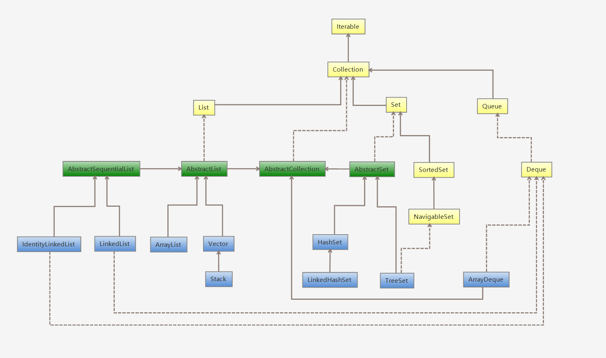
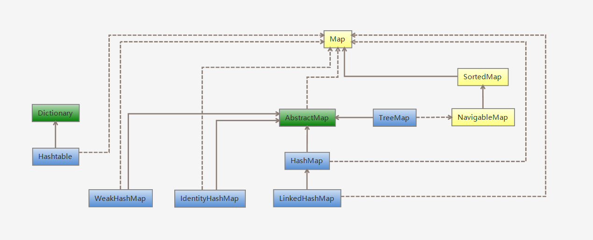
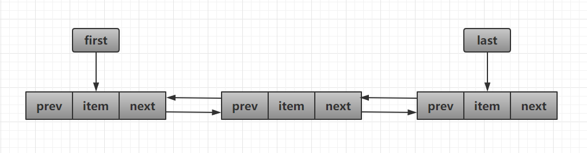
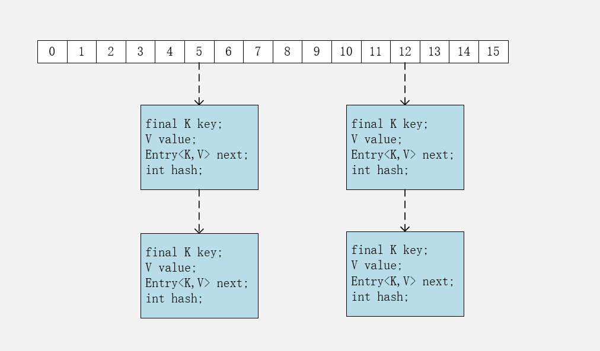
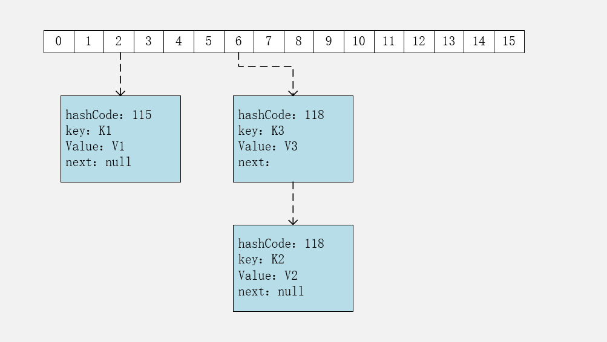

# 一、概述

容器主要包括 **Collection** 和 **Map** 两种：

* Collection 存储着对象的集合
* Map 存储着键值对（两个对象）的映射表。

Collection：



Map：



### 1. Set

- **TreeSet：**基于**红黑树**实现，支持有序性操作，例如根据一个范围查找元素的操作。但是查找效率不如 HashSet，HashSet 查找的时间复杂度为$O(1)$，TreeSet 则为$O(logN)$。
- **HashSet：**基于**哈希表**实现，支持快速查找，但不支持有序性操作。并且失去了元素的插入顺序信息，也就是说使用 Iterator 遍历 HashSet 得到的结果是不确定的。
- **LinkedHashSet：**具有 HashSet 的查找效率，且内部使用双向链表维护元素的插入顺序。

### 2. List

- **ArrayList：**基于**动态数组**实现，支持**随机访问**。
- **Vector：**和 ArrayList 类似，但它是**线程安全**的。
- **LinkedList：**基于**双向链表**实现，只能**顺序访问**，但是可以**快速**地在链表中间**插入**和**删除**元素。不仅如此，LinkedList 还可以用作栈、队列和双向队列。

### 3. Queue

- **LinkedList：**可以用它来实现**双向队列**。
- **PriorityQueue：**基于**堆结构**实现，可以用它来实现**优先队列**。


# 二、源码分析

## ArrayList

#### 1. 类声明

因为 ArrayList 是基于数组实现的，所以支持快速随机访问。RandomAccess 接口标识着该类支持快速随机访问。

```java
public class ArrayList<E> extends AbstractList<E>
        implements List<E>, RandomAccess, Cloneable, java.io.Serializable
```

#### 2.  变量声明

可以看出，**默认初始大小为10**。

```java
/**
* Default initial capacity.
*/
private static final int DEFAULT_CAPACITY = 10;

/**
* Shared empty array instance used for empty instances.
*/
private static final Object[] EMPTY_ELEMENTDATA = {};

/**
* Shared empty array instance used for default sized empty instances. We
* distinguish this from EMPTY_ELEMENTDATA to know how much to inflate when
* first element is added.
* 共享空数组实例，用于默认大小的空实例。
* 我们将其与EMPTY_ELEMENTDATA区分开来，以了解添加第一个元素时应该膨胀多少。
*/
private static final Object[] DEFAULTCAPACITY_EMPTY_ELEMENTDATA = {};

/**
* The array buffer into which the elements of the ArrayList are stored.
* The capacity of the ArrayList is the length of this array buffer. Any
* empty ArrayList with elementData == DEFAULTCAPACITY_EMPTY_ELEMENTDATA
* will be expanded to DEFAULT_CAPACITY when the first element is added.
* 存储ArrayList元素的数组缓冲区。
* ArrayList的容量是这个数组缓冲区的长度。
* 任何带有elementData == DEFAULTCAPACITY_EMPTY_ELEMENTDATA的空ArrayList
* 将在添加第一个元素时扩展为DEFAULT_CAPACITY。
*/
transient Object[] elementData; // non-private to simplify nested class access

/**
* The size of the ArrayList (the number of elements it contains).
*
* @serial
*/
private int size;

/**
* The maximum size of array to allocate (unless necessary).
* Some VMs reserve some header words in an array.
* Attempts to allocate larger arrays may result in
* OutOfMemoryError: Requested array size exceeds VM limit
*/
private static final int MAX_ARRAY_SIZE = Integer.MAX_VALUE - 8;
```

#### 3. 构造函数

可以看到构造函数分为3种：

* **指定容量大小**：因为扩容需要复制数组，代价较高，所以最好是初始化时就指定大小。
* **默认容量大小**：默认值为`DEFAULT_CAPACITY = 10`
* **从现有的集合构造**：也是将集合转为数组，最后复制到当前数组中

```java
/**
* Constructs an empty list with the specified initial capacity.
*/
public ArrayList(int initialCapacity) {
    if (initialCapacity > 0) {
        this.elementData = new Object[initialCapacity];
    } else if (initialCapacity == 0) {
        this.elementData = EMPTY_ELEMENTDATA;
    } else {
        throw new IllegalArgumentException("Illegal Capacity: "+
                                           initialCapacity);
    }
}

/**
* Constructs an empty list with an initial capacity of ten.
*/
public ArrayList() {
    this.elementData = DEFAULTCAPACITY_EMPTY_ELEMENTDATA;
}

/**
* Constructs a list containing the elements of the specified
* collection, in the order they are returned by the collection's
* iterator.
*/
public ArrayList(Collection<? extends E> c) {
    elementData = c.toArray();
    if ((size = elementData.length) != 0) {
        // defend against c.toArray (incorrectly) not returning Object[]
        // (see e.g. https://bugs.openjdk.java.net/browse/JDK-6260652)
        if (elementData.getClass() != Object[].class)
            elementData = Arrays.copyOf(elementData, size, Object[].class);
    } else {
        // replace with empty array.
        this.elementData = EMPTY_ELEMENTDATA;
    }
}
```

#### 4. 添加和扩容

添加元素的时候要检查当前数组是否存满，如果存满了，需要使用`grow()方法`进行扩容。

从源码中可以看出，新容量大小为`oldCapacity + (oldCapacity >> 1)`，也就是原来数组大小的1.5倍。

扩容需要调用`Arrays.copyOf()`方法将原数组复制到新数组中，代价较高，所以就像在讨论构造函数时所说，**最好是在初始化时就指定好容量大小**，减少扩容次数。

```java
private void add(E e, Object[] elementData, int s) {
    if (s == elementData.length)	// 检查是否需要扩容
        elementData = grow();
    elementData[s] = e;
    size = s + 1;
}

public boolean add(E e) {
    modCount++;
    add(e, elementData, size);
    return true;
}

public void add(int index, E element) {
    rangeCheckForAdd(index);
    modCount++;
    final int s;
    Object[] elementData;
    if ((s = size) == (elementData = this.elementData).length)
        elementData = grow();
    System.arraycopy(elementData, index,
                     elementData, index + 1,
                     s - index);
    elementData[index] = element;
    size = s + 1;
}

private Object[] grow(int minCapacity) {
    return elementData = Arrays.copyOf(elementData,
                                       newCapacity(minCapacity));
}

private Object[] grow() {
    return grow(size + 1);
}

private int newCapacity(int minCapacity) {
    // overflow-conscious code
    int oldCapacity = elementData.length;
    int newCapacity = oldCapacity + (oldCapacity >> 1);
    if (newCapacity - minCapacity <= 0) {
        if (elementData == DEFAULTCAPACITY_EMPTY_ELEMENTDATA)
            return Math.max(DEFAULT_CAPACITY, minCapacity);
        if (minCapacity < 0) // overflow
            throw new OutOfMemoryError();
        return minCapacity;
    }
    return (newCapacity - MAX_ARRAY_SIZE <= 0)
        ? newCapacity
        : hugeCapacity(minCapacity);
}
```

#### 5. 删除元素

删除元素需要调用`System.arraycopy()`将`index + 1`后面的元素都复制到前一个位置上，时间复杂度是O(N)，代价较高

```java
public E remove(int index) {
    Objects.checkIndex(index, size);

    modCount++;
    E oldValue = elementData(index);

    int numMoved = size - index - 1;
    if (numMoved > 0)
        System.arraycopy(elementData, index+1, elementData, index,
                         numMoved);
    elementData[--size] = null; // clear to let GC do its work

    return oldValue;
}

public boolean remove(Object o) {
    if (o == null) {
        for (int index = 0; index < size; index++)
            if (elementData[index] == null) {
                fastRemove(index);
                return true;
            }
    } else {
        for (int index = 0; index < size; index++)
            if (o.equals(elementData[index])) {
                fastRemove(index);
                return true;
            }
    }
    return false;
}

private void fastRemove(int index) {
    modCount++;
    int numMoved = size - index - 1;
    if (numMoved > 0)
        System.arraycopy(elementData, index+1, elementData, index,
                         numMoved);
    elementData[--size] = null; // clear to let GC do its work
}
```

#### 6. 快速失败（fail—fast）

> 快速失败（fail—fast）：在用迭代器遍历一个集合对象时，如果遍历过程中对集合对象的内容进行了修改（增加、删除、修改），则会抛出Concurrent Modification Exception。

`modCount` 用来记录 ArrayList **结构发生变化**的次数。

**结构发生变化**是指添加或者删除至少一个元素的所有操作，或者是调整内部数组的大小，仅仅只是设置元素的值不算结构发生变化。

在进行序列化或者迭代等操作时，需要比较操作前后 `modCount `是否改变，如果改变了需要抛出 `ConcurrentModificationException`。

```java
private void writeObject(java.io.ObjectOutputStream s)
    throws java.io.IOException {
    // Write out element count, and any hidden stuff
    int expectedModCount = modCount;
    s.defaultWriteObject();

    // Write out size as capacity for behavioural compatibility with clone()
    s.writeInt(size);

    // Write out all elements in the proper order.
    for (int i=0; i<size; i++) {
        s.writeObject(elementData[i]);
    }

    if (modCount != expectedModCount) {
        throw new ConcurrentModificationException();
    }
}
```

下面是迭代器部分的源码，可以看到，在对其进行操作前，要比较前后modCount是否改变。

**注意**：单线程环境下，`remove()`方法最后会让`expectModCount`和`modCount`相等，所以不会抛出异常。

```java
private class Itr implements Iterator<E> {
    int cursor;       // index of next element to return
    int lastRet = -1; // index of last element returned; -1 if no such
    int expectedModCount = modCount;

    // prevent creating a synthetic constructor
    Itr() {}

    public boolean hasNext() {
        return cursor != size;
    }

    @SuppressWarnings("unchecked")
    public E next() {
        checkForComodification();
        int i = cursor;
        if (i >= size)
            throw new NoSuchElementException();
        Object[] elementData = ArrayList.this.elementData;
        if (i >= elementData.length)
            throw new ConcurrentModificationException();
        cursor = i + 1;
        return (E) elementData[lastRet = i];
    }

    public void remove() {
        if (lastRet < 0)
            throw new IllegalStateException();
        checkForComodification();

        try {
            ArrayList.this.remove(lastRet);
            cursor = lastRet;
            lastRet = -1;
            expectedModCount = modCount;
        } catch (IndexOutOfBoundsException ex) {
            throw new ConcurrentModificationException();
        }
    }

    @Override
    public void forEachRemaining(Consumer<? super E> action) {
        Objects.requireNonNull(action);
        final int size = ArrayList.this.size;
        int i = cursor;
        if (i < size) {
            final Object[] es = elementData;
            if (i >= es.length)
                throw new ConcurrentModificationException();
            for (; i < size && modCount == expectedModCount; i++)
                action.accept(elementAt(es, i));
            // update once at end to reduce heap write traffic
            cursor = i;
            lastRet = i - 1;
            checkForComodification();
        }
    }

    final void checkForComodification() {
        if (modCount != expectedModCount)
            throw new ConcurrentModificationException();
    }
}
```


## Vector

它的实现与ArrayList类似，但是它是**线程安全**的，方法使用了**synchronized进行同步**。

#### 1. 类声明

RandomAccess 接口标识着该类支持快速随机访问。

```java
public class Vector<E>
    extends AbstractList<E>
    implements List<E>, RandomAccess, Cloneable, java.io.Serializable
```

#### 2. 变量声明

```java
/**
* The array buffer into which the components of the vector are
* stored. The capacity of the vector is the length of this array buffer,
* and is at least large enough to contain all the vector's elements.
*
* <p>Any array elements following the last element in the Vector are null.
*	
* @serial
*/
protected Object[] elementData;

/**
* The number of valid components in this {@code Vector} object.
* Components {@code elementData[0]} through
* {@code elementData[elementCount-1]} are the actual items.
*
* @serial
*/
protected int elementCount;			// size()方法

/**
* The amount by which the capacity of the vector is automatically
* incremented when its size becomes greater than its capacity.  If
* the capacity increment is less than or equal to zero, the capacity
* of the vector is doubled each time it needs to grow.
*
* @serial
*/
protected int capacityIncrement;	// 用于扩容
```

#### 3. 构造函数

构造函数有4种：

* **指定初始容量和扩容增量：**使用初始容量，扩容时使用扩容增量（原来容量 + 扩容增量）
* **指定初始容量：**扩容增量为0（扩容时2倍），也就是说默认情况下，每次扩容为原来的2倍
* **使用默认值：**默认初始容量为10，扩容增量为0
* **从现有的集合构造：**将集合转为数组，复制进去

```java
public Vector(int initialCapacity, int capacityIncrement) {
    super();
    if (initialCapacity < 0)
        throw new IllegalArgumentException("Illegal Capacity: "+
                                           initialCapacity);
    this.elementData = new Object[initialCapacity];
    this.capacityIncrement = capacityIncrement;
}

public Vector(int initialCapacity) {
    this(initialCapacity, 0);
}

public Vector() {
    this(10);
}

public Vector(Collection<? extends E> c) {
    elementData = c.toArray();
    elementCount = elementData.length;
    // defend against c.toArray (incorrectly) not returning Object[]
    // (see e.g. https://bugs.openjdk.java.net/browse/JDK-6260652)
    if (elementData.getClass() != Object[].class)
        elementData = Arrays.copyOf(elementData, elementCount, Object[].class);
}
```

#### 4. 添加和扩容

添加时会判断是否还有容量添加，如果不够，那么使用`grow()`函数进行扩容。

如何扩容根据成员变量`capacityIncrement`决定

* 如果`capacityIncrement <= 0`，那么`新容量 = 老容量 * 2`，即：`newCapacity = oldCapacity + oldCapacity;`
* 如果`capacityIncrement > 0`，那么`新容量 = 老容量 + capacityIncrement`，即：`newCapacity = oldCapacity + capacityIncrement;`

根据上述构造函数可以发现：如果没有指定`capacityIncrement`，那么**默认为0**，也就是说，**默认情况下，Vector每次扩容容量都会翻倍。**

```java
private void add(E e, Object[] elementData, int s) {
    if (s == elementData.length)
        elementData = grow();
    elementData[s] = e;
    elementCount = s + 1;
}

public synchronized boolean add(E e) {
    modCount++;
    add(e, elementData, elementCount);
    return true;
}

private Object[] grow(int minCapacity) {
    return elementData = Arrays.copyOf(elementData,
                                       newCapacity(minCapacity));
}

private Object[] grow() {
    return grow(elementCount + 1);
}

private int newCapacity(int minCapacity) {
    // overflow-conscious code
    int oldCapacity = elementData.length;
    int newCapacity = oldCapacity + ((capacityIncrement > 0) ?
                                     capacityIncrement : oldCapacity);
    if (newCapacity - minCapacity <= 0) {
        if (minCapacity < 0) // overflow
            throw new OutOfMemoryError();
        return minCapacity;
    }
    return (newCapacity - MAX_ARRAY_SIZE <= 0)
        ? newCapacity
        : hugeCapacity(minCapacity);
}
```

#### 5. 与 ArrayList 的比较

- Vector 是同步的，因此开销就比 ArrayList 要大，访问速度更慢。最好使用 ArrayList 而不是 Vector，因为同步操作完全可以由程序员自己来控制；
- Vector 每次扩容请求其大小的 2 倍（也可以通过构造函数设置增长的容量），而 ArrayList 是 1.5 倍。

#### 6. 替代方案

##### 方案一：

可以使用 `Collections.synchronizedList();` 得到一个线程安全的 ArrayList。

```java
List<String> list = new ArrayList<>();
List<String> synList = Collections.synchronizedList(list);
```

原理如下：

调用`Collections.synchronizedList(list)`，会调用`new SynchronizedRandomAccessList<>(list)`

```java
public static <T> List<T> synchronizedList(List<T> list) {
    return (list instanceof RandomAccess ?
            new SynchronizedRandomAccessList<>(list) :
            new SynchronizedList<>(list));
}
```

`SynchronizedRandomAccessList`是类`Collections`的一个内部类，继承自`SynchronizedList`，所以会调用父类的构造方法

```java
static class SynchronizedRandomAccessList<E>
        extends SynchronizedList<E>
        implements RandomAccess {

        SynchronizedRandomAccessList(List<E> list) {
            super(list);
        }
        // ...
}
```

`SynchronizedList`是类`Collections`的另一个内部类，继承自`SynchronizedCollection`，继续调用父类的构造方法，内部有许多List特有的方法，用`synchronized`修饰了一下，使其线程安全

```java
static class SynchronizedList<E>
        extends SynchronizedCollection<E>
        implements List<E> {

        final List<E> list;

        SynchronizedList(List<E> list) {
            super(list);
            this.list = list;
        }
        // 内部定义了许多使用synchronized修饰的方法，主要是List特有的方法
        public void add(int index, E element) {
            synchronized (mutex) {list.add(index, element);}
        }
        public E remove(int index) {
            synchronized (mutex) {return list.remove(index);}
        }
        // ...
}
```

`SynchronizedCollection`是类`Collections`的另一个内部类，内部定义了许多集合共有的方法，用`synchronized`修饰，使其线程安全

```java
static class SynchronizedCollection<E> implements Collection<E>, Serializable {
    final Collection<E> c;  // Backing Collection
    final Object mutex;     // Object on which to synchronize

    SynchronizedCollection(Collection<E> c) {
        this.c = Objects.requireNonNull(c);
        mutex = this;
    }

    // 内部定义了许多使用synchronized修饰的方法，集合共有的方法
    public boolean add(E e) {
        synchronized (mutex) {return c.add(e);}
    }
    public boolean remove(Object o) {
        synchronized (mutex) {return c.remove(o);}
    }
    // ...
}
```


##### 方案二：// TODO:

也可以使用 concurrent 并发包下的 CopyOnWriteArrayList 类。

```java
List<String> list = new CopyOnWriteArrayList<>();
```


## LinkedList

#### 1. 概述

基于**双向链表**实现，使用Node存储链表节点信息。

```java
private static class Node<E> {
    E item;
    Node<E> next;
    Node<E> prev;

    Node(Node<E> prev, E element, Node<E> next) {
        this.item = element;
        this.next = next;
        this.prev = prev;
    }
}
```

每个链表有first和last指针，指向首尾节点。

```java
transient Node<E> first;

transient Node<E> last;
```



#### 2. 与 ArrayList 的比较

- ArrayList 基于动态数组实现，LinkedList 基于双向链表实现；
- ArrayList 支持随机访问，LinkedList 不支持；
- LinkedList 在任意位置添加删除元素更快。
- 都**不是线程安全**的


## HashMap

HashMap可以分为两个版本解读，JDK7和JDK8，两个版本有着很大的不同，可以说JDK7 的设计存在一些缺陷，而JDK8对其进行了相当大的改进。

### 1. JDK7的HashMap

经典的哈希表实现：**数组 + 链表**，并且使用**拉链法**解决冲突问题。

#### 1.1 存储结构

包含了一个Entry类型的数组table

```java
transient Entry<K,V>[] table = (Entry<K,V>[]) EMPTY_TABLE;

static class Entry<K,V> implements Map.Entry<K,V> {
        final K key;
        V value;
        Entry<K,V> next;
        int hash;
		// ...
}       
```

从代码中可以看到，Entry存储了键值对。包含了4个字段，从next字段可以看出，**Entry是一个链表**。

数组中的**每个位置被当成一个桶，一个桶存放一个链表**。

使用**拉链法**解决冲突，同一个链表中存放**哈希值和散列桶取模运算**结果**相同**的Entry。




#### 1.2 拉链法的工作原理

```java
HashMap<String, String> map = new HashMap<>();
map.put("K1", "V1");
map.put("K2", "V2");
map.put("K3", "V3");
```

- 新建一个 HashMap，默认大小为 16；
- 插入 <K1,V1> 键值对，先计算 K1 的 hashCode 为 115，使用除留余数法得到所在的桶下标 115%16=3。
- 插入 <K2,V2> 键值对，先计算 K2 的 hashCode 为 118，使用除留余数法得到所在的桶下标 118%16=6。
- 插入 <K3,V3> 键值对，先计算 K3 的 hashCode 为 118，使用除留余数法得到所在的桶下标 118%16=6，插在 <K2,V2> 前面。

应该注意到链表的插入是以头插法方式进行的，例如上面的 <K3,V3> 不是插在 <K2,V2> 后面，而是插入在链表头部。

查找需要分成两步进行：

- 计算键值对所在的桶；
- 在链表上顺序查找，时间复杂度显然和链表的长度成正比。




#### 1.3 put操作

```java
public V put(K key, V value) {
    // hashmap一开始不申请内存，直到使用时才初始化
    if (table == EMPTY_TABLE) {
        inflateTable(threshold);
    }
    
    // 对null键单独操作
    if (key == null)
        return putForNullKey(value);
    int hash = hash(key);
    
    // 确认桶下标
    int i = indexFor(hash, table.length);
    for (Entry<K,V> e = table[i]; e != null; e = e.next) {
        Object k;
        // 如果存在该键，那么更新value
        if (e.hash == hash && ((k = e.key) == key || key.equals(k))) {
            V oldValue = e.value;
            e.value = value;
            e.recordAccess(this);
            return oldValue;
        }
    }
    modCount++;
    // 不存在该键，存入键值对
    addEntry(hash, key, value, i);
    return null;
}
```

 HashMap 允许插入键为 null 的键值对。但是因为无法调用 null 的 hashCode() 方法，也就无法确定该键值对的桶下标，只能通过强制指定一个桶下标来存放。HashMap 使用第 0 个桶存放键为 null 的键值对。 

```java
private V putForNullKey(V value) {
    for (Entry<K,V> e = table[0]; e != null; e = e.next) {
        // 存在null键，那么更新value
        if (e.key == null) {
            V oldValue = e.value;
            e.value = value;
            e.recordAccess(this);
            return oldValue;
        }
    }
    modCount++;
    // 不存在null键，添加null键值对
    addEntry(0, null, value, 0);
    return null;
}
```

 使用链表的**头插法**，也就是新的键值对插在链表的头部，而不是链表的尾部。 

```java
void addEntry(int hash, K key, V value, int bucketIndex) {
    if ((size >= threshold) && (null != table[bucketIndex])) {
        resize(2 * table.length);
        hash = (null != key) ? hash(key) : 0;
        bucketIndex = indexFor(hash, table.length);
    }

    createEntry(hash, key, value, bucketIndex);
}

void createEntry(int hash, K key, V value, int bucketIndex) {
    Entry<K,V> e = table[bucketIndex];
    // 头插法，链表头部指向新的键值对
    // 新节点的next指向e中保存的原来的头
    table[bucketIndex] = new Entry<>(hash, key, value, e);
    size++;
}
```


#### 1.4 确定桶下标

```java
int hash = hash(key);
int i = indexFor(hash, table.length);
```

##### 1.4.1 计算hash值

从注释中可以看出，写了这么复杂的hash函数的主要原因就是，**防止一些质量低的哈希函数造成在低比特位上的碰撞太多**

```java
/**
* Retrieve object hash code and applies a supplemental hash function to the
* result hash, which defends against poor quality hash functions.  This is
* critical because HashMap uses power-of-two length hash tables, that
* otherwise encounter collisions for hashCodes that do not differ
* in lower bits. Note: Null keys always map to hash 0, thus index 0.
*/
final int hash(Object k) {
    int h = hashSeed;
    if (0 != h && k instanceof String) {
        return sun.misc.Hashing.stringHash32((String) k);
    }

    h ^= k.hashCode();

    // This function ensures that hashCodes that differ only by
    // constant multiples at each bit position have a bounded
    // number of collisions (approximately 8 at default load factor).
    h ^= (h >>> 20) ^ (h >>> 12);
    return h ^ (h >>> 7) ^ (h >>> 4);
}
```

##### 1.4.2 取模

令 `x = 1<<4`，即 x 为 2 的 4 次方，它具有以下性质：

```
x   : 0001 0000
x-1 : 0000 1111
```

令一个数 y 与 x-1 做与运算，可以去除 y 位级表示的第 4 位以上数：

```
y       : 1011 0010
x-1     : 0000 1111
y&(x-1) : 0000 0010
```

这个性质和 y 对 x 取模效果是一样的：

```
y   : 1011 0010
x   : 0001 0000
y%x : 0000 0010
```

我们知道，位运算的代价比求模运算小的多，因此在进行这种计算时用位运算的话能带来更高的性能。

确定桶下标的最后一步是将 key 的 hash 值对桶个数取模：`hash % capacity`，**如果能保证 capacity 为 2 的 n 次方，那么就可以将这个操作转换为位运算。**

```java
static int indexFor(int h, int length) {
    return h & (length-1);
}
```

由此，可以得出一个面试题的答案。

> Q：为什么hashmap的容量要是2的n次幂？
>
> A： 由于将取模操作转化为位运算，需要capacity为2的幂数。


#### 1.5 扩容

设 HashMap 的 table 长度为 $M$，需要存储的键值对数量为 $N$，如果哈希函数满足均匀性的要求，那么每条链表的长度大约为 $N/M$，因此平均查找次数的复杂度为 $O(N/M)$。

为了让查找的成本降低，应该尽可能使得$ N/M$ 尽可能小，因此需要保证 M 尽可能大，也就是说 table 要尽可能大。HashMap 采用动态扩容来根据当前的 N 值来调整 M 值，使得空间效率和时间效率都能得到保证。

和扩容相关的参数主要有：`capacity、size、threshold 和 load_factor`。

| 参数       | 含义                                                         |
| ---------- | ------------------------------------------------------------ |
| capacity   | table 的容量大小，默认为 16。需要注意的是 capacity 必须保证为 2 的 n 次方。 |
| size       | 键值对数量。                                                 |
| threshold  | size 的临界值，当 size 大于等于 threshold 就必须进行扩容操作。 |
| loadFactor | 装载因子，table 能够使用的比例，threshold = (int)(newCapacity * loadFactor)。 |

```java
static final int DEFAULT_INITIAL_CAPACITY = 16;

static final int MAXIMUM_CAPACITY = 1 << 30;

static final float DEFAULT_LOAD_FACTOR = 0.75f;

transient Entry[] table;

transient int size;

int threshold;

final float loadFactor;

transient int modCount;
```

从下面的添加元素的代码可以看出，当需要扩容时，capacity为原来的2倍。

```java
void addEntry(int hash, K key, V value, int bucketIndex) {
    if ((size >= threshold) && (null != table[bucketIndex])) {
        resize(2 * table.length);
        hash = (null != key) ? hash(key) : 0;
        bucketIndex = indexFor(hash, table.length);
    }

    createEntry(hash, key, value, bucketIndex);
}
```

扩容使用resize()实现，扩容操作需要调用transfer()函数，把所有的oldTable中的键值对重新插入到newTable中，这一步是非常耗时的，所以，**建议在声明HashMap时指定容量，以空间换时间。**

```java
void resize(int newCapacity) {
    Entry[] oldTable = table;
    int oldCapacity = oldTable.length;
    if (oldCapacity == MAXIMUM_CAPACITY) {
        threshold = Integer.MAX_VALUE;
        return;
    }

    Entry[] newTable = new Entry[newCapacity];
    transfer(newTable, initHashSeedAsNeeded(newCapacity));
    table = newTable;
    threshold = (int)Math.min(newCapacity * loadFactor, MAXIMUM_CAPACITY + 1);
}

/**
* Transfers all entries from current table to newTable.
*/
void transfer(Entry[] newTable, boolean rehash) {
    int newCapacity = newTable.length;
    for (Entry<K,V> e : table) {
        while(null != e) {
            Entry<K,V> next = e.next;
            if (rehash) {
                e.hash = null == e.key ? 0 : hash(e.key);
            }
            int i = indexFor(e.hash, newCapacity);
            e.next = newTable[i];
            newTable[i] = e;
            e = next;
        }
    }
}
```

#### 1.6 扩容 - 重新计算数组下标

在进行扩容时，需要把键值对重新计算桶下标，从而放到对应的桶上。在前面提到，HashMap 使用 `hash % capacity ​`来确定桶下标。

HashMap capacity 为 2 的 n 次方这一特点能够极大降低重新计算桶下标操作的复杂度。

假设原数组长度 capacity 为 16，扩容之后 new capacity 为 32：

```html
capacity     : 0001 0000
new capacity : 0010 0000
```

对于一个 Key，它的哈希值 hash 在第 5 位：

- 为 0，那么 hash % 0001 0000 = hash % 0010 0000，桶位置和原来一致；
- 为 1，hash % 0001 0000 = hash % 0010 0000 + 16，桶位置是原位置 + 16。

#### 1.7 潜在的隐患

* 非常容易碰到死锁 
  * 搜索：coolshell hashmap
* CVE-2011-4858，Tomcat邮件组的讨论


### 2. JDK8的HashMap

JDK8的改进：

* 数组 + 链表 / 红黑树
* 扩容时插入顺序的改进
* 函数方法
  * forEach
  * compute系列
* Map的新api
  * merge
  * replace


#### 2.1 几个参数

下面的注释，说出了为什么树化阈值为8

```java
/*   
 * Because TreeNodes are about twice the size of regular nodes, we
 * use them only when bins contain enough nodes to warrant use
 * (see TREEIFY_THRESHOLD). And when they become too small (due to
 * removal or resizing) they are converted back to plain bins.  In
 * usages with well-distributed user hashCodes, tree bins are
 * rarely used.  Ideally, under random hashCodes, the frequency of
 * nodes in bins follows a Poisson distribution
 * (http://en.wikipedia.org/wiki/Poisson_distribution) with a
 * parameter of about 0.5 on average for the default resizing
 * threshold of 0.75, although with a large variance because of
 * resizing granularity. Ignoring variance, the expected
 * occurrences of list size k are (exp(-0.5) * pow(0.5, k) /
 * factorial(k)). The first values are:
 *
 * 0:    0.60653066
 * 1:    0.30326533
 * 2:    0.07581633
 * 3:    0.01263606
 * 4:    0.00157952
 * 5:    0.00015795
 * 6:    0.00001316
 * 7:    0.00000094
 * 8:    0.00000006
 * more: less than 1 in ten million
 */
```

根据注释可以看出，只有当桶中的元素足够多的时候（TREEIFY_THRESHOLD），才会树化，变成红黑树结构。当扩容或者删除节点，桶中元素变少时，又会从树结构变回链表结构。

当使用分布非常好得hashCode的时候，红黑树很少被用到。

**理想情况下，在完全随机的hashCode中，桶中节点数符合泊松分布，当桶中节点数为8时的概率已经足够小了，所以选择8作为阈值**。


#### 2.2 构造函数中的容量计算

```java
public HashMap(int initialCapacity, float loadFactor) {
    if (initialCapacity < 0)
        throw new IllegalArgumentException("Illegal initial capacity: " +
                                           initialCapacity);
    if (initialCapacity > MAXIMUM_CAPACITY)
        initialCapacity = MAXIMUM_CAPACITY;
    if (loadFactor <= 0 || Float.isNaN(loadFactor))
        throw new IllegalArgumentException("Illegal load factor: " +
                                           loadFactor);
    this.loadFactor = loadFactor;
    this.threshold = tableSizeFor(initialCapacity);
}
```

HashMap 构造函数允许用户传入的容量不是 2 的 n 次方，因为它可以自动地将传入的容量转换为 2 的 n 次方。

先考虑如何求一个数的掩码，对于 `1001 0000`，它的掩码为 `1111 1111`，可以使用以下方法得到：

```
mask |= mask >> 1    1101 1000
mask |= mask >> 2    1111 1110
mask |= mask >> 4    1111 1111
```

mask+1 是大于原始数字的最小的 2 的 n 次方。

```
num      1001 0000
mask + 1 1000 0000
```

以下是 HashMap 中计算数组容量的代码：

```java
static final int tableSizeFor(int cap) {
    int n = cap - 1;
    n |= n >>> 1;
    n |= n >>> 2;
    n |= n >>> 4;
    n |= n >>> 8;
    n |= n >>> 16;
    return (n < 0) ? 1 : (n >= MAXIMUM_CAPACITY) ? MAXIMUM_CAPACITY : n + 1;
}
```

#### 2.3 put操作

```java
final V putVal(int hash, K key, V value, boolean onlyIfAbsent,
               boolean evict) {
    Node<K,V>[] tab; Node<K,V> p; int n, i;
    // 没初始化，进行初始化
    if ((tab = table) == null || (n = tab.length) == 0)
        n = (tab = resize()).length;
    // 桶中无节点，直接添加
    if ((p = tab[i = (n - 1) & hash]) == null)
        tab[i] = newNode(hash, key, value, null);
    else {
        Node<K,V> e; K k;
        // 存在相同键值，保存到e中，后续覆盖
        if (p.hash == hash &&
            ((k = p.key) == key || (key != null && key.equals(k))))
            e = p;
       // 节点是红黑树，使用红黑树的插入操作
        else if (p instanceof TreeNode)
            e = ((TreeNode<K,V>)p).putTreeVal(this, tab, hash, key, value);
        else {	// 节点是链表
            for (int binCount = 0; ; ++binCount) {
                if ((e = p.next) == null) {
                    // 链表中没找到，插入一个新节点
                    p.next = newNode(hash, key, value, null);
                    // 如果超过了变树阈值，进行树化
                    if (binCount >= TREEIFY_THRESHOLD - 1) // -1 for 1st
                        treeifyBin(tab, hash);
                    break;
                }
                // 存在相同键值，已经存到了e中，后续覆盖
                if (e.hash == hash &&
                    ((k = e.key) == key || (key != null && key.equals(k))))
                    break;
                p = e;
            }
        }
        // 上面找到了键相同的节点，那么覆盖掉对应的value
        if (e != null) { 
            V oldValue = e.value;
            if (!onlyIfAbsent || oldValue == null)
                e.value = value;
            afterNodeAccess(e);
            return oldValue;
        }
    }
    ++modCount;
    if (++size > threshold)
        resize();
    afterNodeInsertion(evict);
    return null;
}
```

