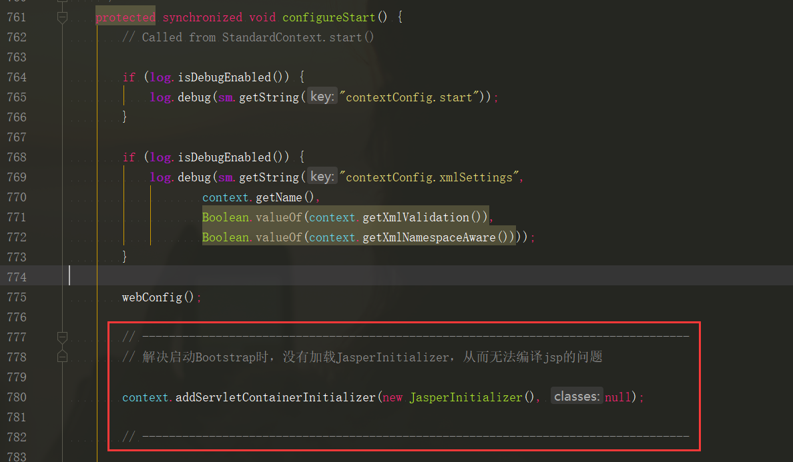

Tomcat目录：

* bin/：存放启动、关闭等批处理脚本文件
  * startup.bat，startup.sh：用于windows和linux下的启动脚本
  * shutdown.bat，shutdown.sh：用于windows和linux下的停止脚本
* conf/：存放Tomcat的相关配置文件
  * Catalina：用于存储针对每个虚拟机的Context配置
  * context.xml：用于定义所有web应用均需加载的Context配置，如果web应用指定了自己的context.xml，该文件将被覆盖
  * catalina.properties：Tomcat的环境变量配置
  * catalina.policy：Tomcat运行的安全策略配置
  * logging.properties：Tomcat的日志配置文件，可以通过该文件修改Tomcat的日志级别及日志路径等
  * server.xml：Tomcat服务器的核心配置文件
  * tomcat-users.xml：定义Tomcat默认的用户及角色映射信息配置
  * web.xml：Tomcat中所有应用默认的部署描述文件，主要定义了基础Service和MIME映射
* lib/：Tomcat服务器的依赖包
* logs/：Tomcat默认的日志存放目录
* temp/：临时文件目录
* webapps/：Tomcat默认的Web应用部署目录
* work/：Web应用jsp代码生成和编译的临时目录


## Tomcat源码导入

##### 1. tomcat官网下载源码包

##### 2. idea创建一个空项目

##### 3. 将源码包解压到空项目的目录中

##### 4. 进入解压后的文件夹中，创建home目录，将conf和webapps目录移入home目录中

##### 5. 继续在该目录中，创建pom.xml

```xml
<?xml version="1.0" encoding="UTF-8"?>
<project xmlns="http://maven.apache.org/POM/4.0.0"
         xmlns:xsi="http://www.w3.org/2001/XMLSchema-instance"
         xsi:schemaLocation="http://maven.apache.org/POM/4.0.0 http://maven.apache.org/xsd/maven-4.0.0.xsd">

    <modelVersion>4.0.0</modelVersion>
    <groupId>org.apache.tomcat</groupId>
    <artifactId>apache-tomcat-8.5.42-src</artifactId>
    <name>Tomcat8.5</name>
    <version>8.5</version>

    <dependencies>
        <dependency>
            <groupId>junit</groupId>
            <artifactId>junit</artifactId>
            <version>4.12</version>
            <scope>test</scope>
        </dependency>

        <dependency>
            <groupId>org.easymock</groupId>
            <artifactId>easymock</artifactId>
            <version>3.4</version>
        </dependency>

        <dependency>
            <groupId>org.apache.ant</groupId>
            <artifactId>ant</artifactId>
            <version>1.9.5</version>
        </dependency>

        <dependency>
            <groupId>javax.xml.rpc</groupId>
            <artifactId>javax.xml.rpc-api</artifactId>
            <version>1.1</version>
        </dependency>

        <dependency>
            <groupId>wsdl4j</groupId>
            <artifactId>wsdl4j</artifactId>
            <version>1.6.2</version>
        </dependency>

        <dependency>
            <groupId>org.eclipse.jdt.core.compiler</groupId>
            <artifactId>ecj</artifactId>
            <version>4.5.1</version>
        </dependency>
    </dependencies>

    <build>
        <finalName>Tomcat8.5</finalName>
        <sourceDirectory>java</sourceDirectory>
        <resources>
            <resource>
                <directory>java</directory>
            </resource>
        </resources>
        <plugins>
            <plugin>
                <groupId>org.apache.maven.plugins</groupId>
                <artifactId>maven-compiler-plugin</artifactId>
                <version>3.1</version>
                <configuration>
                    <encoding>UTF-8</encoding>
                    <source>1.8</source>
                    <target>1.8</target>
                </configuration>
            </plugin>
        </plugins>
    </build>
</project>
```

##### 6. 在idea的maven窗口中，点击加号，选择刚刚创建的pom.xml

##### 7. 配置启动类

点击`Run/Debug Configurations`选项，点击加号，选择`Application`


配置启动类和虚拟机参数：


启动类：

```java
org.apache.catalina.startup.Bootstrap
```


```xml
-Dcatalina.home=G:/TLX/Documents/Java/tomcat_src/apache-tomcat-9.0.27-src/home
-Dcatalina.base=G:/TLX/Documents/Java/tomcat_src/apache-tomcat-9.0.27-src/home
-Djava.util.logging.manager=org.apache.juli.ClassLoaderLogManager 
-Djava.util.logging.config.file=G:/TLX/Documents/Java/tomcat_src/apache-tomcat-9.0.27-src/home/conf/logging.properties
```

##### 8. 点击调试，运行成功后，访问 localhost:8080

注：`JDTCompiler.java`中有几个常量始终找不到，导致不能运行，所以将其注释了


出现上述异常的原因，是我们直接启动`org.apache.catalina.startup.Bootstrap`的时候没有加载`JasperInitializer`，从而无法编译Jsp。

解决方法是在tomcat源码`ContextConfig`中的`configureStart函数`中手动将Jsp解析器初始化。

```java
context.addServletContainerInitializer(new JasperInitializer(), null);
```



##### 9. 重新运行，即可正常访问tomcat