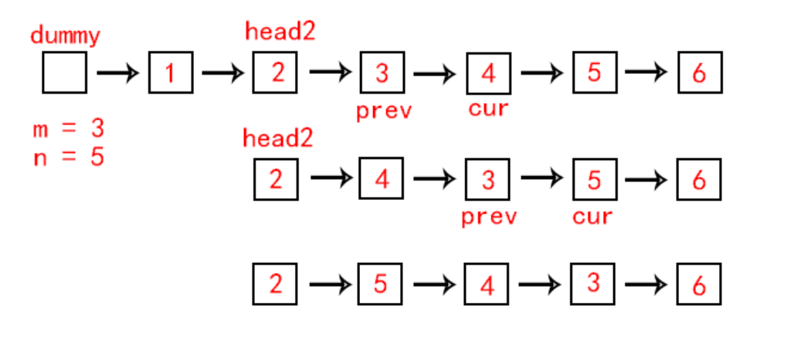

# [Reverse Linked List II][1]

> Reverse a linked list from position *m* to *n*. Do it in one-pass.
>
> **Note:** 1 ≤ *m* ≤ *n* ≤ length of list.
>
> **Example:**
>
> ```java
> Input: 1->2->3->4->5->NULL, m = 2, n = 4
> Output: 1->4->3->2->5->NULL
> ```


## 方法一：

循环遍历链表，记住m前一个节点，m节点，n节点，n后一个节点，reverse从m到n的节点，最后将三部分拼接。

代码如下：

```java
/**
 * Definition for singly-linked list.
 * public class ListNode {
 *     int val;
 *     ListNode next;
 *     ListNode(int x) { val = x; }
 * }
 */
class Solution {
    public ListNode reverseBetween(ListNode head, int m, int n) {
        ListNode dummy = new ListNode(0);
        dummy.next = head;
        ListNode newHead = dummy;
        ListNode newTail = head;
        ListNode prev = dummy;
        ListNode curr = head;
        for (int i = 1; i <= n; i++) {
            if (i >= m) {
                ListNode temp = curr.next;
                curr.next = prev;
                prev = curr;
                curr = temp;
            } else {
                newHead = newHead.next;
                newTail = newTail.next;
                curr = curr.next;
                prev = prev.next;
            }
        }
        newHead.next = prev;
        newTail.next = curr;
        return dummy.next;
    }
}
```


## 方法二：头插法

找到第m个节点，声明head2指向它，以head2为头结点，将后续节点依次插入head2后（头插法）



```c++
class Solution {
public:
	ListNode* reverseBetween(ListNode* head, int m, int n)
	{
		ListNode *dummy = new ListNode(-1);
		dummy->next = head;

		ListNode *prev = dummy;
		for (int i = 0; i < m - 1; i++)
			prev = prev->next;
		ListNode *head2 = prev;

		prev = head2->next;
		ListNode *cur = prev->next;
		for (int i = m; i < n; i++)
		{
			prev->next = cur->next;
			cur->next = head2->next;
			head2->next = cur;
			cur = prev->next;
		}
		return dummy->next;
	}
};
```


[1]: https://leetcode.com/problems/reverse-linked-list-ii/