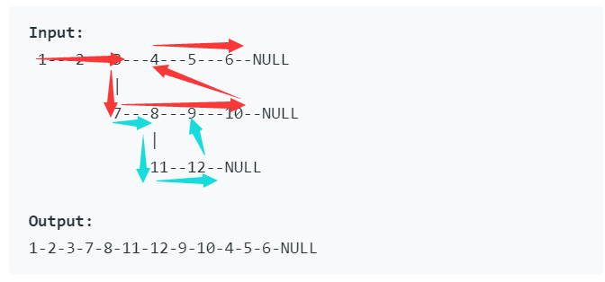

# [Flatten a Multilevel Doubly Linked List Medium][1]

> You are given a doubly linked list which in addition to the next and previous pointers, it could have a child pointer, which may or may not point to a separate doubly linked list. These child lists may have one or more children of their own, and so on, to produce a multilevel data structure, as shown in the example below.
>
> Flatten the list so that all the nodes appear in a single-level, doubly linked list. You are given the head of the first level of the list.
>
>  
>
> **Example:**
>
> ```
> Input:
>  1---2---3---4---5---6--NULL
>          |
>          7---8---9---10--NULL
>              |
>              11--12--NULL
> 
> Output:
> 1-2-3-7-8-11-12-9-10-4-5-6-NULL
> ```


## 方法一：递归

* 空链表返回空
* 将当前节点加入新链，如果当前节点有child，递归child
* 递归调用时，注意保存指针位置，递归函数调用后，主要新链指针位置，并将child设空
* 最后，记得将指向哨兵节点的prev设为空


代码如下：

```java
/*
// Definition for a Node.
class Node {
    public int val;
    public Node prev;
    public Node next;
    public Node child;

    public Node() {}

    public Node(int _val,Node _prev,Node _next,Node _child) {
        val = _val;
        prev = _prev;
        next = _next;
        child = _child;
    }
};
*/
class Solution {
    public Node flatten(Node head) {
        if (head == null)
            return null;
        Node dummy = new Node();
        Node pnew = dummy;
        Node p = head;
        
        while (p != null) {
            pnew.next = p;
            p.prev = pnew;
            pnew = pnew.next;
            Node temp = p.next;		// 保存指针位置
            // pnew.next = null; // 可有可无
            if (p.child != null) {
                pnew.next = flatten(p.child);
                p.child = null;		// 将child设置空
                pnew.next.prev = pnew;
                while (pnew.next != null) {	// 调整新链指针位置
                    pnew = pnew.next;
                }
            }
            p = temp;
        }
        dummy.next.prev = null;	// 指向哨兵节点的prev设空
        return dummy.next;
    }
}
```


## 高票方法：

### 方法一：递归

```java
public Node flatten(Node head) {
    	flattentail(head);
    	return head;
}

// flattentail: flatten the node "head" and return the tail in its child (if exists)
// the tail means the last node after flattening "head"

// Five situations:
// 1. null - no need to flatten, just return it
// 2. no child, no next - no need to flatten, it is the last element, just return it
// 3. no child, next - no need to flatten, go next
// 4. child, no next - flatten the child and done
// 5. child, next - flatten the child, connect it with the next, go next

private Node flattentail(Node head) {
    if (head == null) return head; // CASE 1
    if (head.child == null) {
        if (head.next == null) return head; // CASE 2
        return flattentail(head.next); // CASE 3
    }
    else {
        Node child = head.child;  
        head.child = null;
        Node next = head.next;
        Node childtail = flattentail(child);
        head.next = child;
        child.prev = head;  
        if (next != null) { // CASE 5
            childtail.next = next;
            next.prev = childtail;
            return flattentail(next);
        }
        return childtail; // CASE 4
    }	   	
}
```

* 有些递归情况用循环实现应该更好


## 方法二：

1. Start form the `head` , move one step each time to the next node
2. When meet with a node with child, say node `p`, follow its `child chain` to the end and connect the tail node with `p.next`, by doing this we merged the `child chain` back to the `main thread`
3. Return to `p` and proceed until find next node with child.
4. Repeat until reach `null`

```java
public Node flatten(Node head) {
    if( head == null) return head;
    // Pointer
    Node p = head; 
    while( p!= null) {
        /* CASE 1: if no child, proceed */
        if( p.child == null ) {
            p = p.next;
            continue;
        }
        /* CASE 2: got child, find the tail of the child and link it to p.next */
        Node temp = p.child;
        // Find the tail of the child
        while( temp.next != null ) 
            temp = temp.next;
        // Connect tail with p.next, if it is not null
        temp.next = p.next;  
        if( p.next != null )  p.next.prev = temp;
        // Connect p with p.child, and remove p.child
        p.next = p.child; 
        p.child.prev = p;
        p.child = null;
    }
    return head;
}
```

* top-down
* 每次把第二层合并到第一层




[1]: https://leetcode.com/problems/flatten-a-multilevel-doubly-linked-list/