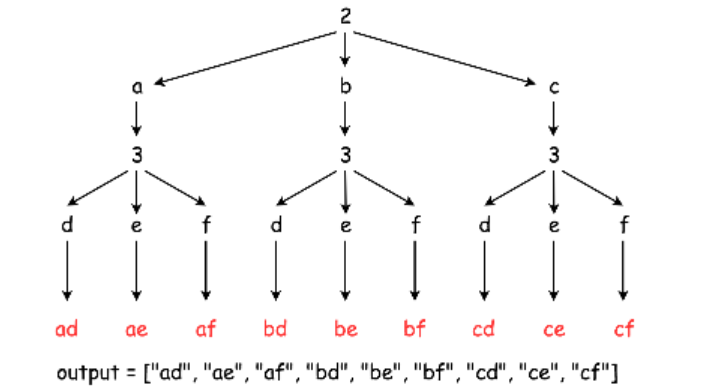

# [17.Letter Combinations of a Phone Number](1)

> Given a string containing digits from `2-9` inclusive, return all possible letter combinations that the number could represent.
>
> A mapping of digit to letters (just like on the telephone buttons) is given below. Note that 1 does not map to any letters.
>
> 
>
> **Example:**
>
> ```
> Input: "23"
> Output: ["ad", "ae", "af", "bd", "be", "bf", "cd", "ce", "cf"].
> ```
>
> **Note:**
>
> Although the above answer is in lexicographical order, your answer could be in any order you want.


对给定数字序列对应的字母，进行组合。


## 方法一：backtracing



* 深度优先遍历
* 递归


```java
class Solution {
    Map<String, String> map = new HashMap<String, String>() {{
            put("2", "abc");
            put("3", "def");
            put("4", "ghi");
            put("5", "jkl");
            put("6", "mno");
            put("7", "pqrs");
            put("8", "tuv");
            put("9", "wxyz");
    }};
    
    List<String> output = new ArrayList<>();
    
    public List<String> letterCombinations(String digits) {
        if (digits == null || digits.length() == 0)
            return output;
        backTrace("", digits);
        return output;
    }
    
    public void backTrace(String curr, String nextDigit) {
        if (nextDigit.length() == 0)
            output.add(curr);
        else {
            String letter = map.get(nextDigit.substring(0, 1));
            for (int i = 0; i < letter.length(); i++) {
                backTrace(curr + letter.substring(i, i+1), nextDigit.substring(1, nextDigit.length()));
            }
        }
    }
}
```


## 高票方法

### 方法一：

```java
public List<String> letterCombinations(String digits) {
		if(digits.isEmpty()) return ans;
    
		String[] mapping = new String[] {"0", "1", "abc", "def", "ghi", "jkl", "mno", "pqrs", "tuv", "wxyz"};
    
    	LinkedList<String> ans = new LinkedList<String>();
		ans.add("");
    
		while(ans.peek().length() != digits.length()){
			String remove = ans.remove();
			String map = mapping[digits.charAt(remove.length())-'0'];
			for(char c: map.toCharArray()){
				ans.addLast(remove+c);
			}
		}
		return ans;
}
```


[1]: https://leetcode.com/problems/letter-combinations-of-a-phone-number/