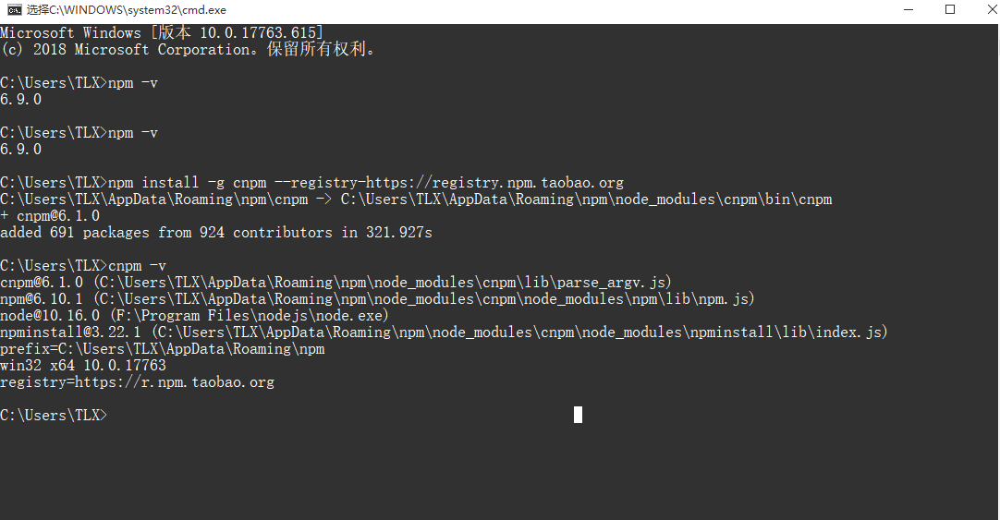
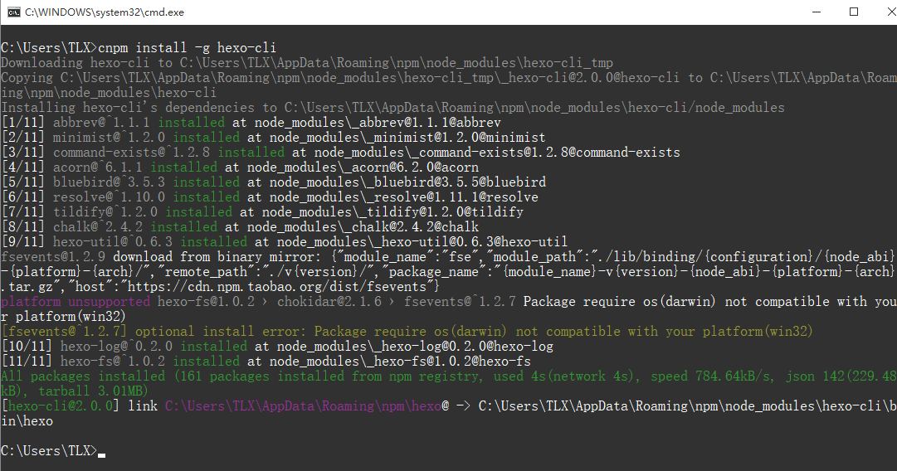
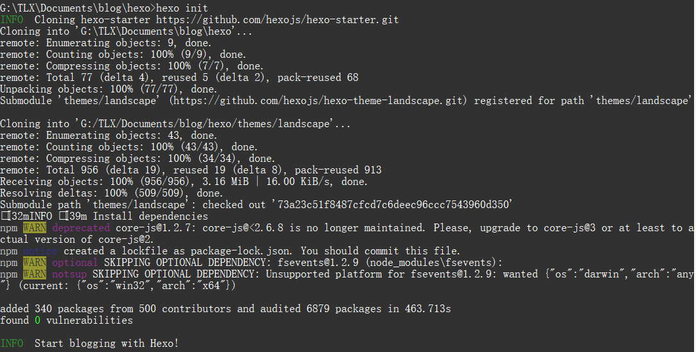
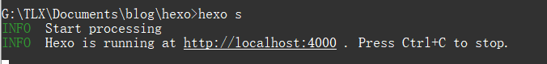
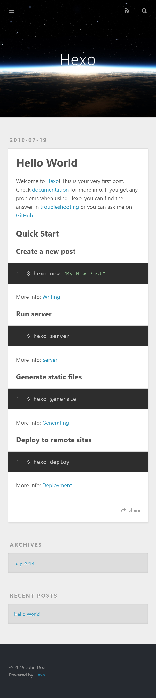
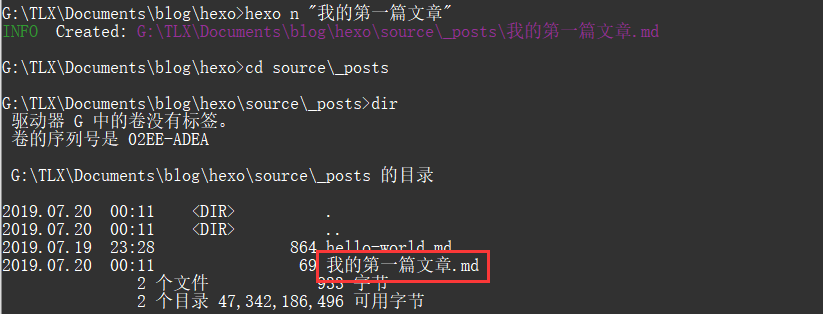
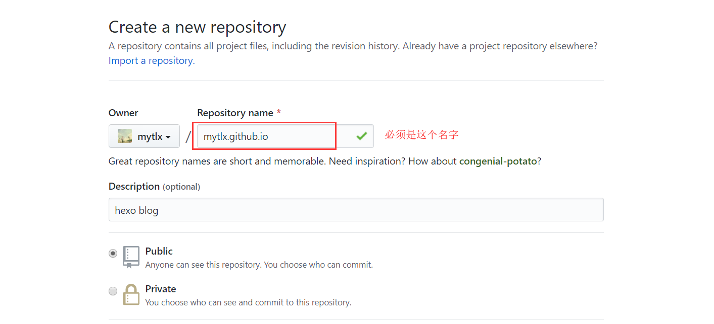
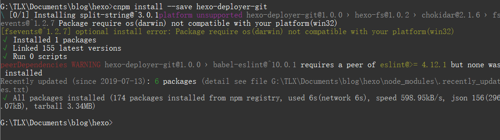
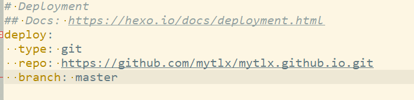
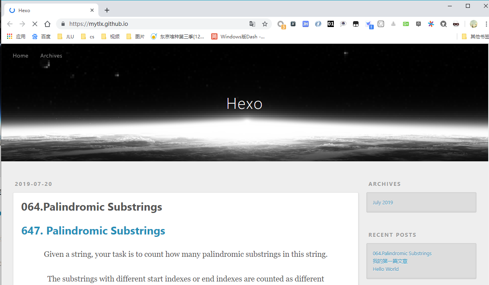

### 1. 安装node.js

* 官网：https://nodejs.org/en/
* 安装时，下一步即可
* 安装过后，需要配置环境变量


### 2. 安装cnpm，并修改镜像源

```shell
# 安装命令
npm install -g cnpm --registry-https://registry.npm.taobao.org
# 查看安装版本
cnpm -v
```




### 3. 安装hexo框架

```shell
cnpm install -g hexo-cli
# 查看版本，验证是否安装成功
hexo -v
```




### 4. 初始化hexo

切换到要clone到的目录下

```shell
hexo init
```




### 5. 运行hexo

```shell
hexo start	# start可简写为s
```



* 进入给出的网址：http://localhost:4000




### 6. 发表文章

```shell
hexo new "文章名称"		# new可以简写为n

# 切换到给出的目录下，可以看见刚才创建的文章
```




* 编辑文章内容
* 清理

```shell
hexo clean
```

* 重新生成

```shell
hexo generate	# 可以简写为g
```

* 启动

```shell
hexo s
```


### 7. 在github上创建一个新仓库

* 仓库名称必须是`名字.github.io`




### 8. 安装插件

```shell
cnpm install --save hexo-deployer-git
```





### 9. 配置仓库

```shell
vim -config.yml

# 文件末尾deploy项下添加
deploy:
  type: git
  repo: https://github.com/mytlx/mytlx.github.io.git
  branch: master
```




### 10. 部署到远端

```shell
hexo d 	# 全称为deploy
```

* 如果之前没配置过github账号，可能需要输入账号密码

* 部署成功后，地址栏输入仓库名称即可访问：`mytlx.github.io`




