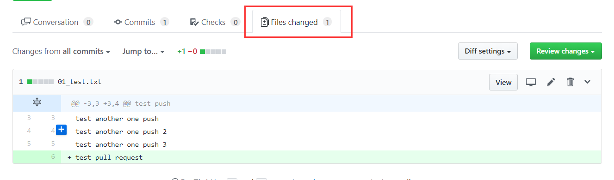

# Git

## 1. 版本控制工具

* 协同修改
  * 多人并行不悖的修改服务器端的同一个文件
* 数据备份
  * 不仅保存目录和文件的当前状态，还能够保存每一个提交过的历史状态
* 版本管理
  * 在保存每一个版本的文件信息的时候要做到不保存重复数据，以节约存储空间，提高运行效率。
  * 这方面SVN采用的是增量式管理的方式，而Git采取了文件系统快照的方式。
* 权限控制
  * 对团队中参与开发的人员进行权限控制
  * 对团队外开发者贡献的代码进行审核 --- Git独有
* 历史记录
  * 查看修改人、修改时间、修改内容、日志信息
  * 将本地文件恢复到某一个历史状态
* 分支管理
  * 允许开发团队在工作过程中多条生产线同时推进任务，进一步提高效率

## 2. 版本控制简介

### 2.1 版本控制

	工程设计领域中使用版本控制管理工程蓝图的设计过程。
	在IT开发过程中也可以使用版本控制思想管理代码的版本迭代。

### 2.2 版本控制工具

* 思想：版本控制

* 实现：版本控制工具

  * 集中式版本控制工具

    * CVS、**SVN**、VSS ...

      

  * 分布式版本控制工具：

    * **Git**、Mercurial、Bazaar、Darcs ...

      

## 3. Git

### 3.1 Git的优势

* 大部分操作在本地完成，不需要联网
* 完整性保证
* 尽可能添加数据而不是删除或修改数据
* 分支操作非常快捷流畅
* 与Linux命令全面兼容

### 3.2 Git安装

* 双击exe安装

  

* 目录非中文

  

* 保持默认选项即可

  

* 使用vim编辑器即可

  

* 第一项和第二项都可以，推荐第一项，不修改环境变量，如果选择第二项，容易把cmd命令和linux命令搞混

  

* 保持默认第一项即可，选择第二项有一定的局限性

  

* 保持默认第一项

  

* 保持默认第一项，使用git命令的默认终端，以免出现cmd和linux命令混用的情况

  

* 保持默认

  

* 安装读条后，完成

  

### 3.3 Git结构

### 3.4 Git和代码托管中心

代码托管中心的任务：维护远程库

* 局域网环境下
  * GitLab服务器
* 外网环境下
  * github
  * 码云

### 3.5 本地库和远程库

* 团队内部协作

  

* 跨团队协作

  

## 4. Git命令行操作

### 4.1 本地库初始化

* 命令： `git init`

* 效果：

  

* 注意：.git目录中存放的是本地库相关的子目录和文件，不要删除，也不要胡乱修改。

### 4.2 设置签名

* 形式：
  * 用户名：mytlx
  * Email地址：mytlx1466@163.com
* 作用：区分不同开发人员的身份
* 辨析：该签名和登录远程库（代码托管中心）的账号、密码没有任何关系。
* 命令：
  * 项目级别/仓库级别：仅在本地库范围有效
    * `git config user.name mytlx`
    * `git config user.email mytlx1466@163.com`
    * 信息保存位置：./.git/config 文件
  * 系统用户级别：登录当前操作系统的用户范围
    * `git config --global user.name mytlx`
    * `git config --global user.email mytlx1466@163.com`
    * 信息保存位置：~/.gitconfig文件
  * 级别优先级
    * 就近原则：**项目级别优先于系统用户级别**，二者都有时采用项目级别的签名
    * 如果只有系统用户级别的签名，就以系统用户级别的签名为准
    * 二者都没有不允许

### 4.3 基本操作

* 状态查看操作
  * `git status` 查看工作区、暂存区状态
* 添加操作
  * `git add [filename]` 将工作区的**新建/修改**添加到暂存区
* 提交操作
  * `git commit -m "commit message" [filename]` 将暂存区的内容提交到本地库
* 查看历史记录
  * `git log`
  * `git log --pretty=oneline`
  * `git log --oneline`
    * 只能显示过去的记录
  * `git reflog` 
    * HEAD@（移动到当前版本需要多少步）
    * 所有历史记录都能显示
* 前进后退
  * 基于索引值操作
    * `git reset --hard 局部索引值`
    * `git reset --hard a6ace91`
  * 使用^符号：只能后退
    * `git reset --hard HEAD^`
    * 一个^表示后退一步，n个表示后退n步
  * 使用~符号：只能后退
    * `git reset --hard HEAD~n`
    * 表示后退n步
* reset命令的三个参数对比
  * --soft参数
    * 仅仅在本地库移动HEAD指针
  * --mixed参数
    * 在本地库移动HEAD指针
    * 重置暂存区
  * --hard参数
    * 在本地库移动HEAD指针
    * 重置暂存区
    * 重置工作区
* 删除文件并找回
  * 前提：删除前，文件存在时的状态提交到了本地库
  * 操作：`git reset --hard 指针位置`
    * 删除操作已经提交到本地库：指针位置指向历史记录
    * 删除操作尚未提交到本地库：指针位置使用HEAD
* 比较文件差异
  * `git diff 文件名`
    * 将工作区中的文件和暂存区进行比较
  * `git diff 本地库中历史版本 文件名`
    * 将工作区中的文件和本地库历史记录比较
  * 不带文件名比较多个文件

### 4.4 分支管理

分支：在版本控制过程中，使用多条线同时推进多个任务。

分支的好处

* 同时并行推进多个功能开发，提高开发效率
* 各个分支在开发过程中，如果某一个分支开发失败，不会对其他分支有任何影响，失败的分支删除重新开始即可。

分支操作

* 创建分支

  * `git branch 分支名` 

* 查看分支

  * `git branch -v`

* 切换分支

  * `git checkout 分支名`

* 合并分支

  * 第一步：切换到接受修改的分支上
    * `git checkout 接受修改分支`
  * 第二步：执行merge命令
    * `git merge 新内容分支`

* 解决冲突

  * 冲突的表现

  

  * 冲突的解决
    * 第一步：编辑文件，删除特殊符号
    * 第二步：把文件修改到满意的程度，保存退出
    * 第三步：`git add 文件名`
    * 第四步：`git commit -m "日志信息"`
      * 注意：此时commit一定不能带具体文件名

## 5. Git基本原理

### 5.1 哈希

哈希是一个系列的加密算法，各个不同的哈希算法虽然加密强度不同，但是有以下几个共同点：

* 不管输入数据的数据量有多大，输入同一个哈希算法，得到的加密结果长度固定
* 哈希算法确定，输入数据确定，输出数据能够保证不变
* 哈希算法确定，输入数据有变化，输出数据一定有变化，而且通常变化很大
* 哈希算法不可逆

Git底层采用的是SHA-1算法。

哈希算法可以被用来验证文件，原理如图：

Git就是靠这种机制从根本上保证数据完整性的。

### 5.2 Git保存版本的机制

#### 5.2.1 集中式版本控制工具的文件管理机制

以文件变更列表的方式存储信息。

这类系统将它们保存的信息看作是一组基本文件和每个文件随时间逐步累积的差异。

#### 5.2.2 Git的文件管理机制

Git把数据看作是小型文件系统的一组快照。

每次提交更新时Git都会对当前的全部文件制作一个快照并保存这个快照的索引。为了高效，如果文件没有修改，Git不再重新存储该文件，而是只保留一个链接指向之前存储的文件。所以Git的工作方式可以称之为**快照流**。

### 5.3 Git文件管理机制细节

* Git的“提交对象”

* 提交对象及其父对象形成的链条

### 5.4 Git分支管理机制

#### 5.4.1 分支的创建

#### 5.4.2 分支的切换

## 6. GitHub

#### 6.1 创建远程库地址

* 查看当前所有远程地址别名
  * `git remote -v`	
* 添加远程地址别名
  * `git remote add 别名 远程地址` 

#### 6.2 推送

* 推送新分支与数据到远程仓库
  * `git push 别名(地址) 分支名`

    

#### 6.3 克隆

* 命令

  * `git clone 远程地址`

* 效果
  * 完整的把远程库下载到本地
  * 创建origin远程地址别名
  * 初始化本地库

#### 6.4 非团队成员push

* 将他人远程库克隆到本地后，对其进行修改后若想push到原库中，如果是非团队成员，则会报错403，加入团队成为团队成员后可成功push

  

* 在一台电脑上想利用另一个github账号push时，发现git会记住github账号，无法切换。

  * 由于http协议是无状态协议，所以http协议并没有能力去记住登录状态。
  * 原因是因为输入的github用户名密码会保存到windows凭据中，若想切换github账号，只有去windows的凭据管理器中删除对应的凭据才可以切换

  

#### 6.5 团队成员邀请

通过其他方式将**邀请链接**发送给要邀请的人，被邀请人登录自己的Github账号，访问邀请链接。

#### 6.6 拉取

* **fetch命令**

  * 从远程仓库下载新分支与数据

  * `git fetch 远程库地址 远程库分支名`

    

    

* **merge命令**

  * 从远端仓库提取数据并尝试合并到当前分支

  * `git merge 远程库地址/远程库分支名`

    

* **pull命令**

  * pull = fetch + merge

  * `git pull 远程库地址 远程库分支名`

    

#### 6.7 解决冲突

* 如果不是基于github远程库的最新版所做的修改，不能推送，必须先拉取
* 拉取下来后如果进入冲突状态，则按照“分支冲突解决”操作解决即可

#### 6.8 跨团队协作

流程：

* fork

  

  

* 本地修改，然后推送到远程库

* pull request

  

  

  

* 项目创建者 审核代码

  

* merge pull requset

  

  

  

* 将远程库修改拉取到本地

#### 6.9 origin和upstream的区别

> 当你从GitHub上 clone 一个 repo 到本地时，除非你已明确声明是这个repo的contributor，否则你是不能向其pull request的，此时，该远程的repo对于本地repo来说，就是upstream。

> 当你从GitHub上 fork 一个 repo 之后，再 clone forked repo 到本地，你就可以任意向其pull request，此时，远程的 repo 就是 origin。

* 如果是 upstream repo，你只可以拉取最新代码(即 git fetch)，从而保证你本地的仓库与源仓库同步 
* 如果是 origin repo，就是你自己的repo（自己创建的，或者 fork 的项目）你可以做 任何推拉操作（pull and push） 
* 你可以通过 pull request 向 upstream repo 贡献代码

#### 6.10 SSH登录

* 进入当前用户的家目录

  * `$ cd ~`

* 删除.ssh目录

  * `$ rm -rvf .ssh`

* 运行命令生成.ssh密钥目录（中间一直回车即可）

  * `ssh-keygen -t rsa -C mytlx1466@163.com`	

  * <b style="color:red">这个参数C必须大写</b>

    

* 进入.ssh目录查看文件列表

  * `$ cd .ssh`
  * `$ ls -lF`

* 查看id_rsa.pub文件内容

  * `$ cat id_rsa.pub`

    

* 复制id_rsa.pub文件内容，登录github，点击用户头像 - settings - SSH and GPG keys

* New SSH Key

  

* 输入复制的密钥信息

  

  

* 回到Git bash 创建远程地址别名

  * `git remote add origin_ssh git@github.com:mytlx/gitTest.git`

    

* 推送文件进行测试

## 7. idea中Git的使用

> 常用快捷键：alt+`

### 7.1 Git的配置

* 选择可执行文件后，点击Test检测是否正确

  

### 7.2 从远程主机checkout项目（克隆）

IntelliJ IDEA允许检出（在Git中术语克隆）现有存储库并根据下载的数据创建新项目。

* 主菜单，`VCS -> Checkout from Version Control -> Git`

  

* 弹出的对话框，添加克隆地址和本地目录，点击Test测试URL是否能正确连接

  

### 7.3 创建基于现有项目的本地存储库

#### 7.3.1 将整个项目导入单个Git存储库

* 打开要放在Git下的项目

* 主菜单，VCS ->Enable Version Control Integration

  

* 在打开的对话框中，从下拉列表中选择Git，然后单击“ 确定”

  * 将在项目根目录下创建.git文件夹，也就是说项目根目录就是git存储库的目录

  

#### 7.3.2 将不同的项目模块导入不同的Git存储库

* 打开要放在Git下的项目

* 主菜单，VCS -> Import into Version Control -> Create Git Repository

  

* 在打开的对话框中，指定将创建新Git存储库的目录

  

* **注：Git不支持外部路径，因此如果选择项目根目录之外的目录，请确保将要创建存储库的文件夹也包含项目根目录。**

#### 7.3.3 将文件添加到本地存储库

* 在为项目初始化Git存储库之后，需要向其添加项目数据。

* Open the **Version Control** tool window (Alt+9 or Alt + shift +9) and switch to the **Local Changes** tab.

  * 通过按`Ctrl+Alt+A`或从上下文菜单中选择“ add to VCS”， 将**Unversioned Files**更改列表中的任何文件放在版本控制下。可以添加整个更改列表，也可以选择单独的文件。

  

* 直接在代码区或者文件鼠标右键菜单，`git->add`也可

  

### 7.4 从版本控制中排除文件（ignore）

* 有时可能需要保留某些类型的文件无版本。这些可以是VCS管理文件，实用工具，备份副本等。

* 可以通过IntelliJ IDEA忽略文件，IDE不会建议将它们添加到Git中，并将它们突出显示为忽略。但是，由于这是在IDE端完成的，Git会将此类文件视为未版本控制，因此如果需要在IntelliJ IDEA之外执行任何操作，或共享项目，还建议添加要忽略的文件列表。

* 配置Git要忽略的文件列表
  * `Settings -> Preferences -> Version Control -> Ignored Files`

    

  * 或者 **Version Control** tool window (Alt+9) and switch to the **Local Changes** tab

    

* **注：一旦你将文件添加到Git版本控制，忽略它将无效。您需要先将其从Git存储库中删除。**

### 7.5 检查项目状态

* 可以检查本地工作副本与项目存储库版本比较的状态。

  * 可以查看哪些文件已被修改，哪些新文件已添加到VCS，哪些文件未被Git跟踪。

* 打开“ 版本控制”工具窗口（Alt+9）并切换到“ 本地更改”选项卡：
  * 在default列表中

    * 如果是新文件，显示**绿色**，
    * 如果是commit过并且被修改，显示**蓝色**

  * `Unversioned Files` 中的文件已经添加到了项目中，但是并未add到暂存区

    
* 如果合并期间存在未解决的冲突，则“ 合并冲突”节点将显示在相应的更改列表中，并带有解决它们的链接：

  

#### 7.5.1 跟踪编辑器中文件的更改

可以在编辑器中修改文件时跟踪文件的更改。所有更改都会突出显示**更改标记**，这些**更改标记**显示在修改后的行旁边的左侧装订线中，并显示与上次commit的更改类型，commit更改后，更改标记将消失。

* `line add` 左侧显示绿色，点击绿色区域可以弹出toolbar

  

* **line changed** 左侧显示蓝色

  

* **line delete** 左侧显示白色三角

  

### 7.6 添加远程存储库

#### 7.6.1 克隆了远程库

* 如果克隆了远程库，则会自动配置远程库，并且不需要在同步时指定它（pull或push）
  * Git克隆的远程库的默认别名是**origin**

#### 7.6.2 本地创建git库

* 如果基于本地源创建了Git库，则需要添加远程库

  * 主菜单，`VCS -> Git -> Push`，或者 `Ctrl+Shift+K`

    

  * 如果尚未添加任何远程库，将显示`define remote`而不是远程库名称，单击以添加远程库

    

#### 7.6.3 添加第二个远程库

* 主菜单，`VCS -> Git -> remote`

* 单击添加按钮，或者 `Alt+Insert`

  

* 另外两个按钮可以**删除**（`Alt+Delete`）和**编辑**（`Enter`）

### 7.7 与远程库同步

在将项目push到远程库之前，需要与远程库同步，以**保证项目的本地副本是最新的**，可以通过以下方式之一执行同步：

* fetch changes
* pull changes
* update your project

#### 7.7.1 fetch changes

* 当获取来自upstream的变化时，自上次commit之后所有新数据会下载到本地，新数据不会集成到本地文件中，并且更改不会应用到代码中
* fetch changes 存储为远程分支，在将它们与本地文件merge之前可以检查
* 因为fetch不会影响本地开发环境，所以这是一个获取远程更新的一种安全的方式
* 主菜单，`VCS -> Git -> Fetch`

#### 7.7.2 pull changes

`pull = fetch + merge`

* 主菜单，`VCS -> Git -> Pull`

  

* Git Root选择本地存储库

* Remote选择远程库

* Branch选择分支

* Strategy选择合并期间解决冲突的合并策略

* 如有必要，选择以下内容

  * **No commit：**不自动提交合并结果，可以检查并在必要时调整
  * **No fast forward：**选择此选项可生成合并提交，即使合并已解析为快进（即仅更新了分支指针）
  * **Squash commit：**选择此选项可在当前分支之上创建单个提交，而不是合并一个或多个分支。它产生工作树和索引状态，就像发生了真正的合并一样，但它实际上并没有提交或移动HEAD。
  * **Add log information：**使用除分支名称之外的正在合并的实际提交中的单行描述填充日志消息

#### 7.7.3 update your project

* 如果有多个项目，或者每次与远程库同步时想要从所有分支获取更改，使用此项比较方便

* 执行**更新**操作时，idea从所有项目和分支中fetch更改，并将远程分支merge到本地（相当于pull）

* 更新项目：

  * 主菜单，`VCS -> Update Project`，或者`Ctrl+T`

    

  * 选择更新类型（将应用于Git版本控制下的所有根目录）

    * **Merge：**选择此项可在更新期间执行merge。相当于 `git pull`
    * **Rebase：**选择此项可在更新期间执行rebase。相当于 `git pull --rebase`（所有本地提交都将放在更新的upstream头之上）
    * **Branch Default：**为不同分支应用不同的更新策略。可以在 **.git/config**配置文件中的**branch.\<name\>**部分为每个分支指定默认更新类型

  * 指定在更新之前清除工作副本时用于保存更改的方法，以便在更新完成后还原未提交的更改

    * **Using Stash：**选择此选项可在git stash存储本地更改。idea之外应用的修补程序，由Git本身生成
    * **Using Shelve：**选择此选项可将本地更改放入shelf。由idea完成，生成的补丁通常应用于idea

### 7.8 提交并推送更改

#### 7.8.1 在本地提交更改

* 点击commit或者`Ctrl+K`，打开commit对话框

  * commit changes 列出自上次提交以来已修改的所有文件以及所有新添加的unversioned files

  

* 输入commit message，选择Before Commit操作。

  * 可以点击区域右上角从最近的提交消息列表中进行选择

* 如有必要，可以在Git部分中选择一下选项：

  * **Author：**指定这些更改的作者
  * **Amend commit：**将本地更改添加到最新提交
  * **Sign-off commit：**签署提交，即证明你将要签入的更改是由你完成的，或者你对相关代码负责
    * 启用此选项后，将在提交消息的末尾自动添加以下行： `Signed off：<username>`

* Commit按钮的几个选项：

  

  * **Commit and Push：**在commit后立即将更改push到远程库
  * **Create Patch：** 根据要提交的更改生成补丁。在打开的对话框中，键入修补程序文件的名称，并指定是否需要反向修补程序。

* **注：**

  - 填写Author为mytlx，点击commit后报错

    

  - 经排查发现，Author这个位置，要么不填，要么按照 `Name <email>`这个格式填写

    

#### 7.8.2 提交文件的一部分

* 选择要提交的块

  * `Ctrl+K`打开commit changes对话框

  * 点击Diff显示库版本和所选文件的本地版本之间的差异

  * 选中要提交的每个已修改或新添加的代码块旁边的复选框，并保留未选择的其他更改

    

* 将更改放入差异更改列表中

  * 编辑器中，单击更改标记

  * 在显示的toolbar中，选择已修改代码块的目标更改列表（或创建新的更改列表）

    

  * 分别提交每个更改列表

#### 7.8.3 将更改推送到远程存储库

> push之前，先同步，以免冲突。

* `Ctrl+Shift+K`打开push commits窗口
  * 显示所有Git仓库，并列出自上次push在每个库中当前分支所有commit
  * 如果项目使用多个不同步控制存储库，则默认情况下仅选择当前存储库
  * 选中某条commit按下**Ctrl+Q以显示额外信息**，例如提交作者，时间，哈希和提交消息。
* 如果存储库没有remote库，则先定义remote
* 如果要修改要推送的目标分支，可以单击分支名称（Enter/F2）。标签变为文本字段，可以在其中键入现有分支名称，或创建新分支。
  * 无法更改本地分支：将推送每个选定存储库的当前分支
* 如果要在推送更改之前预览更改，请选择所需的提交。右侧窗格显示所选提交中包含的更改。可以使用工具栏按钮来检查提交详细信息。
* **注：如果提交的作者与当前用户不同，则此提交将标记为星号。**

---

当运行push时，如果远程库包含你没有的更改，或者你要用本地覆盖远程库，Git将拒绝完成操作。

通常，在使用更改进行更新之前，需要pull以与远程同步。

`--force push`命令禁用此检查，并允许覆盖远程库，从而擦除其历史记录并导致数据丢失。

可能仍需要执行`--force push`的一种可能情况是，对已推送的分支进行rebase，然后将其推送到远程服务器。在这种情况下，当尝试推送时，Git将拒绝你的更改，因为远程引用不是本地引用的祖先。如果`pull`在这种情况下执行，将最终得到两个分支的副本，然后需要合并。

---

### 7.9 changes

#### 7.9.1 查看项目历史记录

* **Version Control** tool window (Alt+9) and switch to the **Log** tab

#### 7.9.2 查看文件历史记录

* 在任何视图中选择所需文件
* `Git -> Show History`，历史记录窗口会在**Version Control**以tab形式打开
* 选中某条，`Ctrl+D`会显示新窗口修改记录对比

#### 7.9.3 显示代码作者

* `Git -> Annotate`或者点击**Version Control**中的图标

  

### 7.10 创建补丁

* 要基于未提交的更改创建修补程序，请执行以下操作：
  * 打开“ **Version Control**”工具窗口（Alt+9）并切换到“ **Local Changes**”选项卡。
  * 选择要根据其创建修补程序的文件或更改列表。
  * 主菜单，`VCS -> Create Patch`
  * 在打开的对话框中，确保选中要包含在修补程序中的所有更改，输入提交注释（可选）并单击“ **创建修补程序**”。
  * 在“ **修补程序文件设置**”对话框中，根据需要修改默认修补程序文件位置，然后单击“ **确定**”。

### 7.11 管理分支

idea中，所有的分支操作都在**Git Branch**弹出窗口中执行，要调用它，单击状态栏中的Git小部件，或者按 **Alt+`** 

### 7.12 管理GitHub上托管的项目

> 用于从IntelliJ IDEA中管理GitHub项目的命令仅在将GitHub项目指定为项目远程时才可用。

#### 7.12.1 github配置账户

- 点击创建Token，填写账号和密码，点击Test测试是否可以正确连接

  

- 管理多个账户

  - `Settings -> Preferences -> Version Control -> GitHub`
  - 点击加号可以根据需要添加任意数量的账户
  - 要将账户设置为当前项目的默认账户，请选择该账户并打钩

#### 7.12.2 从github查看项目

从github克隆（checkout）存储库并基于它创建一个新项目

* 主菜单，`VCS -> Checkout from Version Control -> Git`
* 在打开的对话框中，指定要克隆的URL，或从列表中选择一个存储库，其中包含与你的帐户关联的所有GitHub项目以及你的帐户所属的组织
* 在**Directory**中，指定本地路径
* 单击**Clone**，对话框单击**yes**，Git根映射将自动设置为项目根目录

#### 7.12.3 在github上分享一个项目

* 在github上为项目添加远程库

  * 打开要共享的项目

  * 主菜单，`VCS -> Import into Version Control -> Share Project on GitHub`

  * 在对话框指定新的库名，远程别名，项目主要功能描述

    * private对免费账户不可用

    

#### 7.12.4 贡献给别人项目

* 如果无权推送，遵循以下工作流程：

  * 创建分支

  * 克隆此fork以创建本地存储库

  * 更改原始项目副本

  * 当准备共享时，与原始项目主分支合并，确保你的修改不会造成冲突

  * pull request

    * `VCS -> Git -> Create Pull Request`

    

    * **Base fork：**选择要pull request的项目
    * **Base branch：**选择要pull request的分支