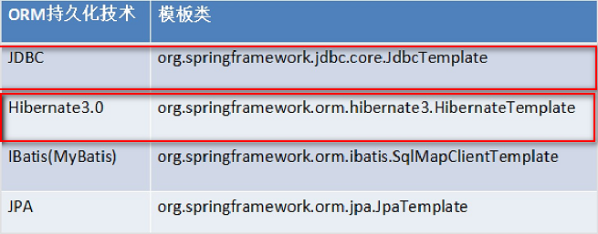

# Spring的AOP的基于AspectJ注解开发


## Spring的基于ApsectJ的注解的AOP开发

#### 1. 创建项目，引入jar包

#### 2. 引入配置文件

#### 3. 编写目标类并配置

```java
package demo01;

/**
 * Created by IntelliJ IDEA.
 * User: TLX
 * Date: 2019.5.8
 * Time: 21:51
 */
public class OrderDao {

    public void save() {
        System.out.println("==========save===========");
    }

    public void update() {
        System.out.println("==========update===========");
    }

    public String  delete() {
        System.out.println("==========delete===========");
        return "xiaoming";
    }

    public void find() {
        System.out.println("==========find===========");
    }
}
```

```xml
<!--配置目标类-->
<bean id="orderDao" class="demo01.OrderDao"/>
```

#### 4. 编写切面类并配置

#### 5. 使用注解的AOP对象目标类进行增强

* 在配置文件中打开注解的AOP开发

  ```xml
  <!--在配置文件中开启注解AOP开发-->
  <aop:aspectj-autoproxy/>
  ```

* 在切面类上使用注解

  ```java
  package demo01;
  
  import org.aspectj.lang.annotation.Aspect;
  import org.aspectj.lang.annotation.Before;
  
  /**
   * Created by IntelliJ IDEA.
   * User: TLX
   * Date: 2019.5.8
   * Time: 22:59
   */
  @Aspect
  public class MyAspectAnno {
  
      @Before(value = "execution(* demo01.OrderDao.save(..))")
      public void before() {
          System.out.println("=========前置增强============");
      }
  }
  ```

#### 6. 编写测试类

```java
package demo01;

import org.junit.Test;
import org.junit.runner.RunWith;
import org.springframework.test.context.ContextConfiguration;
import org.springframework.test.context.junit4.SpringJUnit4ClassRunner;

import javax.annotation.Resource;

/**
 * Created by IntelliJ IDEA.
 * User: TLX
 * Date: 2019.5.8
 * Time: 23:08
 */
@RunWith(SpringJUnit4ClassRunner.class)
@ContextConfiguration("classpath:applicationContext.xml")
public class TestDemo01 {

    @Resource
    private OrderDao orderDao;

    @Test
    public void test01() {
        orderDao.save();
        orderDao.delete();
        orderDao.find();
        orderDao.update();
    }
}
```

* 完整配置文件

```xml
<?xml version="1.0" encoding="UTF-8"?>
<beans xmlns="http://www.springframework.org/schema/beans"
       xmlns:xsi="http://www.w3.org/2001/XMLSchema-instance"
       xmlns:context="http://www.springframework.org/schema/context"
       xmlns:aop="http://www.springframework.org/schema/aop"
       xmlns:tx="http://www.springframework.org/schema/tx"
       xsi:schemaLocation="http://www.springframework.org/schema/beans
            http://www.springframework.org/schema/beans/spring-beans.xsd
            http://www.springframework.org/schema/context
            http://www.springframework.org/schema/context/spring-context.xsd
            http://www.springframework.org/schema/aop
            http://www.springframework.org/schema/aop/spring-aop.xsd
            http://www.springframework.org/schema/tx
            http://www.springframework.org/schema/tx/spring-tx.xsd">


    <!--在配置文件中开启注解AOP开发-->
    <aop:aspectj-autoproxy/>

    <!--配置目标类-->
    <bean id="orderDao" class="demo01.OrderDao"/>

    <!--配置切面类-->
    <bean id="myAspect" class="demo01.MyAspectAnno"/>


</beans>
```


## Spring的注解的AOP的通知类型

### 1.  @Before：前置通知

```java
@Before(value = "execution(* demo01.OrderDao.save(..))")
public void before() {
    System.out.println("=========前置增强============");
}
```

### 2. @AfterReturning：后置通知

```java
@AfterReturning(value = "execution(* demo01.OrderDao.delete(..))", returning = "result")
public void afterRunning(Object result) {
    System.out.println("=========后置增强=========" + result);
}
```

### 3. @Around：环绕通知

```java
@Around(value = "execution(* demo01.OrderDao.update(..))")
public Object around(ProceedingJoinPoint pjp) throws Throwable {
    System.out.println("=========环绕前增强=========" );
    Object proceed = pjp.proceed();
    System.out.println("=========环绕后增强=========");
    return proceed;
}
```

### 4. @AfterThrowing：异常抛出通知

```java
@AfterThrowing(value = "execution(* demo01.OrderDao.find(..))", throwing = "e")
public void afterThrowing(Throwable e) {
    System.out.println("=========异常抛出增强=========" + e.getMessage());
}
```

### 5. @After：最终通知

```java
@After(value = "execution(* demo01.OrderDao.find(..))")
public void after() {
    System.out.println("=========最终增强=========");
}
```


## Spring的注解的AOP的切入点的配置

```java
package demo01;

import org.aspectj.lang.JoinPoint;
import org.aspectj.lang.ProceedingJoinPoint;
import org.aspectj.lang.annotation.*;

import javax.xml.validation.Validator;

/**
 * Created by IntelliJ IDEA.
 * User: TLX
 * Date: 2019.5.8
 * Time: 22:59
 */
@Aspect
public class MyAspectAnno {

    // @Before(value = "execution(* demo01.OrderDao.save(..))")
    @Before(value = "MyAspectAnno.pointcut3()")
    public void before() {
        System.out.println("=========前置增强============");
    }

    // @AfterReturning(value = "execution(* demo01.OrderDao.delete(..))", returning = "result")
    @AfterReturning(value = "MyAspectAnno.pointcut2()", returning = "result")
    public void afterRunning(Object result) {
        System.out.println("=========后置增强=========" + result);
    }

    // @Around(value = "execution(* demo01.OrderDao.update(..))")
    @Around(value = "MyAspectAnno.pointcut4()")
    public Object around(ProceedingJoinPoint pjp) throws Throwable {
        System.out.println("=========环绕前增强=========" );
        Object proceed = pjp.proceed();
        System.out.println("=========环绕后增强=========");
        return proceed;
    }

    // @AfterThrowing(value = "execution(* demo01.OrderDao.find(..))", throwing = "e")
    @AfterThrowing(value = "MyAspectAnno.pointcut1()", throwing = "e")
    public void afterThrowing(Throwable e) {
        System.out.println("=========异常抛出增强=========" + e.getMessage());
    }

    // @After(value = "execution(* demo01.OrderDao.find(..))")
    @After(value = "MyAspectAnno.pointcut1()")
    public void after() {
        System.out.println("=========最终增强=========");
    }

    // 切入点配置
    @Pointcut(value = "execution(* demo01.OrderDao.find(..))")
    private void pointcut1() {}
    @Pointcut(value = "execution(* demo01.OrderDao.delete(..))")
    private void pointcut2() {}
    @Pointcut(value = "execution(* demo01.OrderDao.save(..))")
    private void pointcut3() {}
    @Pointcut(value = "execution(* demo01.OrderDao.update(..))")
    private void pointcut4() {}
}
```


# Spring的JDBC的模板的使用

## Spring的JDBC的模板

Spring是EE开发的一站式的框架，有EE开发的每层的解决方案。

Spring对持久层也提供了解决方案：ORM模块和**JDBC的模板**。

Spring提供了很多的模板用于简化开发：



### JDBC模板使用

#### 1. 创建项目，引入jar包

* 基本开发包
* 数据库驱动
  * mysql-connector
* Spring的JDBC模板jar包
  * spring-jdbc
  * spring-tx

#### 2. 创建数据库和表

```mysql
create database spring4_day03;
use spring4_day03;
create table account(
	id int primary key auto_increment,
	name varchar(20),
	money double
);
```

#### 3. 引入Spring的配置文件

```xml
<!--配置Spring的内置连接池-->
<bean id="dataSource" class="org.springframework.jdbc.datasource.DriverManagerDataSource">
    <property name="driverClassName" value="com.mysql.cj.jdbc.Driver"/>
    <property name="url" value="jdbc:mysql:///spring4_day03?useSSL=false&amp;serverTimezone=GMT"/>
    <property name="username" value="root"/>
    <property name="password" value="8372"/>
</bean>

<!--配置spring的jdbc模板-->
<bean id="jdbcTemplate" class="org.springframework.jdbc.core.JdbcTemplate">
    <property name="dataSource" ref="dataSource"/>
</bean>
```

#### 4. 使用jdbc模板

* 引入spring_aop的jar包

```java
package demo01;

import org.junit.Test;
import org.junit.runner.RunWith;
import org.springframework.jdbc.core.JdbcTemplate;
import org.springframework.test.context.ContextConfiguration;
import org.springframework.test.context.junit4.SpringJUnit4ClassRunner;

import javax.annotation.Resource;

/**
 * Created by IntelliJ IDEA.
 * User: TLX
 * Date: 2019.5.10
 * Time: 14:51
 */
@RunWith(SpringJUnit4ClassRunner.class)
@ContextConfiguration("classpath:applicationContext.xml")
public class TestDemo01 {

    @Resource(name = "jdbcTemplate")
    private JdbcTemplate jdbcTemplate;

    @Test
    public void test01() {
        jdbcTemplate.update("insert into account values (null, ?, ?)", "小明", 10000d);
    }
}
```

### 使用开源的数据库连接池

#### 1. DBCP的使用

* 引入jar包

  * com.springsource.org.apache.commons.dbcp
  * com.springsource.org.apache.commons.pool

* 配置DBCP连接池

  ```xml
  <!--配置DBCP连接池-->
  <bean id="dataSource" class="org.apache.commons.dbcp.BasicDataSource">
      <property name="driverClassName" value="com.mysql.cj.jdbc.Driver"/>
      <property name="url" value="jdbc:mysql:///spring4_day03?useSSL=false&amp;serverTimezone=GMT"/>
      <property name="username" value="root"/>
      <property name="password" value="8372"/>
  </bean>
  
  <!--配置spring的jdbc模板-->
  <bean id="jdbcTemplate" class="org.springframework.jdbc.core.JdbcTemplate">
      <property name="dataSource" ref="dataSource"/>
  </bean>
  ```

#### 2. C3P0的使用

* 引入c3p0连接池的jar包

  * com.springsource.com.mchange.v2.c3p0

* 配置c3p0连接池

  ```xml
  <!--配置c3p0连接池    -->
  <bean id="dataSource" class="com.mchange.v2.c3p0.ComboPooledDataSource">
      <property name="driverClass" value="com.mysql.cj.jdbc.Driver"/>
      <property name="jdbcUrl" value="jdbc:mysql:///spring4_day03?useSSL=false&amp;serverTimezone=GMT"/>
      <property name="user" value="root"/>
      <property name="password" value="8372"/>
  </bean>
  
  <!--配置spring的jdbc模板-->
  <bean id="jdbcTemplate" class="org.springframework.jdbc.core.JdbcTemplate">
      <property name="dataSource" ref="dataSource"/>
  </bean>
  ```

### 抽取配置到属性文件

#### 1. 定义一个属性文件

* jdbc.properties

  * url中的&用`&amp;`代替会出问题

  ```properties
  jdbc.driverClass=com.mysql.cj.jdbc.Driver
  jdbc.url=jdbc:mysql:///spring4_day03?useSSL=false&serverTimezone=GMT
  jdbc.username=root
  jdbc.password=8372
  ```

#### 2. 在Spring的配置文件中引入属性文件

* 第一种

  ```xml
  <!--第一种方式通过一个bean标签引入（很少）-->
  <bean class="org.springframework.beans.factory.config.PropertyPlaceholderConfigurer">
      <property name="location" value="classpath:jdbc.properties"/>
  </bean>
  ```

* 第二种

  ```xml
  <!--第二种方式通过context标签引入-->
  <context:property-placeholder location="classpath:jdbc.properties"/>
  ```

#### 3. 引入属性文件的值

```xml
<!--配置c3p0连接池    -->
<bean id="dataSource" class="com.mchange.v2.c3p0.ComboPooledDataSource">
    <property name="driverClass" value="${jdbc.driverClass}"/>
    <property name="jdbcUrl" value="${jdbc.url}"/>
    <property name="user" value="${jdbc.username}"/>
    <property name="password" value="${jdbc.password}"/>
</bean>
```

#### 4. 测试

```java
@Test
public void test02() {
    jdbcTemplate.update("insert into account values (null, ?, ?)", "小红", 10000d);
}
```

### 使用JDBC模板完成CRUD的操作

```java
@Test
// 插入
public void test01() {
    jdbcTemplate.update("insert into account values (null, ?, ?)", "小明", 10000d);
}

@Test
// 修改
public void test02() {
    jdbcTemplate.update("update account set name=?, money=? where id=?", "张三", 20000d, 3);
}

@Test
// 删除
public void test03() {
    jdbcTemplate.update("delete from account where id=?", 5);
}
```

#### 查询操作

* 查询某个属性

  ```java
  @Test
  public void test04() {
      String s = jdbcTemplate.queryForObject("select name from account where id = ?", String.class, 3);
      System.out.println("s = " + s);
  }
  
  @Test
  // 统计查询
  public void test05() {
      Long aLong = jdbcTemplate.queryForObject("select count(*) from account", Long.class);
      System.out.println("aLong = " + aLong);
  }
  ```

* 查询返回对象或集合

  ```java
  @Test
  // 封装到一个对象中
  public void test06() {
      Account s = jdbcTemplate.queryForObject("select * from account where id = ?", new MyRowMapper(), 4);
      System.out.println("s = " + s);
  }
  
  @Test
  // 查询多条记录
  public void test07() {
      List<Account> query = jdbcTemplate.query("select * from account", new MyRowMapper());
      for (Account a : query) {
          System.out.println("a = " + a);
      }
  }
  ```

* 数据封装

  ```java
  // 数据封装，需要Account类
  class MyRowMapper implements RowMapper<Account> {
      @Override
      public Account mapRow(ResultSet resultSet, int i) throws SQLException {
          Account account = new Account();
          account.setId(resultSet.getInt("id"));
          account.setName(resultSet.getString("name"));
          account.setMoney(resultSet.getDouble("money"));
          return account;
      }
  }
  ```


# Spring的事务管理

* 事务：逻辑上的一组操作，组成这组操作的各个单元，要么全部执行，要么全不执行。
* 事务的特性
  * 原子性：事务不可分割
  * 一致性：事务执行前后数据完整性保持一致
  * 隔离性：一个事务的执行不应该受到其他事务的干扰
  * 持久性：一旦事务结束，数据就持久化到数据库
* 安全性问题
  * 读问题
    * 脏读：一个事务读到另一个事务未提交的数据
    * 不可重复读：一个事务读到另一个事务已经提交的update的数据，导致一个事务中多次查询结果不一致
  * 写问题
    * 丢失更新


## 解决读问题

* 设置事务的隔离级别
  * Read uncommitted ：未提交读，任何读问题解决不了。
  * **Read committed：已提交读，解决脏读，但是不可重复读和虚读有可能发生。**
  * **Repeatable read ：重复读，解决脏读和不可重复读，但是虚读有可能发生。**
  * Serializable：解决所有读问题。


## Spring的事务管理的API

### 1. PlatformTransactionManager：平台事务管理器

* 平台事务管理器：接口，是Spring用于管理事务的真正的
  * **DataSourceTransactionManager：底层使用JDBC管理事务**
  * HibernateTransactionManager：底层使用Hibernate管理事务

### 2. TransactionDefinition：事务定义信息

* 事务定义：用于定义事务的相关的信息，隔离级别、超时信息、**传播行为**、是否只读

### 3. TransactionStatus：事务的状态

* 事务状态：用于记录在事务管理过程中，事务的状态的对象。

#### 4. 事务管理的API的关系：

* Spring进行事务管理的时候，首先平台事务管理器根据事务定义信息进行事务的管理，在事务管理过程中，产生各种状态，将这些状态的信息记录到事务状态的对象中。


## Spring的事务的传播行为

### 1. Spring的传播行为

* Spring中提供了七种事务的传播行为：
  * 保证多个操作在同一个事务中
    * **PROPAGATION_REQUIRED**：默认值，如果A中有事务，使用A中的事务，如果A没有，创建一个新的事务，将操作包含进来
    * PROPAGATION_SUPPORTS：支持事务，如果A中有事务，使用A中的事务。如果A没有事务，不使用事务。
    * PROPAGATION_MANDATORY：如果A中有事务，使用A中的事务。如果A没有事务，抛出异常。
  * 保证多个操作不在同一个事务中
    * **PROPAGATION_REQUIRES_NEW**：如果A中有事务，将A的事务挂起（暂停），创建新事务，只包含自身操作。如果A中没有事务，创建一个新事务，包含自身操作
    * PROPAGATION_NOT_SUPPORTED：如果A中有事务，将A的事务挂起。不使用事务管理。
      ROPAGATION_NEVER：如果A中有事务，报异常。
  * 嵌套式事务
    * **PROPAGATION_NESTED**：嵌套事务，如果A中有事务，按照A的事务执行，执行完成后，设置一个保存点，执行B中的操作，如果没有异常，执行通过，如果有异常，可以选择回滚到最初始位置，也可以回滚到保存点。


## Spring的事务管理

### 搭建Spring的事务管理环境

* 创建service接口和实现类

```java
public interface AccountService {
    public void transfer(String from,String to,Double money);
}
```

```java
public class AccountServiceImpl implements AccountService {

    // 注入Dao
    private AccountDao accountDao;

    public void setAccountDao(AccountDao accountDao) {
        this.accountDao = accountDao;
    }

    @Override
    public void transfer(String from, String to, Double money) {
        accountDao.outMoney(from, money);
        accountDao.inMoney(to, money);
    }
}
```

* 创建Dao接口和实现类

```java
public interface AccountDao {
    public void outMoney(String from ,Double money);
    public void inMoney(String to ,Double money);
}
```

```java
public class AccountDaoImpl extends JdbcDaoSupport implements AccountDao {
    @Override
    public void outMoney(String from, Double money) {
        this.getJdbcTemplate().update("update account set money = money - ? where name = ?", money, from);
    }

    @Override
    public void inMoney(String to, Double money) {
        this.getJdbcTemplate().update("update account set money = money + ? where name = ?", money, to);
    }
}
```

* 配置文件

```xml
<?xml version="1.0" encoding="UTF-8"?>
<beans xmlns="http://www.springframework.org/schema/beans"
       xmlns:xsi="http://www.w3.org/2001/XMLSchema-instance"
       xmlns:context="http://www.springframework.org/schema/context"
       xmlns:aop="http://www.springframework.org/schema/aop"
       xmlns:tx="http://www.springframework.org/schema/tx"
       xsi:schemaLocation="http://www.springframework.org/schema/beans
            http://www.springframework.org/schema/beans/spring-beans.xsd
            http://www.springframework.org/schema/context
            http://www.springframework.org/schema/context/spring-context.xsd
            http://www.springframework.org/schema/aop
            http://www.springframework.org/schema/aop/spring-aop.xsd
            http://www.springframework.org/schema/tx
            http://www.springframework.org/schema/tx/spring-tx.xsd">

    <bean id="accountService" class="demo02.AccountServiceImpl">
        <property name="accountDao" ref="accountDao"/>
    </bean>

    <bean id="accountDao" class="demo02.AccountDaoImpl">
        <property name="dataSource" ref="dataSource"/>
    </bean>

    <!--第二种方式通过context标签引入-->
    <context:property-placeholder location="classpath:jdbc.properties"/>

    <!--配置c3p0连接池    -->
    <bean id="dataSource" class="com.mchange.v2.c3p0.ComboPooledDataSource">
        <property name="driverClass" value="${jdbc.driverClass}"/>
        <property name="jdbcUrl" value="${jdbc.url}"/>
        <property name="user" value="${jdbc.username}"/>
        <property name="password" value="${jdbc.password}"/>
    </bean>

</beans>
```

* 测试类

```java
package demo02;

import org.junit.Test;
import org.junit.runner.RunWith;
import org.springframework.test.context.ContextConfiguration;
import org.springframework.test.context.junit4.SpringJUnit4ClassRunner;

import javax.annotation.Resource;

/**
 * Created by IntelliJ IDEA.
 * User: TLX
 * Date: 2019.5.10
 * Time: 17:34
 */
@RunWith(SpringJUnit4ClassRunner.class)
@ContextConfiguration("classpath:tx.xml")
public class TestDemo02 {

    @Resource(name = "accountService")
    private AccountService accountService;

    @Test
    public void demo1() {
        accountService.transfer("小明", "小红", 1000d);
    }
}
```


### 第一类：编程式事务（需要手动编写代码）---了解

* 配置

```xml
<?xml version="1.0" encoding="UTF-8"?>
<beans xmlns="http://www.springframework.org/schema/beans"
       xmlns:xsi="http://www.w3.org/2001/XMLSchema-instance"
       xmlns:context="http://www.springframework.org/schema/context"
       xmlns:aop="http://www.springframework.org/schema/aop"
       xmlns:tx="http://www.springframework.org/schema/tx"
       xsi:schemaLocation="http://www.springframework.org/schema/beans
            http://www.springframework.org/schema/beans/spring-beans.xsd
            http://www.springframework.org/schema/context
            http://www.springframework.org/schema/context/spring-context.xsd
            http://www.springframework.org/schema/aop
            http://www.springframework.org/schema/aop/spring-aop.xsd
            http://www.springframework.org/schema/tx
            http://www.springframework.org/schema/tx/spring-tx.xsd">

    <bean id="accountService" class="demo02.AccountServiceImpl">
        <property name="accountDao" ref="accountDao"/>
        <!--注入事务管理的模板-->
        <property name="trsactionTemplate" ref="transactionTemplate"/>
    </bean>

    <bean id="accountDao" class="demo02.AccountDaoImpl">
        <property name="dataSource" ref="dataSource"/>
    </bean>

    <!--第二种方式通过context标签引入-->
    <context:property-placeholder location="classpath:jdbc.properties"/>

    <!--配置c3p0连接池    -->
    <bean id="dataSource" class="com.mchange.v2.c3p0.ComboPooledDataSource">
        <property name="driverClass" value="${jdbc.driverClass}"/>
        <property name="jdbcUrl" value="${jdbc.url}"/>
        <property name="user" value="${jdbc.username}"/>
        <property name="password" value="${jdbc.password}"/>
    </bean>

    <!--配置平台事务管理器-->
    <bean id="transactionManager" class="org.springframework.jdbc.datasource.DataSourceTransactionManager">
        <property name="dataSource" ref="dataSource"/>
    </bean>

    <!--配置事务管理的模板-->
    <bean id="transactionTemplate" class="org.springframework.transaction.support.TransactionTemplate">
        <property name="transactionManager" ref="transactionManager"/>
    </bean>
</beans>
```

* AccountServiceImpl

```java
package demo02;

import org.springframework.transaction.TransactionStatus;
import org.springframework.transaction.support.TransactionCallbackWithoutResult;
import org.springframework.transaction.support.TransactionTemplate;

/**
 * Created by IntelliJ IDEA.
 * User: TLX
 * Date: 2019.5.10
 * Time: 17:21
 */
public class AccountServiceImpl implements AccountService {

    // 注入Dao
    private AccountDao accountDao;

    // 注入事务管理的模板
    private TransactionTemplate trsactionTemplate;

    public void setAccountDao(AccountDao accountDao) {
        this.accountDao = accountDao;
    }

    public void setTrsactionTemplate(TransactionTemplate trsactionTemplate) {
        this.trsactionTemplate = trsactionTemplate;
    }

    @Override
    public void transfer(final String from, final String to, final Double money) {
        trsactionTemplate.execute(new TransactionCallbackWithoutResult() {
            @Override
            protected void doInTransactionWithoutResult(TransactionStatus transactionStatus) {
                accountDao.outMoney(from, money);
                // int d = 1 / 0;
                accountDao.inMoney(to, money);
            }
        });
    }
}
```

* 测试

```java
package demo02;

import org.junit.Test;
import org.junit.runner.RunWith;
import org.springframework.test.context.ContextConfiguration;
import org.springframework.test.context.junit4.SpringJUnit4ClassRunner;

import javax.annotation.Resource;

@RunWith(SpringJUnit4ClassRunner.class)
@ContextConfiguration("classpath:tx2.xml") // 此处要修改为tx2.xml
public class TestDemo02 {

    @Resource(name = "accountService")
    private AccountService accountService;

    @Test
    public void demo1() {
        accountService.transfer("小明", "小红", 1000d);
    }
}
```


### 第二类：声明式事务管理（通过配置实现）---AOP

#### 1. XML方式的声明式事务管理

* 配置

```xml
<?xml version="1.0" encoding="UTF-8"?>
<beans xmlns="http://www.springframework.org/schema/beans"
       xmlns:xsi="http://www.w3.org/2001/XMLSchema-instance"
       xmlns:context="http://www.springframework.org/schema/context"
       xmlns:aop="http://www.springframework.org/schema/aop"
       xmlns:tx="http://www.springframework.org/schema/tx"
       xsi:schemaLocation="http://www.springframework.org/schema/beans
            http://www.springframework.org/schema/beans/spring-beans.xsd
            http://www.springframework.org/schema/context
            http://www.springframework.org/schema/context/spring-context.xsd
            http://www.springframework.org/schema/aop
            http://www.springframework.org/schema/aop/spring-aop.xsd
            http://www.springframework.org/schema/tx
            http://www.springframework.org/schema/tx/spring-tx.xsd">

    <bean id="accountService" class="demo03.AccountServiceImpl">
        <property name="accountDao" ref="accountDao"/>
    </bean>

    <bean id="accountDao" class="demo03.AccountDaoImpl">
        <property name="dataSource" ref="dataSource"/>
    </bean>

    <!--第二种方式通过context标签引入-->
    <context:property-placeholder location="classpath:jdbc.properties"/>

    <!--配置c3p0连接池    -->
    <bean id="dataSource" class="com.mchange.v2.c3p0.ComboPooledDataSource">
        <property name="driverClass" value="${jdbc.driverClass}"/>
        <property name="jdbcUrl" value="${jdbc.url}"/>
        <property name="user" value="${jdbc.username}"/>
        <property name="password" value="${jdbc.password}"/>
    </bean>

    <!--配置平台事务管理器-->
    <bean id="transactionManager" class="org.springframework.jdbc.datasource.DataSourceTransactionManager">
        <property name="dataSource" ref="dataSource"/>
    </bean>

    <!--配置事务的增强-->
    <tx:advice id="txAdvice" transaction-manager="transactionManager">
        <tx:attributes>
            <!-- 事务管理的规则 -->
            <!-- <tx:method name="save*" propagation="REQUIRED" isolation="DEFAULT"/>
            <tx:method name="update*" propagation="REQUIRED"/>
            <tx:method name="delete*" propagation="REQUIRED"/>
            <tx:method name="find*" read-only="true"/> -->
            <tx:method name="*" propagation="REQUIRED" read-only="false"/>
        </tx:attributes>
    </tx:advice>

    <!-- aop的配置 -->
    <aop:config>
        <aop:pointcut expression="execution(* demo03.AccountServiceImpl.*(..))" id="pointcut1"/>
        <aop:advisor advice-ref="txAdvice" pointcut-ref="pointcut1"/>
    </aop:config>
</beans>
```

* service

```java
package demo03;

public class AccountServiceImpl implements AccountService {

    // 注入Dao
    private AccountDao accountDao;

    public void setAccountDao(AccountDao accountDao) {
        this.accountDao = accountDao;
    }

    @Override
    public void transfer(String from, String to, Double money) {
        accountDao.outMoney(from, money);
        // int d = 1 / 0;
        accountDao.inMoney(to, money);
    }
}
```

* 测试

```java
package demo03;

import org.junit.Test;
import org.junit.runner.RunWith;
import org.springframework.test.context.ContextConfiguration;
import org.springframework.test.context.junit4.SpringJUnit4ClassRunner;

import javax.annotation.Resource;

@RunWith(SpringJUnit4ClassRunner.class)
@ContextConfiguration("classpath:tx3.xml")
public class TestDemo03 {

    @Resource(name = "accountService")
    private AccountService accountService;

    @Test
    public void demo1() {
        accountService.transfer("小明", "小红", 1000d);
    }
}
```

#### 2. 注解方式的声明式事务管理

1. 配置事务管理器

2. 开启注解事务
3. 在业务层添加注解

* 配置

```xml
<?xml version="1.0" encoding="UTF-8"?>
<beans xmlns="http://www.springframework.org/schema/beans"
       xmlns:xsi="http://www.w3.org/2001/XMLSchema-instance"
       xmlns:context="http://www.springframework.org/schema/context"
       xmlns:aop="http://www.springframework.org/schema/aop"
       xmlns:tx="http://www.springframework.org/schema/tx"
       xsi:schemaLocation="http://www.springframework.org/schema/beans
            http://www.springframework.org/schema/beans/spring-beans.xsd
            http://www.springframework.org/schema/context
            http://www.springframework.org/schema/context/spring-context.xsd
            http://www.springframework.org/schema/aop
            http://www.springframework.org/schema/aop/spring-aop.xsd
            http://www.springframework.org/schema/tx
            http://www.springframework.org/schema/tx/spring-tx.xsd">

    <bean id="accountService" class="demo04.AccountServiceImpl">
        <property name="accountDao" ref="accountDao"/>
    </bean>

    <bean id="accountDao" class="demo04.AccountDaoImpl">
        <property name="dataSource" ref="dataSource"/>
    </bean>

    <!--第二种方式通过context标签引入-->
    <context:property-placeholder location="classpath:jdbc.properties"/>

    <!--配置c3p0连接池    -->
    <bean id="dataSource" class="com.mchange.v2.c3p0.ComboPooledDataSource">
        <property name="driverClass" value="${jdbc.driverClass}"/>
        <property name="jdbcUrl" value="${jdbc.url}"/>
        <property name="user" value="${jdbc.username}"/>
        <property name="password" value="${jdbc.password}"/>
    </bean>

    <!--配置平台事务管理器-->
    <bean id="transactionManager" class="org.springframework.jdbc.datasource.DataSourceTransactionManager">
        <property name="dataSource" ref="dataSource"/>
    </bean>

    <!--开启注解事务-->
    <tx:annotation-driven transaction-manager="transactionManager"/>
</beans>
```

* service

```java
package demo04;

import org.springframework.transaction.annotation.Isolation;
import org.springframework.transaction.annotation.Propagation;
import org.springframework.transaction.annotation.Transactional;

@Transactional(isolation = Isolation.DEFAULT, propagation = Propagation.REQUIRED)
public class AccountServiceImpl implements AccountService {

    // 注入Dao
    private AccountDao accountDao;

    public void setAccountDao(AccountDao accountDao) {
        this.accountDao = accountDao;
    }

    @Override
    public void transfer(String from, String to, Double money) {
        accountDao.outMoney(from, money);
        // int d = 1 / 0;
        accountDao.inMoney(to, money);
    }
}
```

* 测试

```java
package demo04;

import org.junit.Test;
import org.junit.runner.RunWith;
import org.springframework.test.context.ContextConfiguration;
import org.springframework.test.context.junit4.SpringJUnit4ClassRunner;

import javax.annotation.Resource;

@RunWith(SpringJUnit4ClassRunner.class)
@ContextConfiguration("classpath:tx4.xml")
public class TestDemo03 {

    @Resource(name = "accountService")
    private AccountService accountService;

    @Test
    public void demo1() {
        accountService.transfer("小明", "小红", 1000d);
    }
}
```

