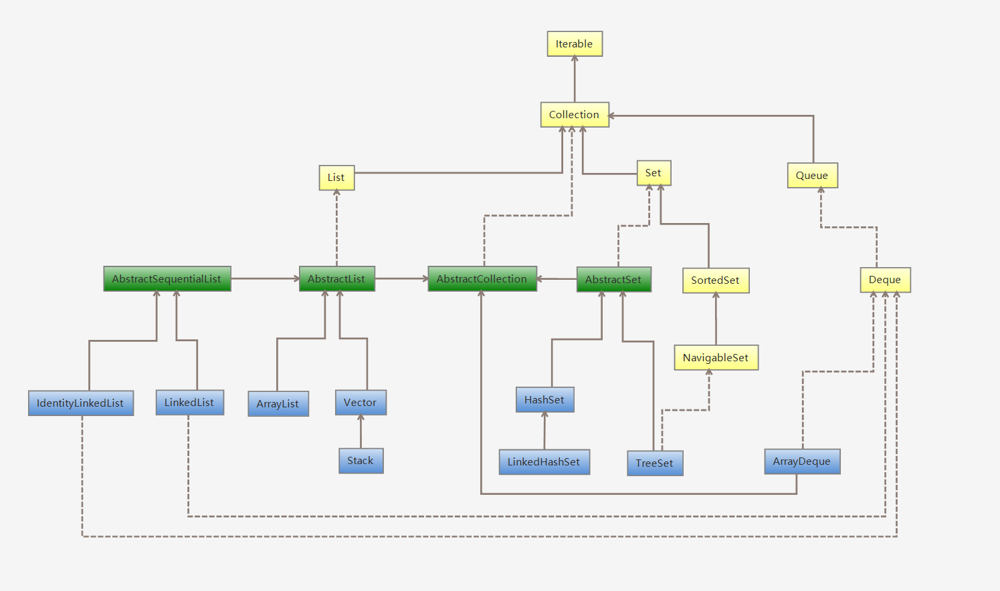
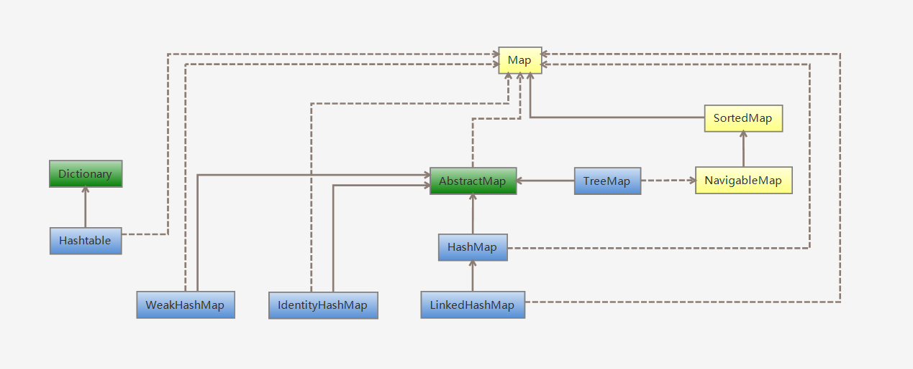
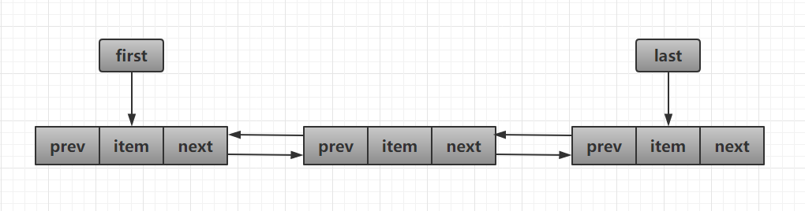

# 一、概述

容器主要包括 **Collection** 和 **Map** 两种：

* Collection 存储着对象的集合
* Map 存储着键值对（两个对象）的映射表。

Collection：



Map：



### 1. Set

- **TreeSet：**基于**红黑树**实现，支持有序性操作，例如根据一个范围查找元素的操作。但是查找效率不如 HashSet，HashSet 查找的时间复杂度为$O(1)$，TreeSet 则为$O(logN)$。
- **HashSet：**基于**哈希表**实现，支持快速查找，但不支持有序性操作。并且失去了元素的插入顺序信息，也就是说使用 Iterator 遍历 HashSet 得到的结果是不确定的。
- **LinkedHashSet：**具有 HashSet 的查找效率，且内部使用双向链表维护元素的插入顺序。

### 2. List

- **ArrayList：**基于**动态数组**实现，支持**随机访问**。
- **Vector：**和 ArrayList 类似，但它是**线程安全**的。
- **LinkedList：**基于**双向链表**实现，只能**顺序访问**，但是可以**快速**地在链表中间**插入**和**删除**元素。不仅如此，LinkedList 还可以用作栈、队列和双向队列。

### 3. Queue

- **LinkedList：**可以用它来实现**双向队列**。
- **PriorityQueue：**基于**堆结构**实现，可以用它来实现**优先队列**。


# 二、源码分析

## ArrayList

#### 1. 类声明

因为 ArrayList 是基于数组实现的，所以支持快速随机访问。RandomAccess 接口标识着该类支持快速随机访问。

```java
public class ArrayList<E> extends AbstractList<E>
        implements List<E>, RandomAccess, Cloneable, java.io.Serializable
```

#### 2.  变量声明

可以看出，**默认初始大小为10**。

```java
/**
* Default initial capacity.
*/
private static final int DEFAULT_CAPACITY = 10;

/**
* Shared empty array instance used for empty instances.
*/
private static final Object[] EMPTY_ELEMENTDATA = {};

/**
* Shared empty array instance used for default sized empty instances. We
* distinguish this from EMPTY_ELEMENTDATA to know how much to inflate when
* first element is added.
* 共享空数组实例，用于默认大小的空实例。
* 我们将其与EMPTY_ELEMENTDATA区分开来，以了解添加第一个元素时应该膨胀多少。
*/
private static final Object[] DEFAULTCAPACITY_EMPTY_ELEMENTDATA = {};

/**
* The array buffer into which the elements of the ArrayList are stored.
* The capacity of the ArrayList is the length of this array buffer. Any
* empty ArrayList with elementData == DEFAULTCAPACITY_EMPTY_ELEMENTDATA
* will be expanded to DEFAULT_CAPACITY when the first element is added.
* 存储ArrayList元素的数组缓冲区。
* ArrayList的容量是这个数组缓冲区的长度。
* 任何带有elementData == DEFAULTCAPACITY_EMPTY_ELEMENTDATA的空ArrayList
* 将在添加第一个元素时扩展为DEFAULT_CAPACITY。
*/
transient Object[] elementData; // non-private to simplify nested class access

/**
* The size of the ArrayList (the number of elements it contains).
*
* @serial
*/
private int size;

/**
* The maximum size of array to allocate (unless necessary).
* Some VMs reserve some header words in an array.
* Attempts to allocate larger arrays may result in
* OutOfMemoryError: Requested array size exceeds VM limit
*/
private static final int MAX_ARRAY_SIZE = Integer.MAX_VALUE - 8;
```

#### 3. 构造函数

可以看到构造函数分为3种：

* **指定容量大小**：因为扩容需要复制数组，代价较高，所以最好是初始化时就指定大小。
* **默认容量大小**：默认值为`DEFAULT_CAPACITY = 10`
* **从现有的集合构造**：也是将集合转为数组，最后复制到当前数组中

```java
/**
* Constructs an empty list with the specified initial capacity.
*/
public ArrayList(int initialCapacity) {
    if (initialCapacity > 0) {
        this.elementData = new Object[initialCapacity];
    } else if (initialCapacity == 0) {
        this.elementData = EMPTY_ELEMENTDATA;
    } else {
        throw new IllegalArgumentException("Illegal Capacity: "+
                                           initialCapacity);
    }
}

/**
* Constructs an empty list with an initial capacity of ten.
*/
public ArrayList() {
    this.elementData = DEFAULTCAPACITY_EMPTY_ELEMENTDATA;
}

/**
* Constructs a list containing the elements of the specified
* collection, in the order they are returned by the collection's
* iterator.
*/
public ArrayList(Collection<? extends E> c) {
    elementData = c.toArray();
    if ((size = elementData.length) != 0) {
        // defend against c.toArray (incorrectly) not returning Object[]
        // (see e.g. https://bugs.openjdk.java.net/browse/JDK-6260652)
        if (elementData.getClass() != Object[].class)
            elementData = Arrays.copyOf(elementData, size, Object[].class);
    } else {
        // replace with empty array.
        this.elementData = EMPTY_ELEMENTDATA;
    }
}
```

#### 4. 添加和扩容

添加元素的时候要检查当前数组是否存满，如果存满了，需要使用`grow()方法`进行扩容。

从源码中可以看出，新容量大小为`oldCapacity + (oldCapacity >> 1)`，也就是原来数组大小的1.5倍。

扩容需要调用`Arrays.copyOf()`方法将原数组复制到新数组中，代价较高，所以就像在讨论构造函数时所说，**最好是在初始化时就指定好容量大小**，减少扩容次数。

```java
private void add(E e, Object[] elementData, int s) {
    if (s == elementData.length)	// 检查是否需要扩容
        elementData = grow();
    elementData[s] = e;
    size = s + 1;
}

public boolean add(E e) {
    modCount++;
    add(e, elementData, size);
    return true;
}

public void add(int index, E element) {
    rangeCheckForAdd(index);
    modCount++;
    final int s;
    Object[] elementData;
    if ((s = size) == (elementData = this.elementData).length)
        elementData = grow();
    System.arraycopy(elementData, index,
                     elementData, index + 1,
                     s - index);
    elementData[index] = element;
    size = s + 1;
}

private Object[] grow(int minCapacity) {
    return elementData = Arrays.copyOf(elementData,
                                       newCapacity(minCapacity));
}

private Object[] grow() {
    return grow(size + 1);
}

private int newCapacity(int minCapacity) {
    // overflow-conscious code
    int oldCapacity = elementData.length;
    int newCapacity = oldCapacity + (oldCapacity >> 1);
    if (newCapacity - minCapacity <= 0) {
        if (elementData == DEFAULTCAPACITY_EMPTY_ELEMENTDATA)
            return Math.max(DEFAULT_CAPACITY, minCapacity);
        if (minCapacity < 0) // overflow
            throw new OutOfMemoryError();
        return minCapacity;
    }
    return (newCapacity - MAX_ARRAY_SIZE <= 0)
        ? newCapacity
        : hugeCapacity(minCapacity);
}
```

#### 5. 删除元素

删除元素需要调用`System.arraycopy()`将`index + 1`后面的元素都复制到前一个位置上，时间复杂度是O(N)，代价较高

```java
public E remove(int index) {
    Objects.checkIndex(index, size);

    modCount++;
    E oldValue = elementData(index);

    int numMoved = size - index - 1;
    if (numMoved > 0)
        System.arraycopy(elementData, index+1, elementData, index,
                         numMoved);
    elementData[--size] = null; // clear to let GC do its work

    return oldValue;
}

public boolean remove(Object o) {
    if (o == null) {
        for (int index = 0; index < size; index++)
            if (elementData[index] == null) {
                fastRemove(index);
                return true;
            }
    } else {
        for (int index = 0; index < size; index++)
            if (o.equals(elementData[index])) {
                fastRemove(index);
                return true;
            }
    }
    return false;
}

private void fastRemove(int index) {
    modCount++;
    int numMoved = size - index - 1;
    if (numMoved > 0)
        System.arraycopy(elementData, index+1, elementData, index,
                         numMoved);
    elementData[--size] = null; // clear to let GC do its work
}
```

#### 6. 快速失败（fail—fast）

> 快速失败（fail—fast）：在用迭代器遍历一个集合对象时，如果遍历过程中对集合对象的内容进行了修改（增加、删除、修改），则会抛出Concurrent Modification Exception。

`modCount` 用来记录 ArrayList 结构发生变化的次数。结构发生变化是指添加或者删除至少一个元素的所有操作，或者是调整内部数组的大小，仅仅只是设置元素的值不算结构发生变化。

在进行序列化或者迭代等操作时，需要比较操作前后 `modCount `是否改变，如果改变了需要抛出 `ConcurrentModificationException`。

```java
private void writeObject(java.io.ObjectOutputStream s)
    throws java.io.IOException {
    // Write out element count, and any hidden stuff
    int expectedModCount = modCount;
    s.defaultWriteObject();

    // Write out size as capacity for behavioural compatibility with clone()
    s.writeInt(size);

    // Write out all elements in the proper order.
    for (int i=0; i<size; i++) {
        s.writeObject(elementData[i]);
    }

    if (modCount != expectedModCount) {
        throw new ConcurrentModificationException();
    }
}
```

下面是迭代器部分的源码，可以看到，在对其进行操作前，要比较前后modCount是否改变。

**注意**：单线程环境下，`remove()`方法最后会让`expectModCount`和`modCount`相等，所以不会抛出异常。

```java
private class Itr implements Iterator<E> {
    int cursor;       // index of next element to return
    int lastRet = -1; // index of last element returned; -1 if no such
    int expectedModCount = modCount;

    // prevent creating a synthetic constructor
    Itr() {}

    public boolean hasNext() {
        return cursor != size;
    }

    @SuppressWarnings("unchecked")
    public E next() {
        checkForComodification();
        int i = cursor;
        if (i >= size)
            throw new NoSuchElementException();
        Object[] elementData = ArrayList.this.elementData;
        if (i >= elementData.length)
            throw new ConcurrentModificationException();
        cursor = i + 1;
        return (E) elementData[lastRet = i];
    }

    public void remove() {
        if (lastRet < 0)
            throw new IllegalStateException();
        checkForComodification();

        try {
            ArrayList.this.remove(lastRet);
            cursor = lastRet;
            lastRet = -1;
            expectedModCount = modCount;
        } catch (IndexOutOfBoundsException ex) {
            throw new ConcurrentModificationException();
        }
    }

    @Override
    public void forEachRemaining(Consumer<? super E> action) {
        Objects.requireNonNull(action);
        final int size = ArrayList.this.size;
        int i = cursor;
        if (i < size) {
            final Object[] es = elementData;
            if (i >= es.length)
                throw new ConcurrentModificationException();
            for (; i < size && modCount == expectedModCount; i++)
                action.accept(elementAt(es, i));
            // update once at end to reduce heap write traffic
            cursor = i;
            lastRet = i - 1;
            checkForComodification();
        }
    }

    final void checkForComodification() {
        if (modCount != expectedModCount)
            throw new ConcurrentModificationException();
    }
}
```


## Vector

它的实现与ArrayList类似，但是它是**线程安全**的，方法使用了**synchronized进行同步**。

#### 1. 类声明

RandomAccess 接口标识着该类支持快速随机访问。

```java
public class Vector<E>
    extends AbstractList<E>
    implements List<E>, RandomAccess, Cloneable, java.io.Serializable
```

#### 2. 变量声明

```java
/**
* The array buffer into which the components of the vector are
* stored. The capacity of the vector is the length of this array buffer,
* and is at least large enough to contain all the vector's elements.
*
* <p>Any array elements following the last element in the Vector are null.
*	
* @serial
*/
protected Object[] elementData;

/**
* The number of valid components in this {@code Vector} object.
* Components {@code elementData[0]} through
* {@code elementData[elementCount-1]} are the actual items.
*
* @serial
*/
protected int elementCount;			// size()方法

/**
* The amount by which the capacity of the vector is automatically
* incremented when its size becomes greater than its capacity.  If
* the capacity increment is less than or equal to zero, the capacity
* of the vector is doubled each time it needs to grow.
*
* @serial
*/
protected int capacityIncrement;	// 用于扩容
```

#### 3. 构造函数

构造函数有4种：

* **指定初始容量和扩容增量：**使用初始容量，扩容时使用扩容增量（原来容量+扩容增量）
* **指定初始容量：**扩容增量为0（扩容时2倍），也就是说默认情况下，每次扩容为原来的2倍
* **使用默认值：**默认初始容量为10，扩容增量为0
* **从现有的集合构造：**将集合转为数组，复制进去

```java
public Vector(int initialCapacity, int capacityIncrement) {
    super();
    if (initialCapacity < 0)
        throw new IllegalArgumentException("Illegal Capacity: "+
                                           initialCapacity);
    this.elementData = new Object[initialCapacity];
    this.capacityIncrement = capacityIncrement;
}

public Vector(int initialCapacity) {
    this(initialCapacity, 0);
}

public Vector() {
    this(10);
}

public Vector(Collection<? extends E> c) {
    elementData = c.toArray();
    elementCount = elementData.length;
    // defend against c.toArray (incorrectly) not returning Object[]
    // (see e.g. https://bugs.openjdk.java.net/browse/JDK-6260652)
    if (elementData.getClass() != Object[].class)
        elementData = Arrays.copyOf(elementData, elementCount, Object[].class);
}
```

#### 4. 添加和扩容

添加时会判断是否还有容量添加，如果不够，那么使用`grow()`函数进行扩容。

如何扩容根据成员变量`capacityIncrement`决定

* 如果`capacityIncrement <= 0`，那么`新容量 = 老容量 * 2`，即：`newCapacity = oldCapacity + oldCapacity;`
* 如果`capacityIncrement > 0`，那么`新容量 = 老容量 + capacityIncrement`，即：`newCapacity = oldCapacity + capacityIncrement;`

根据上述构造函数可以发现：如果没有指定`capacityIncrement`，那么**默认为0**，也就是说，**默认情况下，Vector每次扩容容量都会翻倍。**

```java
private void add(E e, Object[] elementData, int s) {
    if (s == elementData.length)
        elementData = grow();
    elementData[s] = e;
    elementCount = s + 1;
}

public synchronized boolean add(E e) {
    modCount++;
    add(e, elementData, elementCount);
    return true;
}

private Object[] grow(int minCapacity) {
    return elementData = Arrays.copyOf(elementData,
                                       newCapacity(minCapacity));
}

private Object[] grow() {
    return grow(elementCount + 1);
}

private int newCapacity(int minCapacity) {
    // overflow-conscious code
    int oldCapacity = elementData.length;
    int newCapacity = oldCapacity + ((capacityIncrement > 0) ?
                                     capacityIncrement : oldCapacity);
    if (newCapacity - minCapacity <= 0) {
        if (minCapacity < 0) // overflow
            throw new OutOfMemoryError();
        return minCapacity;
    }
    return (newCapacity - MAX_ARRAY_SIZE <= 0)
        ? newCapacity
        : hugeCapacity(minCapacity);
}
```

#### 5. 与 ArrayList 的比较

- Vector 是同步的，因此开销就比 ArrayList 要大，访问速度更慢。最好使用 ArrayList 而不是 Vector，因为同步操作完全可以由程序员自己来控制；
- Vector 每次扩容请求其大小的 2 倍（也可以通过构造函数设置增长的容量），而 ArrayList 是 1.5 倍。

#### 6. 替代方案

##### 方案一：

可以使用 `Collections.synchronizedList();` 得到一个线程安全的 ArrayList。

```java
List<String> list = new ArrayList<>();
List<String> synList = Collections.synchronizedList(list);
```

原理如下：

调用`Collections.synchronizedList(list)`，会调用`new SynchronizedRandomAccessList<>(list)`

```java
public static <T> List<T> synchronizedList(List<T> list) {
    return (list instanceof RandomAccess ?
            new SynchronizedRandomAccessList<>(list) :
            new SynchronizedList<>(list));
}
```

`SynchronizedRandomAccessList`是类`Collections`的一个内部类，继承自`SynchronizedList`，所以会调用父类的构造方法

```java
static class SynchronizedRandomAccessList<E>
        extends SynchronizedList<E>
        implements RandomAccess {

        SynchronizedRandomAccessList(List<E> list) {
            super(list);
        }
        // ...
}
```

`SynchronizedList`是类`Collections`的另一个内部类，继承自`SynchronizedCollection`，继续调用父类的构造方法，内部有许多List特有的方法，用`synchronized`修饰了一下，使其线程安全

```java
static class SynchronizedList<E>
        extends SynchronizedCollection<E>
        implements List<E> {

        final List<E> list;

        SynchronizedList(List<E> list) {
            super(list);
            this.list = list;
        }
        // 内部定义了许多使用synchronized修饰的方法，主要是List特有的方法
        public void add(int index, E element) {
            synchronized (mutex) {list.add(index, element);}
        }
        public E remove(int index) {
            synchronized (mutex) {return list.remove(index);}
        }
        // ...
}
```

`SynchronizedCollection`是类`Collections`的另一个内部类，内部定义了许多集合共有的方法，用`synchronized`修饰，使其线程安全

```java
static class SynchronizedCollection<E> implements Collection<E>, Serializable {
    final Collection<E> c;  // Backing Collection
    final Object mutex;     // Object on which to synchronize

    SynchronizedCollection(Collection<E> c) {
        this.c = Objects.requireNonNull(c);
        mutex = this;
    }

    // 内部定义了许多使用synchronized修饰的方法，集合共有的方法
    public boolean add(E e) {
        synchronized (mutex) {return c.add(e);}
    }
    public boolean remove(Object o) {
        synchronized (mutex) {return c.remove(o);}
    }
    // ...
}
```


##### 方案二：// TODO:

也可以使用 concurrent 并发包下的 CopyOnWriteArrayList 类。

```java
List<String> list = new CopyOnWriteArrayList<>();
```


## LinkedList

#### 1. 概述

基于**双向链表**实现，使用Node存储链表节点信息。

```java
private static class Node<E> {
    E item;
    Node<E> next;
    Node<E> prev;

    Node(Node<E> prev, E element, Node<E> next) {
        this.item = element;
        this.next = next;
        this.prev = prev;
    }
}
```

每个链表有first和last指针，指向首尾节点。

```java
transient Node<E> first;

transient Node<E> last;
```



#### 2. 与 ArrayList 的比较

- ArrayList 基于动态数组实现，LinkedList 基于双向链表实现；
- ArrayList 支持随机访问，LinkedList 不支持；
- LinkedList 在任意位置添加删除元素更快。
- 都**不是线程安全**的


## HashMap


