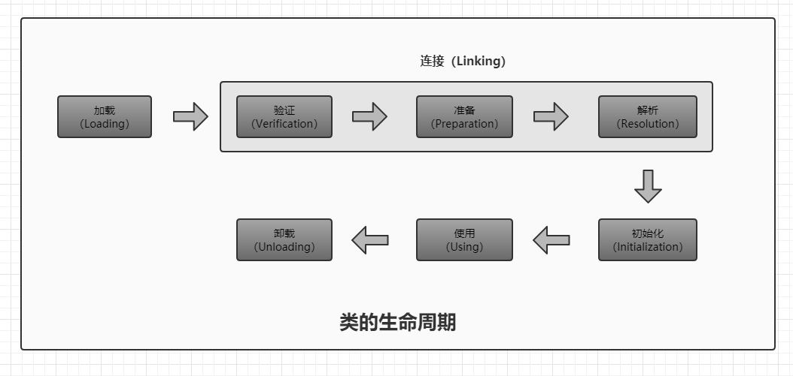
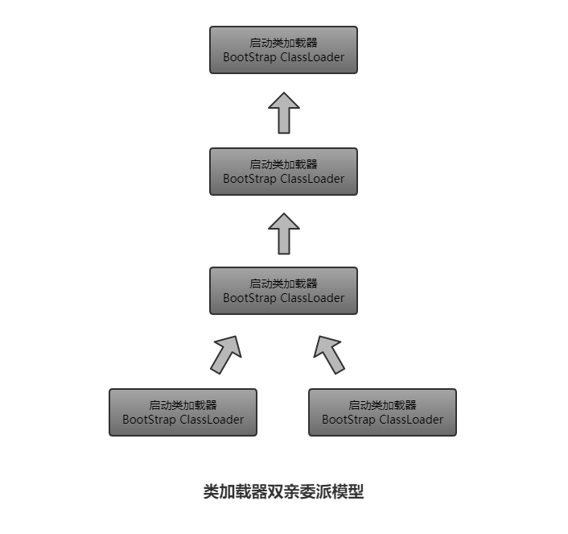

# 虚拟机类加载机制

* **虚拟机的类加载机制：**虚拟机把描述类的数据从Class文件加载到内存，并对数据进行校验、转换解析和初始化，最终形成可以被虚拟机直接使用的Java类型。
* 类型的加载、连接和初始化过程都是在程序运行期间完成的
* Java里天生可以动态扩展的语言特性就是依赖运行期动态加载和动态连接这个特点实现的


## 类加载的时机

类从被加载到虚拟机内存中开始，到卸载出内存为止，整个生命周期：

* 加载（Loading）
* 验证（Verification）
* 准备（Preparation）
* 解析（Resolution）
* 初始化（Initialization）
* 使用（Using）
* 卸载（Unloading）

**验证、准备、解析**统称为**连接（Linking）**。



* 加载、验证、准备、初始化、卸载这5个阶段顺序是确定的
* 解析不一定，可以在初始化之后再开始，为了支持java的动态绑定

**有且只有5种情况必须立即对类进行初始化：**

1. 遇到new、getstatic、putstatic、invokestatic这4条字节码指令时，如果类没有进行初始化，则需要先触发其初始化。
   * 生成这4条指令最常见的java代码场景：
     * 使用new关键字实例化对象
     * 读取或设置一个类的静态字段（被final修饰、已在编译期把结果放入常量池的静态字段除外）
     * 调用一个类的静态方法
2. 使用java.lang.reflect包的方法对类进行反射调用的时候。
3. 初始化一个类时，如果其父类还没有进行初始化，则需要先触发其父类的初始化。
4. 当虚拟机启动时，用户需要指定一个要执行的主类（包含main方法），虚拟机会先初始化这个类。
5. 当使用JDK 1.7的动态语言支持时，如果一个java.lang.invok.MethodHandle实例最后的解析结果REF_getStatic、REF_putStatic、REF_invokeStatic的方法句柄，并且这个方法句柄对应的类没有进行过初始化，则需要先触发其初始化。

* 这5种情景的行为称为对一个类进行**主动引用**，除此之外，所有引用类的方式都不会触发初始化，称为**被动引用**。


## 类加载的过程

### 1. 加载

**加载**是**类加载（Class Loading）**过程的一个阶段。

在加载阶段，虚拟机需要完成以下3件事情：

1. 通过一个类的全限定名来**获取定义此类的二进制字节流**
   * 没有指明从哪里获取，怎样获取，很大的发挥空间
     * 从ZIP包中获取
       * JAR、EAR、WAR格式的基础
     * 从网络中获取
       * Applet
     * 运行时计算生成
       * 动态代理技术
     * 由其他文件生成
       * JSP应用
     * 从数据库中读取
       * 有些中间件服务器可以选择把程序安装到数据库中来完成程序代码在集群间的分发
2. 将这个字节流所代表的静态存储结构转化为**方法区的运行时数据结构**
3. 在内存中生成一个**代表这个类的java.lang.Class对象**，作为**方法区**这个类的各种数据的访问入口

一个**非数组类**的加载阶段可控性是最强的，因为加载阶段既可以使用系统提供的引导类加载器完成，也可以由用户自定义的类加载器去完成，开发人员可以通过定义自己的类加载器去控制字节流的获取方式（即重写一个类加载器的loadClass方法）。

**数组类**本身不通过类加载器创建，它是由jvm直接创建的，然而数组类的元素类型是要靠类加载器去创建的。

一个数组类（C）创建过程遵循以下规则：

* 如果数组的组件类型是**引用类型**，那就递归采用上述加载过程去加载这个组件类型，数组C将在加载该组件类型的类加载器的类名称空间上被标识。
* 如果数组的组件类型不是引用类型，jvm会把数组C标记为与引导类加载器相关联。
* 数组类的可见性与它的组件类型的可见性一致，如果组件类型不是引用类型，那数组类的可见性默认为public。

加载阶段完成后，虚拟机外部的**二进制字节流**就按照虚拟机所需的格式存储在**方法区**之中，然后在内存中实例化一个java.lang.Class类的对象，这个对象将作为程序访问方法区中的这些类型数据的外部接口。

* 对于HotSpot而言，Class对象比较特殊，虽然是对象，但是存放在方法区里面


### 2. 验证

目的：确保Class文件的字节流中包含的信息符合当前虚拟机的要求，并且不会危害虚拟机自身的安全。

java语言本身是相对安全的语言，但是Class文件并不一定要求用java源码编译而来，所以验证是虚拟机对自身保护的一项重要工作。

如果验证到输入的字节流不符合Class文件格式的约束，虚拟机应抛出一个java.lang.VerifyError异常或其子类异常。

从整体上看，验证阶段大致上会完成下面4个阶段的检验动作：文件格式验证、元数据验证、字节码验证、符号引用验证。

#### 2.1 文件格式验证

验证字节流是否符合Class文件格式的规范，并且能被当前版本的虚拟机处理。

可能包括以下验证点：

* 是否以魔数`0xCAFEBABE`开头
* 主、次版本号是否在当前虚拟机处理范围之内
* 常量池的常量是否有不被支持的常量类型（检查常量标志tag）
* 指向常量的各种索引值中是否有指向不存在的常量或不符合类型的常量
* `CONSTANT_Utf8_info`型的常量中是否有不符合UTF8编码的数据
* Class文件中各个部分及文件本身是否有被删除的或附加的其他信息

主要目的：保证输入的字节流能正确地解析并存储于方法区之内，格式上符合描述一个java类型信息的要求。

该阶段的验证是**基于二进制字节流**进行的，只有通过了这个阶段的验证，字节流才能进入方法区，所以后面的3个验证都是**基于方法区的存储结构**进行的。

#### 2.2 元数据验证

对字节码描述的信息进行语义分析，保证其描述的信息符合java语言规范的要求。

验证点：

* 这个类是否有父类（除了object外）
* 这个类的父类是否继承了不允许被继承的类（final修饰的类）
* 如果这个类不是抽象类，是否实现了其父类或接口之中要求实现的所有方法
* 类中的字段、方法是否与父类产生矛盾

主要目的：对类的元数据信息进行语义校验，保证不存在不符合java语言规范的元数据信息。

#### 2.3 字节码验证

最复杂的一个阶段。

主要目的：通过数据流和控制流分析，确定程序语义是合法的、符合逻辑的。

对类的方法体进行校验分析，保证被校验类的方法在运行时不会做出危害虚拟机安全的事件，如：

* 保证任意时刻操作数栈的数据类型与指令代码序列都能配合工作
* 保证跳转指令不会跳转到方法体以外的字节码指令上
* 保证方法体中的类型转换是有效的

#### 2.4 符号引用验证

发生时间：虚拟机将符号引用转化为直接引用时。

符号引用验证可以看做是对类自身意外的信息进行匹配性校验（常量池中的各种符号引用）。

通常需要校验以下内容：

* 符号引用中通过字符串描述的全限定名是否能找到对应的类
* 在指定类中是否存在符合方法的字段描述符以及简单名称所描述的方法和字段
* 符号引用中的类、字段、方法的访问性（private、protected、public、default）是否可被当前类访问

目的：确保解析动作能正常执行

如果无法通过符号引用验证，将抛出`java.lang.IncompatibleClassChangeError`异常的子类，如：`java.lang.IllegalAccessError`、`java.lang.NoSuchFieldError`、`java.lang.NoSuchMethodError`等

验证阶段非常重要，但不是必要（对程序运行期没有影响）。


### 3. 准备

* 正式为类变量分配内存并设置类变量初始值的阶段。
  * 所使用的内存都在**方法区**中分配。
  * 仅包括**类变量（staic修饰）**，而不包括实例变量
    * 实例变量在对象实例化时随着对象一起分配在java堆中
  * 初始值通常是**零值**

* 如果类字段的字段属性表存在ConstantValue属性，那在准备阶段变量value就会被初始化为ConstantValue属性所指定的值

  ```java
  public static final int value = 123;
  ```


### 4. 解析

* 将常量池内的符号引用替换为直接引用的过程
  * 符号引用（Symbolic References）：以一组符号来描述所引用的目标
    * 符号可以是任何形式的字面量
    * 引用的目标并不一定已经加载到内存中
    * 字面量形式明确定义在jvm规范的Class文件格式中
  * 直接引用（Direct References）：可以是直接指向目标的指针、相对偏移量、一个能间接定位到目标的句柄
    * 和jvm实现的内存布局相关
    * 如果有了直接引用，引用的目标一定已经在内存中
* jvm规范只要求在执行`anewarray, checkcase, getfield, getstatic, instanceof, invokedynamic, inovokeinterface, invokespecial, invoestatic, invokevirtual, ldc, ldc_w, multianewarray, new, putfield, putstatic`这16个用于操作符号引用的字节码指令之前，先对它们所使用的符号引用进行解析
* jvm实现可以根据需要来判断，在**类被加载器加载时**就对常量池中的符号引用进行解析，还是等到一个**符号引用将要被使用前**才去解析
* 除了invokedynamic指令之外，jvm实现可以对第一次解析的结果进行缓存，从而避免解析动作重复执行
* 在同一个实体中，如果一个符号引用之前已经被成功解析过，那么后续的引用解析请求应当一直成功；如果第一次解析失败，那么其他指令对这个符号的解析请求也应该收到相同的异常
* **解析动作主要针对7类符号引用进行，对应于常量池的7种常量类型，如下表：**

| 符号引用     | 常量池中常量类型                 |
| ------------ | -------------------------------- |
| 类或接口     | CONSTANT_Class_info              |
| 字段         | CONSTANT_Fieldref_info           |
| 类方法       | CONSTANT_Methodref_info          |
| 接口方法     | CONSTANT_InterfaceMethodref_info |
| 方法类型     | CONSTANT_MethodType_info         |
| 方法句柄     | CONSTANT_MethodHandle_info       |
| 调用点限定符 | CONSTANT_InvokeDynamic_info      |

#### 4.1 类或接口的解析

**类D**，从未解析过的**符号引用N**解析为一个**类或接口C**的直接引用。

3个步骤：

1. 如果C**不是数组类型**，jvm把代表**N的全限定名**传递给**D的类加载器**去加载这个类C
   * 加载过程中，可能触发其他相关类的加载动作

2. 如果C是一个**数组类型**，**数组元素类型为对象**，N的描述符形式：`[Ljava/lang/Integer`，按照第一点规则加载**数组元素类型（对象）**，接着由jvm生成一个**代表此数组维度和元素的数组对象**

3. 如果上面步骤没有异常，C在jvm中已经成为一个有效的类或接口了，但是解析完成之前还需要进行**符号引用验证**，**确认D是否具备对C的访问权限**，如果不具备，抛出`java.lang.IllegalAccessError`

#### 4.2 字段解析

要解析一个未解析过的字段符号引用，首先先解析字段所属的类或接口的符号引用。

如下步骤对C进行后续字段的搜索：

1. 如果C本身就包含了**简单名称和字段描述符都与目标相匹配的字段**，返回这个字段的**直接引用**，查找结束。
2. 否则，如果C实现了**接口**，按继承关系**从下往上**递归搜索各个接口和它的父接口，如果接口中包含了简单名称和字段描述符都与目标相匹配的字段，返回这个字段的直接引用，查找结束。
3. 否则，如果C不是object，将会按照继承关系**从下往上**递归搜索其父类，如果... ...，查找结束
4. 都这，查找失败，抛出`java.lang.NoSuchFieldError`

如果查找过程成功返回了引用，将会对这个字段进行 **权限验证**，不具备对字段的访问权限，抛出`java.lang.IllegalAccessError`。

实际应用中，如果有一个同名字段同时出现在C的接口和父类中，或者同时在自己或父类的多个接口中出现，那编译器可能拒绝编译。

#### 4.3 类方法解析

先解析字段所属的类或接口的符号引用。

按如下步骤进行后续的类方法搜索：

1. 类方法和几口方法符号引用的的常量类型定义是分开的，类方法表中发现C是个接口，直接抛出`java.lang.IncompatibleClassChangeError`
2. 在**类C**中查找是否有**简单名称和描述符都与目标相匹配的方法**，如果有则返回这个方法的**直接引用**，查找结束
3. 否则，在类C的**父类**中递归查找 ... ... ，如果有则返回这个方法的直接应用，查找结束
4. 否则，在类C实现的**接口列表**及它们的父接口之中递归查找是否有... ...，如果存在匹配的方法，说明==类C是一个抽象类==（？），查找结束，抛出`java.lang.AbstractMethodError`
5. 否则，查找失败

如果查找过程成功返回了引用，将会对这个字段进行 **权限验证**，不具备对字段的访问权限，抛出`java.lang.IllegalAccessError`。

#### 4.4 接口方法解析

先解析字段所属的类或接口的符号引用。

按如下步骤进行后续的接口方法搜索：

1. 接口方法表中发现C是个类而不是接口，直接抛出`java.lang.IncompatibleClassChangeError`
2. 否则，在接口C中查找是否有简单名称和描述符都与目标相匹配的方法，如果有，返回这个方法的直接引用，查找结束
3. 否则，在接口C的父接口中递归查找，直到Object类，看是否... ...
4. 否则，查找失败，抛出`java.lang.NoSuchMethodError`

由于接口中的所有方法默认都是public，所以不存在访问权限的问题。


### 5. 初始化

到此阶段，才真正开始执行类中定一个java程序代码（字节码）。

在准备阶段，变量已经赋过一次系统要求的初始值，在初始化阶段，则根据程序员通过程序制定的主观计划去初始化类变量和其他资源。

初始化阶段是执行类构造器\<clinit\>()方法的过程。

* \<clinit\>()方法是由编译器自动收集类中的所有类变量的赋值动作和静态语句块（static块）中的语句合并产生的
  * 收集顺序是语句在源文件中出现的顺序所决定的
  * 静态语句块中只能访问到定义在静态语句块之前的变量，定义在它之后的变量，在前面的静态语句块中可以赋值，但是不能访问
* \<clinit\>()方法与类的构造函数不同（\<init\>()方法），不需要显式地调用父类构造器，jvm会保证在子类的\<clinit\>()方法执行之前，父类的\<clinit\>()方法已经执行完毕
  * 所以，jvm中第一个执行的\<clinit\>()方法的类肯定是`java.lang.Object`
* 父类中定义的静态语句块要优先于子类的变量赋值操作
* 对于类或接口不是必需的，如果一个类中没有静态语句块，也没有对变量的赋值操作，则可以不生成
* 接口中不能使用静态语句块，但仍然有变量初始化的赋值操作
  * 不需要先执行父接口的\<clinit\>()方法
  * 只有父接口中定义的变量使用时，父接口才会初始化
  * 接口的实现类在初始化时也不会执行接口的\<clinit\>()方法
* jvm保证一个类的\<clinit\>()方法在多线程环境中被正确的加锁、同步
  * 多个线程同时初始化一个类，只会有一个线程去执行这个类的\<clinit\>()方法
  * 同一个类加载器下，一个类型只会初始化一次


## 类加载器

把类加载阶段中的**“通过一个类的全限定名来获取描述此类的二进制字节流”**这个动作放到jvm外部去实现，以便让应用程序自己决定如何去获取所需要的类。实现这个动作的代码模块称为**类加载器**

### 类与类加载器

* 对于任意一个类，都需要由加载它的类加载器和这个类本身一同确立其在jvm中的唯一性，每一个类加载器，都拥有一个独立的类名称空间
* 只要加载它们的类加载器不同，那么这两个类就必定不相等


### 双亲委派模型

3种系统提供的类加载器：

* **启动类加载器（Bootstrap ClassLoader）：**由C++实现，是虚拟机的一部分
  * 负责将存放在<JAVA_HOME>\lib目录中的，或者被-Xbootclasspath参数所指定的路径中的，并且是虚拟机识别的类库加载到虚拟机内存中（仅按照文件名识别）
  * 无法被java程序直接引用
  * 用户在编写自定义类加载器时，如果需要把加载请求委派给引导类加载器，那直接使用null代替即可
* **扩展类加载器（Extension ClassLoader）：**由`sun.misc.Launcher$ExtClassLoader`实现
  * 负责加载<JAVA_HOME>\lib\ext目录中的，或者被`java.ext.dirs`系统变量所指定的路径中的所有类库
  * 开发者可以直接使用扩展类加载器
* **应用程序类加载器（Application ClassLoader）：**由`sun.misc.Launcher$AppClassLoader`实现
  * 由于这个类加载器是ClassLoader中的`getSystemClassLoader()`方法的返回值，所以也称**系统类加载器**
  * 负责加载用户类路径（ClassPath）上所指定的类库
  * 可以直接使用
  * 如果应用程序中没有自定义过自己的类加载器，一般情况下这个就是**程序中默认的类加载器**

**类加载器的双亲委派模型（Parents Delegation Model）**

* 要求除了顶层的启动类加载器外，其余的类加载器都应当有自己的父类加载器
* 父子关系一般不会以继承的关系来实现，都是使用组合关系来复用父加载器的代码
* 不是一个强制性的约束模型
* 工作过程：
  * 如果该一个类加载器收到了类加载的请求，不会自己加载这个类，而是把请求委派给父类加载器完成，每一个层次的类加载器都是如此，所有的加载请求最终都应该传送到顶层的启动类加载器中，只有父加载器反馈自己无法完成这个加载请求时，子加载器才会尝试自己去加载
* 好处：java类随着它的类加载器一起举杯了一种带有优先级的层次关系




