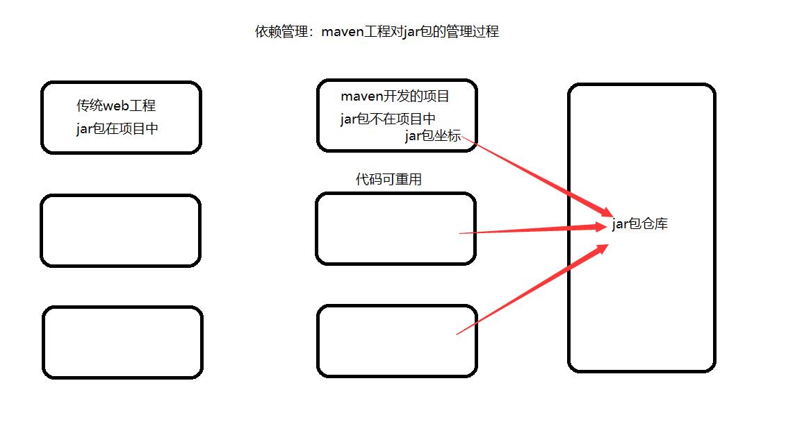

## maven依赖管理的概念

- 依赖管理：maven工程对jar包管理的过程。
- 传统web工程
  - jar包在项目中，导致项目所占空间巨大
- maven开发项目
  - jar包不在项目中
  - 项目中只包含jar包的坐标，利用坐标到jar包仓库中查找
  - 代码可重用

## 项目的一键构建

* 构建：项目从编译、测试、运行、打包、安装、部署整个过程都交给maven进行管理，这个过程称为构建
* 一键构建：整个构建过程，使用maven一个命令可以轻松完成整个工作
  * mvn tomcat:run
* Maven规范化构建流程如下：
  * maven将项目构建的过程进行标准化，每个阶段使用一个命令完成
  * 构建阶段
    * 清理
    * 编译
    * 测试
    * 报告
    * 打包
    * 部署

## maven的安装

1. 官网下载安装包：http://maven.apache.org/download.cgi

2. 解压到非中文无空格目录下
   * bin/
     * m2.conf
     * mvn
     * mvn.cmd：构建项目
     * mvnDebug
     * mvnDebug.cmd
     * mvnyjp

   * boot/ 
     * plexus-classworlds-2.6.0.jar：自身运行所需要的类加载器
   * conf/
     * logging/
     * settings.xml：maven配置文件
     * toolchains.xml

   * lib/
     * 放置maven自身运行所依赖的jar包
   * LICENSE
   * NOTICE
   * README.txt

3. 配置环境变量，maven需要 JAVA_HOME

4. 出现如下图所示，环境变量配置成功

## 仓库的种类和关系

仓库的种类：

- 本地仓库

  - 配置本地的仓库 settings.xml

    

- 远程仓库（私服）

- 中央仓库

  - 如果中央仓库下载慢，可以配置成阿里云的maven仓库

    

仓库之间的关系：

* 启动一个maven工程的时候，会通过pom.xml文件中的jar包的坐标去本地仓库找对应的jar包
* 默认情况下，如果本地仓库没有对应的jar包，会自动去中央仓库下载jar包到本地仓库
* 在公司中，如果本地仓库没有对应jar包，会先从私服下载jar包
  * 如果私服没有jar包，可以从中央仓库下载，也可以从本地上传

## maven项目目录结构

* src/main/java：核心代码部分
* src/main/resources：配置文件部分
* src/test/java：测试代码部分
* src/test/resources：测试配置文件
* src/main/webapp：页面资源，js，css，图片等
* target：项目输出位置，编译后的class文件会输出到此目录
* pom.xml：maven项目的核心配置文件

## 常用maven命令

### 1. compile

compile是maven工程的编译命令，作用是将src/main/java下的文件编译为class文件输出到target目录下。

### 2. test

test是maven工程的测试命令，会执行src/test/java下的单元测试类

### 3. clean

clean是maven工程的清理命令，执行clean会删除target目录的内容

### 4. package

package是maven工程的打包命令，对于java工程执行package打包成jar包，对于web工程打成war包

### 5. install

intall是maven工程的安装命令，执行install将maven打成jar包或war包发布到本地仓库

## maven生命周期

### 1. 三套生命周期

maven对项目构建过程分为三套相互独立的生命周期，相互独立。

* Clean Lifecycle：在进行真正的构建之前进行一些清理工作
* Default Lifecycle：构建的核心部分，编译，测试，打包，部署等
* Site Lifecycle：生成项目报告，站点，发布站点

### 2. 生命周期的阶段

每个声明周期都有很多阶段，每个阶段对应一个执行命令。

* 清理生命周期
  * pre-clean：执行一些需要在clean之前完成的工作
  * **clean：移除所有上一次构建生成的文件**
  * post-clean：执行一些需要在clean之后立刻完成的工作
* 默认生命周期
  * validate
  * generate-sources
  * process-sources
  * generate-resources
  * process-resources：复制并处理资源文件，至目标目录，准备打包
  * **compile：编译**
  * process-classes
  * generate-test-sources
  * process-test-sources
  * generate-test-resources
  * process-test-resources：复制并处理资源文件，至目标测试目录
  * test-compile：编译测试源代码
  * process-test-classes
  * **test：使用合适的单元测试框架运行测试，这些测试代码不会被打包或部署**
  * prepare-package
  * **package：接受编译好的代码，打包成可发布的格式，如JAR**
  * pre-integration-test
  * integration-test
  * post-integration-test
  * verify
  * **install：安装**
  * **deploy：发布**
* 站点生命周期
  * pre-site：执行一些需要在生成站点文档之前完成的工作
  * site：生成项目的站点文档
  * post-site：执行一些需要在生成站点文档之后完成的工作，并且为部署做准备
  * site-deploy：将生成的站点文档部署到特定的服务器上

## maven的概念模型

maven包含了一个项目对象模型，一组标准集合，一个项目生命周期，一个依赖管理系统，和 用来运行定义在生命周期阶段中插件目标的逻辑。

* 项目对象模型（Project Object Model）
  * 每个maven工程都有一个pom.xml文件，通过pom.xml文件定义项目的坐标、项目依赖、项目信息、插件目标等。
* 依赖管理系统（Dependency Management System）
  * 通过maven的依赖管理对项目所依赖的jar包进行统一管理
* 一个项目生命周期（Project Lifecycle）
  * 使用maven完成项目的构建，项目构建包括：清理、编译、测试、部署等过程，maven将这些过程规范为一个生命周期
* 一组标准集合
  * maven将整个项目管理过程定义一组标准
  * 比如：通过maven构建工程有标准的目录结构，有标准的生命周期阶段、依赖管理有标准的坐标定义等
* 插件（plugin）目标（goal）
  * maven管理项目生命周期过程都是基于插件完成的

## idea集成maven插件

* 配置maven的安装目录，setting目录

* 配置`-DarchetypeCatalog=internal`，只要联网下载过，就会从本地查找，以后无需联网

## 使用骨架创建maven的java工程

* 选择maven项目

* 配置maven坐标

* 确认maven信息

* 配置项目名称和位置等信息

* 等待下载完成后，项目创建完毕，此时会有一个小demo可以运行

* 创建的项目目录并不完善，需要自己在main目录下创建resources目录，并标记为资源文件目录

## 不使用骨架创建maven的java工程

* 与使用类似，不过在创建时不勾选使用骨架，创建后的目录结构自动有resources目录。
* 推荐使用这种方式

## maven导入jar包时冲突的解决

* 第一声明优先原则：哪个jar包的坐标在靠上的位置，这个jar包就是先声明的，先声明的jar包坐标下的依赖包，可以优先进入项目中。
* 路径近者有限原则：直接依赖路径比传递路径近，那么最终项目进入的jar包会是路径近的直接依赖包。
  * 直接依赖：项目中直接导入的jar包，就是该项目的直接依赖包
  * 传递依赖：项目中没有直接导入的jar包，可以通过项目直接依赖jar包传递到项目中去
* **直接排除法（推荐）**：当我们要排除某个jar包下的依赖包，在配置exclusion标签的时候，内部可以不写版本号，因为此时依赖包使用的版本和默认的本jar包一样

maven工程是可以分父子依赖关系的。

凡是依赖别的项目后，拿到的别的项目的依赖包，都属于依赖传递。

比如，当前A项目，被B项目依赖。那么我们A项目中所有jar包都会传递到B项目中。

B项目开发者，如果再在B项目中导入一套ssm框架的jar包，对于B项目是直接依赖。

那么直接依赖的jar包就会把我们A项目传递过去的jar包覆盖掉。

为了防止以上情况的出现，我们可以把A项目中主要jar包的坐标锁住，那么其他依赖该项目中，

即便是有同名jar包直接依赖，也无法覆盖。

锁定的包不会添加依赖项，所以还需要额外添加依赖。

## maven拆分和聚合

maven把一个完整的项目，分成不同的独立模块，这些模块都有各自独立的坐标，哪个地方需要其中某个模块，就直接引用该模块的坐标即可。

今后如果公司开发一个新项目，我们先考虑问题不是dao，sevice，utils，domain如何编写，

而是这些模块是否已经存在，如果存在直接引用。

以上就是maven拆分的思想。

我们可以把拆分零散的模块聚合到一起编写一个完整的项目，这就是maven聚合思想。

## 工程和模块

工程和模块的区别：

* 工程不等于完整的项目，模块也不等于完整的项目，一个完整的项目看的是代码，代码完整，就可以说这是一个完整的项目，和此项目是工程和模块没有关系。

* 工程天生只能使用自己内部资源，工程天生是独立的，后天可以和其他工程或模块建立关联关系。

* 模块天生不是独立的，模块天生是属于父工程的，模块一旦创建，所有父工程的资源都可以使用。

* 父子工程之间，子模块天生集成父工程，可以使用父工程所有资源。

* 子模块之间天生是没有任何关系的。

* 父子工程之间不用建立关系，继承关系是先天的，不需要手动建立。

* 平级直接的引用叫依赖，依赖不是先天的，依赖是需要后天建立的。

