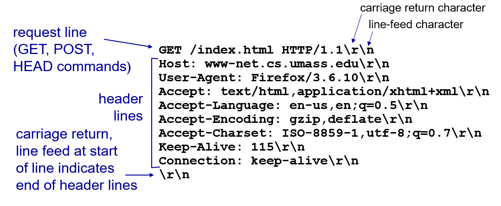
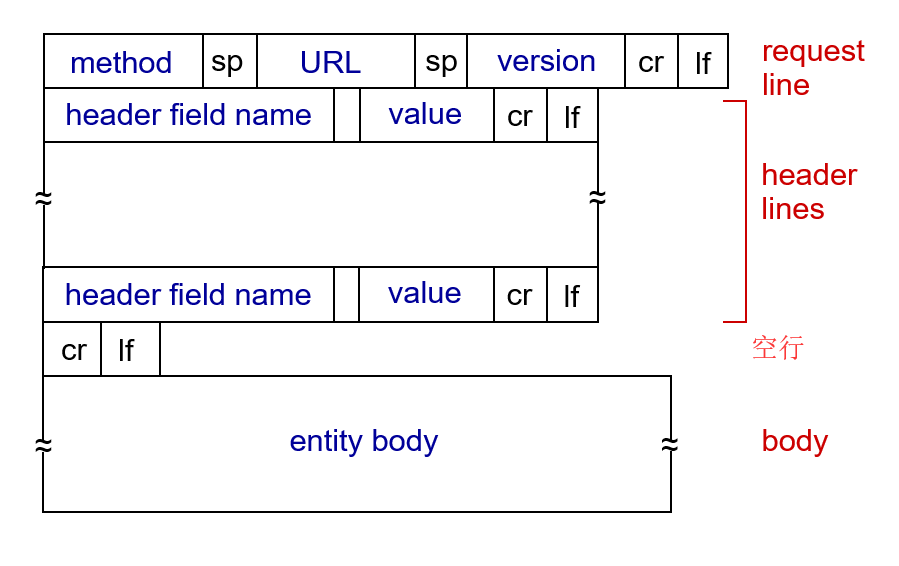
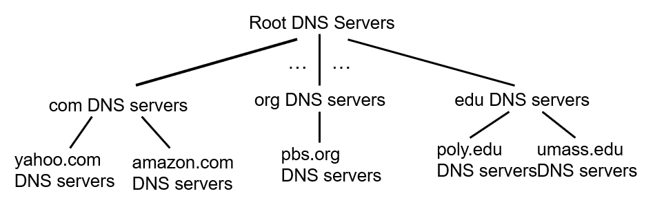
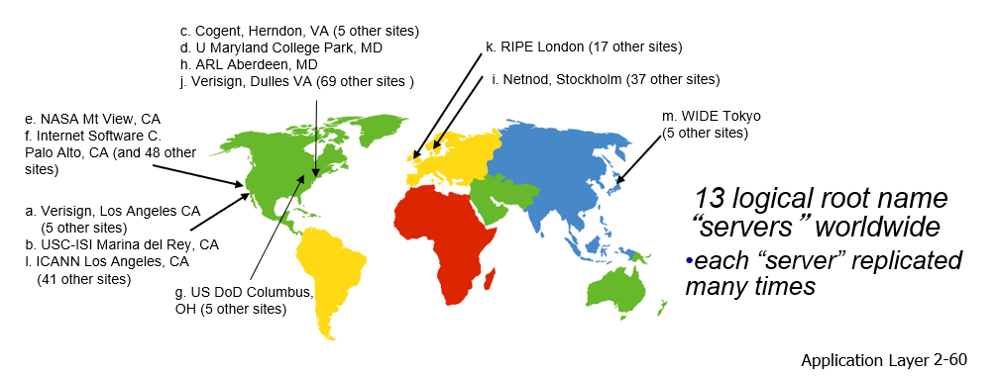
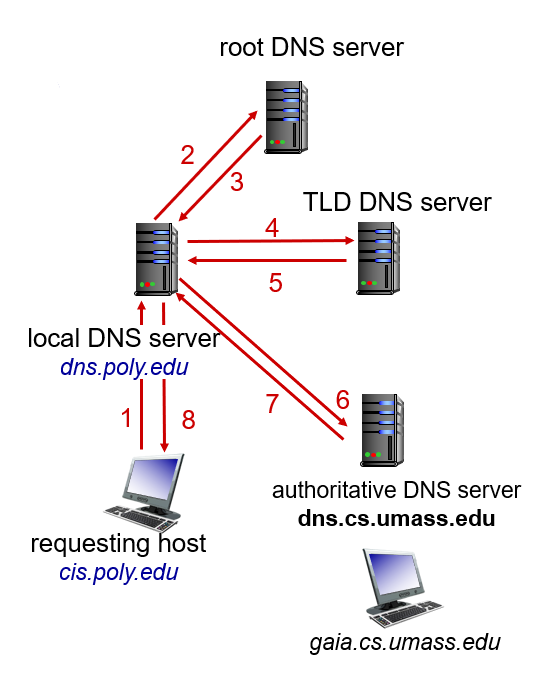
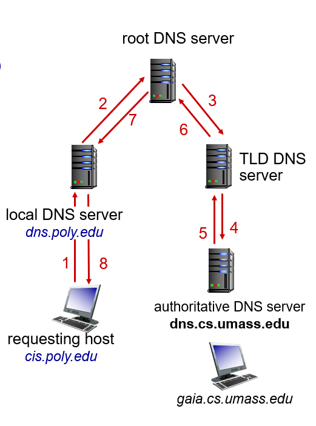

# 第二章  应用层

### 2.1 应用层协议原理

研发网络应用程序的核心是写出能够在不同的端系统和通过网络彼此通信的程序。

* 需要编写能在多台端系统上运行的软件，可用C，java，python等编写。
* 不需要写在网络核心设备如路由器或链路层交换机上运行的软件。因为网络核心设备并不在应用层上起作用，而仅在较低层起作用，特别是在网络层及下面层次起作用。

#### 2.1.1 网络应用程序体系结构

从应用程序研发者的角度看，网络体系结构是固定的，并为应用程序提供了特定的服务集合。

在另一方面，应用程序体系结构（application architecture）由应用程序研发者设计，规定了如何在各种端系统上组织该应用程序。

两种主流体系结构：**客户 - 服务器体系结构** 和 **对等（P2P）体系结构**

##### **1.  客户 - 服务器体系结构（client - server architecture）**

**服务器（server）：**

* 一个总是打开的主机，服务于来自许多其他称为**客户**的主机的请求。

* 服务器具有固定的、周知的地址，称为IP地址
* 配备大量主机的数据中心用于创建虚拟服务器

**客户（client）：**

* 与服务器通信
* 可能间歇性连接
* 可能有动态IP地址
* 相互之间不直接通信

**著名应用程序：**

* Web
* FTP
* Telnet
* 电子邮件

##### **2. P2P体系结构（P2P architecture）**

应用程序在间断连接的主机对之间使用直接通信，这些主机称为**对等方**。

对等方不为服务提供商所有，这种对等方通信不比通过专门的服务器，体系结构称为**对等方到对等方的**。

**特性：**

* 没有不间断服务器

* 任意终端系统直接通信
* 对等方从其他对等方请求服务，向其他对等方提供服务
  * 自扩展性：新的对等方产生新的**服务请求**和新的**服务能力**
* 对等方间断连接并更改IP地址
  * 复杂的管理

#### 2.1.2 进程通信

多个进程运行在相同的端系统上时，使用**进程间通信机制**相互通信。

网络主要关运行在**不同端系统上**（可能是不同的操作系统）的进程间的通信。

在不同端系统上的进程，通过跨越计算机网络**交换报文（message）**而相互通信。

* **发送进程**生成并向网络中发送报文
* **接收进程**接受这些报文并可能通过回送报文进行响应

##### 1. 客户和服务器进程

网络应用程序由**成对的进程**组成，这些进程通过网络相互发送报文。

* **客户（client）**：发起通信的进程
* **服务器（server）**：在会话开始时等待联系的进程

##### 2. 进程与计算机网络之间的接口

进程通过一个称为**套接字（socket）的软件接口**向网络发送报文和从网络接收报文。

进程类比于一座房子，而套接字则是它的门。

套接字是同一台主机内**应用层与运输层之间的接口**。

由于套接字是建立网络应用程序的可编程接口，因此套接字称为**应用程序和网络之间的应用程序编程接口（Application Programming Interface, API）**

应用程序开发者可以控制套接字在应用层端的一切，但是对该套接字的运输层几乎没有控制权。

对运输层的控制权仅限于：

1.  选择运输层**协议**
2.  也许能设定几个运输层**参数**，如最大缓存和最大报文段长度等

##### 3. 进程寻址

为了标识接受进程，需要定义两种信息：

* 主机的地址，由**IP地址（IP address）**标识
* 在目的主机中指定接收进程的标识符，由**端口号（port number）**标识

#### 2.1.3 可供应用程序使用的运输服务

当开发应用时，必须选择一种可用的运输层协议。

大体能够从四个方面对应用程序服务要求进行分类：**可靠数据传输**、**吞吐量**、**定时**和**安全性**。、

##### 1. 可靠数据传输

**可靠数据传输（reliable data transfer）：**确保由应用程序的一段发送的数据正确、完全地交付给该应用程序的另一端。

**容忍丢失的应用（loss-tolerant application）：**多媒体应用，如音频和视频等，能够承受一定量的数据丢失，可以使用不可靠数据传输。

##### 2. 吞吐量（throughput）

运输层协议能够以某种特定的速率提供确保的可用吞吐量

* **带宽敏感的应用（bandwidth-sensitive application）：**具有吞吐量要求的应用程序。

许多当前的多媒体应用是带宽敏感的，尽管某些多媒体应用程序可能采用自适应编码技术对数字语音或视频以与当前可用带宽相匹配的速率进行编码。

* **弹性应用（elatic application）：**能够根据当时可用的带宽或多或少地利用可供使用的吞吐量。

电子邮件、文件传输以及Web传送都属于弹性应用。

##### 3. 定时（timing）

某些服务为了有效性而要求数据交付有严格的时间限制。

对于非实时的应用，较低的时延总比较高的时延好，但对端到端的时延没有严格的约束。

##### 4. 安全性（security）

运输协议能为应用程序提供一种或多种安全性服务。例如，在发送主机中，运输协议能够加密由发送进程传输的所有数据，在接收主机中，运输层协议能都在将数据交付给接受进程之前解密这些数据。

运输协议还能提供除了机密性以外的其他安全性服务，包括数据完整性和端点鉴别。

#### 2.1.4 因特网提供的运输服务

因特网（TCP/IP网络）为应用程序提供了两个**运输层协议**，即**UDP**和**TCP**。

##### 1. TCP服务

TCP服务模型包括**面向连接服务**和**可靠数据传输服务**。当某个应用程序调用TCP作为运行协议时，应用程序就能获得这两种服务。

* **面向服务的连接：**
  * 握手阶段，TCP让客户和服务器互相交换运输层控制信息。
  * 握手阶段后，一个**TCP连接（TCP connection）**就在两个进程的套接字之间建立了。
  * 这条连接是**全双工**的，即连接双方的进程可以在此连接上同时进行报文收发。
  * 当应用程序结束报文发送时，必须**拆除该连接**。
* **可靠的数据传送服务：**通信进程能够依靠TCP，无差错、按适当顺序交付所有发送的数据。当应用程序的一端将字节流进套接字时，它能够依靠TCP将相同的字节流交付给接收方的套接字，而没有字节的丢失和冗余。

TCP协议还具有**拥塞控制机制**，不一定能为通信进程带来直接好处，但能为因特网带来整体好处。当发送方和接受方之间的网络出现拥塞时，该机制会抑制发送进程（客户或服务器）。

---

<h4 align="center">TCP安全</h4>

无论TCP还是UDP都没有提供任何加密机制。

**安全套接字层（Secure Sockets Layer, SSL）：**TCP的加强版本，提供了关键的进程到进程的安全性服务，包括加密、数据完整性和端点鉴别。

- **SSL不是运输协议**，而是对TCP的一种加强，这种强化是在应用层上实现的。

- SSL有它自己的套接字API

---

##### 2. UDP服务

* UDP是一种不提供不必要服务的轻量级运输协议，它仅提供最小服务
* 无连接，没有握手过程
* 不可靠数据传送服务，不保证报文一定到达接收进程，到达报文可能是乱序的
* 没有拥塞控制机制

##### 3. 因特网运输协议所不提供的服务

**吞吐量**和**定时保证**，这些服务目前的因特网运输协议并没有提供。

<h5 align="center">流行的因特网应用及其应用层协议和支撑的运输协议</h5>

|     应用     |         应用层协议          | 支撑的运输协议 |
| :----------: | :-------------------------: | :------------: |
|   电子邮件   |            SMTP             |      TCP       |
| 远程终端访问 |           Telnet            |      TCP       |
|     Web      |            HTTP             |      TCP       |
|   文件传输   |             FTP             |      TCP       |
|  流式多媒体  |            HTTP             |      TCP       |
|  因特网电话  | SIP、RTP或专用的（如Skype） |    UDP或TCP    |

#### 2.1.5 应用层协议

**应用层协议（application-layer protocol）**定义了运行在不同端系统上的应用程序进程如何相互传递报文。

* 交换的报文类型
* 各种报文类型的语法
* 字段的语义
* 确定一个进程何时以及如何发送报文，对报文进行相应的规则

**应用层协议只是网络应用的一部分。**

五种重要的网络应用：Web、文件传输、电子邮件、目录服务、流式视频和P2P。

### 2.2 Web和HTTP

最具吸引力的是**Web的按需操作**。

#### 2.2.1 HTTP概况

- **Web网页（Web page）**（也叫文档）是由**对象**组成。
- **对象（object）：**一个文件，诸如一个HTML文件、一个JPEG文件、一个Java小程序或一个视频片段这样的文件，并且他们可以通过一个URL地址寻址。
- 多数Web页面含有一个**HTML基本文件（base HTML file）**以及几个引用对象。
- HTML基本文件通过对象的URL地址引用页面中的其他对象。
- 每个对象由URL寻址。
- URL由两部分组成：存放对象的服务器主机名 + 对象路径名

**HTTP（HyperText Transfer Protocol）：**超文本传输协议，Web的核心。

* 应用层协议
* 端口号：80
* 两个程序实现
  * 客户：使用HTTP协议，请求、接收和“显示”Web对象的浏览器
  * 服务器：使用HTTP协议，Web服务器用于存储Web对象，并且发送对象以响应请求
* 定义了Web客户向Web服务器请求Web页面的方式，以及服务器向客户传送Web页面的方式

* 使用**TCP**作为运输协议
  * 客户发起一个与服务器的TCP连接（创建套接字）
  * 服务接收从客户来的TCP连接
  * 在浏览器和服务器间交换HTTP报文
  * TCP连接关闭
* **无状态协议（stateless protocol）：**HTTP服务器不保存关于客户的任何信息。
  * protocols that maintain “state” are complex：
    * 过去的历史(状态)必须保持
    * 如果服务器/客户端崩溃，他们对“状态”的观点可能不一致，必须进行协调

#### 2.2.2 非持续连接和持续连接

**1. 非持续连接（non-persistent connection）：**每个请求/响应对是经一个**单独的TCP连接**发送。

* 每个TCP连接在服务器发送一个对象后关闭，即该连接不为其他的对象而持续下来
* 每个TCP连接只传输一个请求报文和一个响应报文
* 下载多个对象需要多个TCP连接
* 缺点：
  * 必须为每一个请求对象建立和维护一个全新的连接
  * 每一个对象经受两倍RTT的交付时延

**往返时间（Round-Trip Time, RTT）：**指一个短分组从客户到服务器然后再返回客户所花费的时间

**HTTP响应时间：**

* one RTT 启动TCP连接
* one RTT用于HTTP请求和返回几个字节的HTTP响应
* 文件传输时间
* **非持续连接的HTTP响应时间 = 2RTT + 文件传输时间**

**2. 持续连接（persistent connection）：**所有的请求及其响应经**相同的TCP连接**发送。

在采用HTTP 1.1 持续连接的情况下：

* 服务器在发送响应后保持该TCP连接打开
* 后续的请求和响应报文能够通过相同的连接进行传送
* 如果一条连接经过一定时间间隔（可配置）仍未被使用，HTTP服务器就关闭该链接
* **HTTP的默认模式是**使用带流水线的<b style="color: red;">持续连接</b>

#### 2.2.3 HTTP报文格式

HTTP报文有两种：请求报文和响应报文。

##### 1. HTTP请求报文

* 普通的ASCII文本书写
* 每行由一个回车和换行符结束，最后一行附加一个回车换行符
* 第一行叫**请求行（request line）**，其后继的行叫作**首部行（header line）**
  * 请求行有三个字段：
    * 方法字段：GET、POST、HEAD、PUT 和 DELETE
    * URL字段
    * HTTP版本字段
  * 首部行
    * Host：指明对象所在主机
    * User-Agent：指明用户代理即向服务器发送请求的浏览器的类型
    * Accept-Language：表示用户想得到该对象的法语版本

<h5 align="center">一个HTTP请求报文的通用格式</h5>

**实体体（entity body）：**使用GET方法时为空，使用POST方法时才使用该实体体。

**POST方法：**

* Web页面通常包含表单输入
* 实体体中包含表单输入值

**URL方法：**

* 使用GET方法
* 输入值包含在请求行的URL中
  * URL结构：`www.somesite.com/animalsearch?monkeys&bananas`

提交方法类型：

* **HTTP/1.0：**
  * GET
  * POST
  * HEAD
    * asks server to leave requested object out of response
* **HTTP/1.1：**

  * GET, POST, HEAD

  * PUT

    * uploads file in entity body to path specified in URL field（将实体主体中的**文件上传**到URL字段中指定的路径）

  * DELETE

    * deletes file specified in the URL field（**删除**URL字段中指定的**文件**）

##### 2. HTTP响应报文

* **状态行（status line）**
  * 协议版本字段
  * 状态码
  * 相应状态信息
* **首部行（header line）**
  * Connection：close首部行，发送完报文后将关闭该TCP连接
  * Date：首部行，服务器产生并发送该响应报文的日期和时间（将该对象插入响应报文，并发送该响应报文的时间）
  * Server：首部行，该报文由一台Apache Web服务器产生
  * Last-Modified：首部行，对象创建或者最后修改的日期和时间
  * Content-Length：首部行，被发送对象中的字节数
  * Content-Type：实体体中的对象类型
* **实体体（entity body）**
  * 报文的主要部分，包含了所请求的对象本身

<h4 align="center">HTTP响应报文的通用格式</h4>

<h4>响应状态码</h4>

| 1XX  |       表示请求已经接收，继续处理       |
| :--: | :------------------------------------: |
| 2XX  |             请求被正常处理             |
| 3XX  | 表明浏览器要执行某种附加操作以完成请求 |
| 4XX  |             客户端发生错误             |
| 5XX  |             服务器发生错误             |

<h4>常用状态码</h4>      

| 200  |   表示客户端请求成功   |
| :--: | :--------------------: |
| 301  |      永久性重定向      |
| 302  |      临时性重定向      |
| 304  | 从客户端的缓存中取资源 |
| 400  |  客户端请求有语法错误  |
| 401  |      请求需要认证      |
| 403  |     服务端拒绝服务     |
| 404  |     找不到对应资源     |
| 500  |    服务器端发生故障    |

#### 2.2.4 用户与服务器的交互：cookie

> 由服务端产生保存在客户端，可以追踪用户回话，弥补了HTTP无状态的不足。
>
> 可以识别用户，限制用户访问，把内容与用户身份联系起来。

四个组件：

* 在HTTP响应报文中的一个cookie首部行
* 在HTTP请求报文中的一个cookie首部行
* 在用户端系统保留有一个cookie文件，并由用户的浏览器进行管理
* 位于Web站点的一个后端数据库

<h5 align="center">用cookie追踪用户状态</h5>

**cookie的作用：**

* 标识用户
* 购物车
* 推荐
* 可以在无状态的HTTP之上建立一个用户会话层

#### 2.2.5 Web缓存

**Web缓存器（Web cache)**：

* 也叫**代理服务器（proxy server）**
* 能够代表**初始Web服务器（origin server）**来满足HTTP请求的网络实体
* 有自己的磁盘存储空间，并在存储空间中保存最近请求过的对象的副本

<h5 align="center">客户通过Web缓存器请求对象</h5>

* 浏览器通过cache访问Web
* 浏览器向cache发送所有的request
  * 对象在cache直接返回
  * 对象不在cache，cache向origin server请求，之后返回给client

在因特网上部署Web缓存器主要有两个原因：

* cache可以大大减少对客户请求的响应时间
* cache可以大大减少一个机构的接入链路到因特网的通信量

#### 2.2.6 条件GET方法

**条件GET方法(conditional GET)**

* 存放在cache中的对象副本可能是陈旧的，该方法允许cache证实它的对象是最新的
* 请求报文使用GET方法
* 请求报文中包含一个“If-Modified-Since：”首部行

* cache：在请求中指定缓存副本的日期
  * `IF-Modified-Since：<date>`
* server：
  * 仅当自指定日期之后该对象被修改过，才发送对象
  * 未被修改过，只向cache发送一个response报文，`HTTP/1.1 304 Not MOdified`

### 2.3 因特网中的电子邮件

3个主要组成部分：

* **用户代理（user agent）**
  * 也可以叫**邮件阅读器（mail reader）**
  * 撰写、编辑、阅读邮件
  * 传出、传入存储在服务器上的消息
* **邮件服务器（mail server）**
  * 电子邮件体系结构的核心
  * 每个接收方在其中的某个邮件服务器上有一个**邮箱（mailbox）**
  * 邮箱管理和维护接收到的报文
  * **报文队列（message queue）**中保持未成功发送的报文并在以后会尝试再次发送
* **简单邮件传输协议**（Simple Mail Transfer Protocol，**SMTP**）

#### 2.3.1 SMTP

* **应用层**协议
* 端口号：**25**
* 使用**TCP可靠数据传输服务**，从发送方邮件服务器向接收方邮件服务器发送邮件
* 两部分组成：
  * 运行在发送方邮件服务器的**客户端**
  * 运行在接收方邮件服务器的**服务器**
* 一般不使用中间邮件服务器发送邮件（direct transfer）
* 邮件并不在中间的某个邮件服务器存留
* 发送的三个阶段：
  * 握手
  * 发送报文
  * 关闭连接
* 邮件报文的体部分（不只是其首部）只能采用简单的**7-bit ASCII**表示
* 使用**持续连接（persistent connections）**
* 每个报文以**CRLF.CRLF**结束

#### 2.3.2 与HTTP的对比

|                             HTTP                             |                             SMTP                             |
| :----------------------------------------------------------: | :----------------------------------------------------------: |
| 拉协议（pull protocol），用户使用HTTP从该服务器拉取这些信息，TCP连接由接收文件的机器发起 | 推协议（push protocol），发送邮件服务器把文件推向接收邮件服务器，TCP由要发送该文件的机器发起 |
|                            无限制                            |           每个报文（包括他们的体）采用7-bit ASCII            |
|             把每个对象封装到自己的HTTP响应报文中             |                把所有报文对象放在一个报文之中                |

#### 2.3.3 邮件报文格式

* **首部行（header line）：**
  * 每个首部必须含有一个From：首部行和一个To：首部行
  * 也许包含一个Subjuct：首部行以及其他可选的首部行
* **空白行：**报文首部之后，紧接着一个空白行
* **报文体：**ASCII格式表示

#### 2.3.4 邮件访问协议

* 邮件服务器管理用户邮箱，并且运行SMTP的客户端和服务器端
* 用户代理没有任何办法到达一个不可达的目的地接收服务器，所以需要先将邮件存放在自己的邮件服务器中
* 用户代理不能使用SMTP得到报文，因为取报文是一个拉操作，而SMTP是一个拉协议

**邮件访问协议（mail access protocol）：**将邮件服务器报文传送给用户代理

* 第三版的邮局协议（Post Office Protocol - Version 3，**POP3**）
  * 特许，下载
* 因特网邮件访问协议（Internet Mail Access Protocol，**IMAP**）
  * 更多特性，包括对服务器上存储的消息的操作
* **HTTP**
  * gmail，Hotmail，Yahoo! Mail，etc

##### 1. POP3

三个阶段：

* **特许（authorization）**
  * 用户代理发送（以明文形式）用户名和口令以鉴别用户
  * 主要两个命令
    * `user <user name>`
    * `pass <password>`
* **事务处理（transaction）**
  * 用户代理取回报文，还能对报文做删除标记，取消报文删除标记，以及获取邮件的统计信息
  * 用户代理发出一些命令，服务器对每个命令做出回答，可能是`+OK`和`-ERR`
* **更新**
  * 出现在客户发出了quit命令之后，目的是结束该POP3会话，删除那些被标记为删除的报文

POP3：

* 用户代理通常被用户配置为**”下载并删除“**或者**“下载并保留”**
  - 下载并删除：用户代理发出list、retr、dele命令
  - 下载并保留：可以在不同客户端查看
* 会话不包含状态信息

##### 2. IMAP

* 所有的报文都保存在server
* IMAP服务器把每个报文与一个文件夹联系起来
* 允许用户在文件夹中管理邮件
* 维护了会话的用户状态信息
  * 文件夹的名字以及哪些报文与哪些文件夹相关联

##### 3. HTTP

* 基于Web的电子邮件
* 用户代理就是浏览器
* 报文从浏览器发送到邮件服务器，用的是HTTP

### 2.4 DNS：因特网的目录服务

识别主机有两种方式：**主机名**或者**IP地址**

**域名系统（Domain Name System，DNS）：**能进行主机名到IP地址转换的目录服务

* 一个由分层的**DNS服务器（DNS server）**实现的分布式数据库
* 一个使得主机能够查询分布式数据库的**应用层协议**，
* DNS协议运行在**UDP**之上，**端口号：53**
* DNS不直接和用户打交道，而是为因特网上的用户应用程序以及其他软件提供一种核心功能
* DNS通常由其他应用层协议使用

#### 2.4.1 DNS服务

* **主机别名（host aliasing）**
  * 有着复杂主机名的主机能拥有一个或者多个别名
  * 原名叫**规范主机名（canonical hostname）**
  * 应用程序可以调用DNS来获得主机别名对应的规范主机名以及主机的IP地址
* **邮件服务器别名（mail server aliasing）**
  * 电子邮件应用程序可以调用DNS，对提供的主机别名进行解析，以获取该主机的规范主机名及其IP地址
* **负载分配（load distribution）**
  * 冗余的Web服务器：许多IP地址对应于一个名称

#### 2.4.2 DNS工作机理

DNS工作过程：

* 应用程序将调用DNS的客户端，并指明需要被转换的主机名
* 用户主机的DNS收到后，向网络中发送一个DNS查询报文
* 用户主机的DNS接收DNS回答报文
* 映射结果传递到调用DNS的应用程序

集中式设计的问题：

* 单点故障（a single point of failure）
* 通信容量（traffic volume）
* 远距离的集中式数据库（distant centralizes database）
* 维护（maintenance）

##### 1.  分布式、层次数据库

* **根DNS服务器：**
  * 400多个根服务器遍及全世界，13个不同的组织管理
  * 提供TLD服务器的IP地址

* **顶级域DNS服务器**（Top-Level Domain, **TLD**）：
  * 对每个顶级域（如：com，org，net，edu 和 gov）和所有国家顶级域（如：uk，fr，ca 和 jp），都有TLD服务器
  * 提供权威DNS服务器的IP地址
* **权威DNS服务器：**
  * 在因特网上具有公共可访问性主机的每个组织机构必须提供公共可访问的DNS记录，这些记录将这些主机名映射为IP地址

还有一类DNS服务器：**本地DNS服务器**

* 不属于该服务器层次结构
* 每个ISP都有一台本地DNS服务器（也叫默认名字服务器）

**递归查询（recursive query）**和 **迭代查询（iterative query）**

**递归查询（recursive query）**

##### 2.  DNS缓存

**DNS缓存（DNS caching）**

* 为了改善时延性能并减少在因特网上到处传输的DNS报文数量
* 在一个请求链中，当某DNS服务器接收一个DNS回答时，能将映射缓存在本地存储器中
* 如果缓存了一台主机名/IP地址对，另一个对相同主机名的查询到达该DNS服务器时，该DNS服务器就能够提供所要求的IP地址，即使它不是该主机名的权威服务器
* DNS服务器在一段时间后（通常设置为两天）将丢弃缓存的信息

#### 2.4.3 DNS记录和报文

**资源记录（Resource Record，RR）：**提供了主机名到IP地址的映射

* 四元组：RR format **（Name，Value， type， TTL）**
  * TTL是记录的生存时间，决定了RR应该从缓存中删除的时间
  * Type = A，则Name是主机名，Value是对应IP
  * Type=NS，则Name是个域，Value是个知道如何获得该域中主机IP地址的权威DNS服务器的主机名
  * Type=CNAME，则Value是别名为Name的主机对应的规范主机名
  * Type=MX，则Value是个别名为Name的邮件服务器的规范主机名