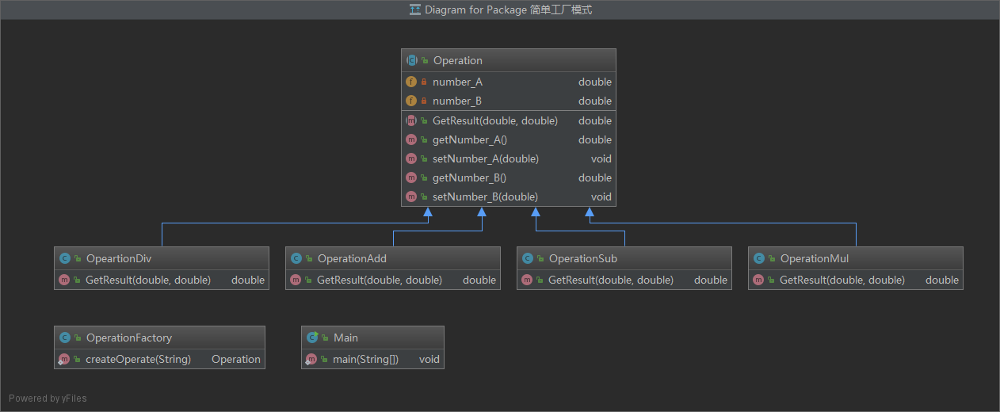
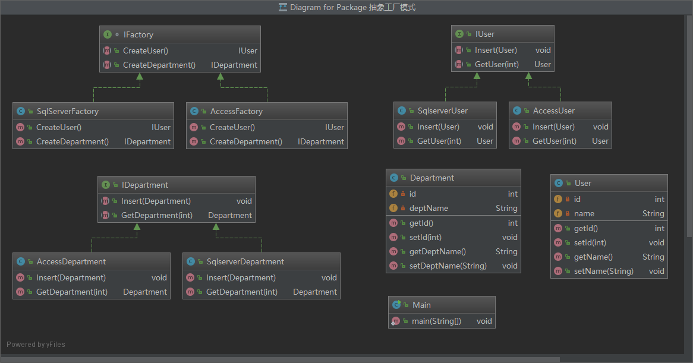
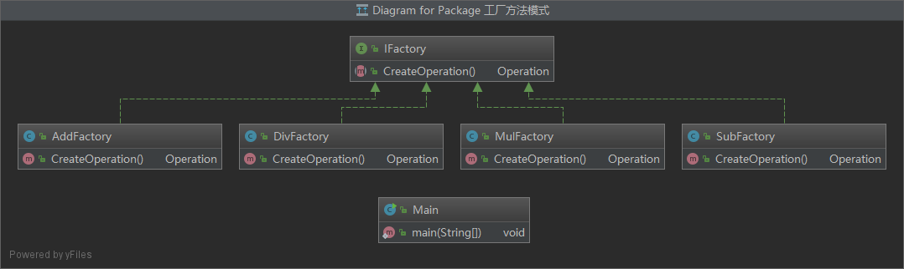
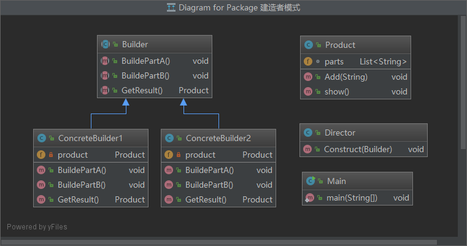
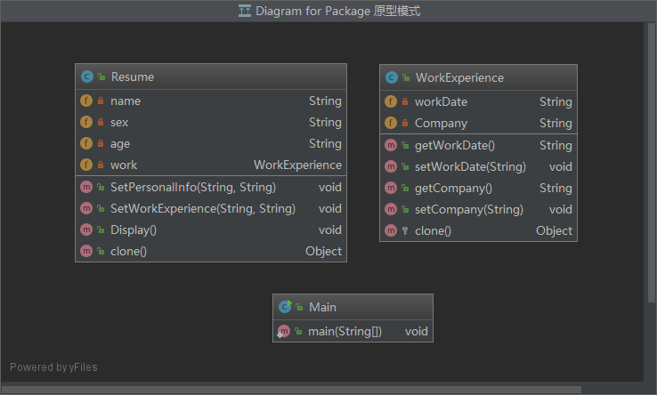

## 一、创建型设计模式

创建型设计模式，顾名思义就是创建对象的模式，对对象实例化过程进行了抽象。

帮助系统独立于如何创建、组合和表示它的那些对象。

一个类创建型模式使用继承改变被实例化的类，而一个对象创建型模式将实例化委托给另一个对象。

两个主旋律：

* 它们都将关于该系统使用哪些具体的类的信息封装起来
* 它们隐藏了这些类的实例是如何被创建和放在一起的


### 1. 简单工厂模式（Simple Factory）

> 由一个工厂对象决定创建出哪一种产品类的实例。

#### 1.1 类图



#### 1.2 特点

简单工厂模式把实例化的操作单独放到一个类中，这个类就是简单工厂，其中包含了必要的逻辑判断，由工厂决定具体用哪个子类来实例化，可以根据客户端的选择条件动态实例化相关的类，对于客户端来说，去除了与具体产品的依赖，客户类不再需要知道有哪些子类以及应当实例化哪个子类。

但是，如果想新添加功能，那么就需要在工厂的逻辑判断中增加代码，不但对扩展开放了，对修改也开放了，违背了**开放-封闭原则**。

#### 1.3 实现

```java
public abstract class Operation {
    private double number_A;
    private double number_B;

    public abstract double GetResult(double number_A, double number_B);

    public Operation() {
    }

    public Operation(double number_A, double number_B) {
        this.number_A = number_A;
        this.number_B = number_B;
    }

    public double getNumber_A() {
        return number_A;
    }

    public void setNumber_A(double number_A) {
        this.number_A = number_A;
    }

    public double getNumber_B() {
        return number_B;
    }

    public void setNumber_B(double number_B) {
        this.number_B = number_B;
    }
}
```

```java
public class OperationAdd extends Operation {
    @Override
    public double GetResult(double number_A, double number_B) {
        return number_A + number_B;
    }
}
```

```java
public class OperationSub extends Operation {
    @Override
    public double GetResult(double number_A, double number_B) {
        return number_A - number_B;
    }
}

```

```java
public class OperationMul extends Operation {
    @Override
    public double GetResult(double number_A, double number_B) {
        return number_A * number_B;
    }
}
```

```java
public class OpeartionDiv extends Operation {
    @Override
    public double GetResult(double number_A, double number_B) {
        if (number_B == 0) {
            try {
                throw new Exception("除数不能为0");
            } catch (Exception e) {
                e.printStackTrace();
            }
        }
        return number_A / number_B;
    }
}
```

工厂类中进行逻辑判断

```java
public class OperationFactory {
    public static Operation createOperate(String operate) {
        Operation oper = null;
        switch (operate) {
            case "+":
                oper = new OperationAdd();
                break;
            case "-":
                oper = new OperationSub();
                break;
            case "*":
                oper = new OperationMul();
                break;
            case "/":
                oper = new OpeartionDiv();
                break;
        }
        return oper;
    }
}
```

```java
public class Main {
    public static void main(String[] args) {
        Scanner sc = new Scanner(System.in);
        System.out.println("please input an operation:");
        double number_A = sc.nextDouble();
        String operator = sc.next();
        double number_B = sc.nextDouble();
        
        Operation operate = OperationFactory.createOperate(operator);
        double result = operate.GetResult(number_A, number_B);
        System.out.println("result : " + result);
    }
}
```


### 2. 抽象工厂模式（Abstract Factory）

> 提供一个创建一系列相**关或互相依赖**的对象的**接口**，而无需指定它们具体的类。

#### 2.1 类图



#### 2.2 特点

工厂方法模式具有唯一性，一般情况下，一个具体工厂中只有一个工厂方法或者一组重载的工厂方法，但是有时候需要一个工厂可以**提供多个产品对象**，所以引入了抽象工厂模式。

两个概念：

* **产品等级结构：**即产品的继承结构，如一个抽象类是电视机，其子类有各种品牌的电视机，抽象电视机与具体品牌的电视机之间构成了一个产品等级结构
* **产品族：**指由一个工厂生产的，位于不同产品等级结构中的一组产品，如，冰箱，电视

工厂所需生产的具体**产品并不是一个简单的对象，而是多个位于不同产品等级结构中的一个产品族**，这时就需要抽象工厂。

抽象工厂：一个工厂可以创建出分属于不同产品等级结构的一个产品族中的所有对象。

##### 与工厂方法模式的不同：

* 工厂方法模式针对的是一个产品等级结构，抽象工厂模式则需要面对多个产品等级结构。

* 抽象工厂模式是所有形式的工厂模式中最为抽象和最具一般性的一种形态。

##### 优点：

* 易于交换产品系列，只需要改变具体工厂即可使用不同的产品配置
* 让具体的创建实例过程与客户端分离，客户端是通过抽象接口操纵实例，产品的具体类名也被具体工厂的实现分离，不会出现在客户端代码中

##### 缺点：

* 增加功能，需要改动的地方较多

#### 2.3 实现

产品族包含两个产品等级结构：User和Department

* User产品等级结构

```java
public class User {
    private int id;
    private String name;

    public int getId() {
        return id;
    }

    public void setId(int id) {
        this.id = id;
    }

    public String getName() {
        return name;
    }

    public void setName(String name) {
        this.name = name;
    }
}
```

```java
public interface IUser {
    void Insert(User user);

    User GetUser(int id);
}
```

```java
public class AccessUser implements IUser {
    @Override
    public void Insert(User user) {
        System.out.println("在Access中给User表增加一条记录");
    }

    @Override
    public User GetUser(int id) {
        System.out.println("在Access中根据id得到User表一条记录");
        return null;
    }
}
```

```java
public class SqlserverUser implements IUser {
    @Override
    public void Insert(User user) {
        System.out.println("在SQL Server中给User表增加一条记录");
    }

    @Override
    public User GetUser(int id) {
        System.out.println("在SQL Server中根据id得到User表一条记录");
        return null;
    }
}
```

* Department产品等级结构

```java
public class Department {
    private int id;
    private String deptName;

    public int getId() {
        return id;
    }

    public void setId(int id) {
        this.id = id;
    }

    public String getDeptName() {
        return deptName;
    }

    public void setDeptName(String deptName) {
        this.deptName = deptName;
    }
}
```

```java
interface IFactory {
    IUser CreateUser();

    IDepartment CreateDepartment();
}
```

```java
public class AccessDepartment implements IDepartment {
    @Override
    public void Insert(Department department) {
        System.out.println("在Access中给Department表增加一条记录");
    }

    @Override
    public Department GetDepartment(int id) {
        System.out.println("在Access中根据id得到Department表一条记录");
        return null;
    }
}
```

```java
public class SqlserverDepartment implements IDepartment {
    @Override
    public void Insert(Department department) {
        System.out.println("在SQL Server中给Department表增加一条记录");
    }

    @Override
    public Department GetDepartment(int id) {
        System.out.println("在SQL Server中根据id得到Department表一个记录");
        return null;
    }
}
```

* 抽象工厂

```java
interface IFactory {
    IUser CreateUser();

    IDepartment CreateDepartment();
}
```

```java
public class AccessFactory implements IFactory {
    @Override
    public IUser CreateUser() {
        return new AccessUser();
    }

    @Override
    public IDepartment CreateDepartment() {
        return new AccessDepartment();
    }
}
```

```java
public class SqlServerFactory implements IFactory {
    @Override
    public IUser CreateUser() {
        return new SqlserverUser();
    }

    @Override
    public IDepartment CreateDepartment() {
        return new SqlserverDepartment();
    }
}
```

* 客户端代码

```java
public class Main {
    public static void main(String[] args) {
        User user = new User();
        Department dept = new Department();

        // 只需改变具体类，就可以切换不同配置
        // IFactory factory = new SqlServerFactory();
        IFactory factory = new AccessFactory();

        IUser iu = factory.CreateUser();
        iu.Insert(user);
        iu.GetUser(1);

        IDepartment id = factory.CreateDepartment();
        id.Insert(dept);
        id.GetDepartment(1);

    }
}
```

#### 2.4 改进：反射+配置文件 // TODO


### 3. 工厂方法模式（Factory Method）

> 定义一个用于创建对象的接口，让子类决定实例化哪一个类，工厂方法使一个类的实例化延迟到其子类。

#### 3.1 类图



#### 3.2 特点

客户端需要决定实例化哪一个工厂来实现运算类，选择判断的问题还是存在的，也就是说，工厂方法把简单工厂的内部逻辑判断移到了客户端代码来进行。

##### 优点：

* 工厂方法用来创建客户端所需要的产品，同时还向客户隐藏了哪种具体产品类将被实例化这一细节，用户只需关心所需产品对应的工厂，无需关心创建细节，甚至无需知道具体产品类的类名
* 基于工厂角色和产品角色的多态性设计是工厂方法模式的关键。它能够使工厂可以自主确定创建何种产品对象，而如何创建这个对象的细节则完全封装在具体工厂内部。工厂方法之所以被称为多态工厂模式，正式因为所有的具体工厂类都具有同一抽象父类。
* 加入新产品时，无需修改抽象工厂和抽象产品提供的接口，无需修改客户端，也无需修改其他的具体工厂和具体产品，而只要添加一个具体工厂和具体茶品就可以了，系统的课拓展性变得很好，符合**开闭原则**

##### 缺点：

* 添加新产品时，需要编写新的具体产品类，还要提供与之对应的具体工厂类，系统中类的个数将成对增加，在一定程度上增加了系统的复杂度
* 考虑到可扩展性，引入了抽象层，增加了系统的抽象性和理解难度。

#### 3.3 实现

* 工厂类（产品类与简单工厂一样）

```java
public interface IFactory {
    Operation CreateOperation();
}
```

```java
public class AddFactory implements IFactory {
    @Override
    public Operation CreateOperation() {
        return new OperationAdd();
    }
}
```

```java
public class SubFactory implements IFactory {
    @Override
    public Operation CreateOperation() {
        return new OperationSub();
    }
}
```

```java
public class MulFactory implements IFactory {
    @Override
    public Operation CreateOperation() {
        return new OperationMul();
    }
}
```

```java
public class DivFactory implements IFactory {
    @Override
    public Operation CreateOperation() {
        return new OpeartionDiv();
    }
}
```

* 客户端

```java
public class Main {
    public static void main(String[] args) {
        Scanner sc = new Scanner(System.in);
        System.out.println("please input an operation:");
        double number_A = sc.nextDouble();
        String operator = sc.next();
        double number_B = sc.nextDouble();
        Operation operate = OperationFactory.createOperate(operator);

        IFactory operFactory  = null;
        switch (operator) {
            case "+":
                operFactory = new AddFactory();
                break;
            case "-":
                operFactory = new SubFactory();
                break;
            case "*":
                operFactory = new MulFactory();
                break;
            case "/":
                operFactory = new DivFactory();
                break;
        }
        Operation operation = operFactory.CreateOperation();
        double result = operation.GetResult(number_A, number_B);
        System.out.println("result : " + result);
    }
}
```


### 4. 建造者（生成器）模式（Builder）

> 将一个复杂对象的构建与它的表示分离，使得同样的构建过程可以创建不同的表示。

#### 4.1 类图



#### 4.2 特点

建造者模式是一步一步创建一个复杂的对象，它允许用户只通过制定复杂对象的类型和内容就可以创建它们，用户不需要知道内部的具体构建细节。

##### 设计动机

建造者模式返回给客户一个完整的产品对象，而客户端无需关心该对象所包含的额外的属性和组建方式。

##### 使用时机

* 创建一些复杂的对象时，这些对象的内部组成构建间的**构造顺序**是**稳定**的，但是对象的内部**组成构件**面临着复杂的**变化**
* 要创建的复杂对象的算法，独立于该对象的组成部分，也独立于组成部分的装配方法

##### 好处

* 使得建造与表示代码分离，由于建造者隐藏了该产品是如何组装的，所以若需要改变一个产品的内部表示，只需要再定义一个具体的建造者就可以了

##### 角色

* **抽象建造者（Builder）**：为创建一个产品对象的各个部件制定的抽象接口。这个接口规定要实现复杂对象的哪些部分的创建，并不涉及具体的对象部件的创建。
* **具体建造者（ConcreteBuilder）**：实现Builder接口，构造和装配各个部件，针对不同的商业逻辑，具体化复杂对象的各部分的创建。在建造过程完成后，提供产品的实例。
* **指挥者（Director）**：构建一个使用Builder接口的对象，调用具体建造者来创建复杂对象的各个部分，在指挥者中不涉及具体产品的信息，只负责保证对象各部分完整创建或按某种顺序创建。
* **具体产品（Product）**：要创建的复杂对象。


#### 4.3 实现

```java
public class Director {
    public void Construct(Builder builder) {
        builder.BuildePartA();
        builder.BuildePartB();
    }
}
```

```java
public abstract class Builder {
    public abstract void BuildePartA();

    public abstract void BuildePartB();

    public abstract Product GetResult();

}
```


```java
public class ConcreteBuilder1 extends Builder {
    private Product product = new Product();

    @Override
    public void BuildePartA() {
        product.Add("部件A");
    }

    @Override
    public void BuildePartB() {
        product.Add("部件B");
    }

    @Override
    public Product GetResult() {
        return product;
    }
}
```

```java
public class ConcreteBuilder2 extends Builder {
    private Product product = new Product();

    @Override
    public void BuildePartA() {
        product.Add("部件X");
    }

    @Override
    public void BuildePartB() {
        product.Add("部件Y");
    }

    @Override
    public Product GetResult() {
        return product;
    }
}
```

```java
public class Product {
    List<String> parts = new ArrayList<>();

    public void Add(String part) {
        parts.add(part);
    }

    public void show() {
        System.out.println("\n 产品 创建 ----");
        for (String s : parts) {
            System.out.println(s);
        }
    }
}
```

```java
public class Main {
    public static void main(String[] args) {
        Director director = new Director();
        Builder b1 = new ConcreteBuilder1();
        Builder b2 = new ConcreteBuilder2();

        director.Construct(b1);
        Product p1 = b1.GetResult();
        p1.show();

        director.Construct(b2);
        Product p2 = b2.GetResult();
        p2.show();
    }
}
```

#### 4.4 与抽象工厂模式对比

建造者返回一个组装好的完整产品，而抽象工厂返回一系列相关的产品，这些产品位于不同的产品等级结构，构成了一个产品族。


### 5. 单例模式（Singleton）

> 确保一个类只有一个实例，并提供该实例的全局访问点。。

#### 5.1 懒汉式 - 线程不安全

私有静态变量 `instance` 被延迟实例化，这样做的好处是，如果没有用到该类，那么就不会实例化 `instance`，从而节约资源。

这个实现在多线程环境下是不安全的，如果多个线程能够同时进入`if (instance == null)`，并且此时`instance`为null，那么会有多个线程执行`instance = new Singleton()`，导致实例化多次。

```java
public class Singleton {
    private static Singleton instance = null;

    private Singleton() {

    }

    public static Singleton getInstance() {
        if (instance == null) {
            instance = new Singleton();
        }
        return instance;
    }
}
```

#### 5.2 懒汉式 - 线程安全

多线程可以使用，但是当一个线程进入该方法之后，其他所有试图进入该方法的线程都必须等待，即使`instance`已经被实例化了，这会让线程阻塞时间过长，因此该方法有性能问题，不推荐使用。

```java
public class Singleton1 {
    private static Singleton1 instance = null;

    private Singleton1() {

    }

    public static synchronized Singleton1 getInstance() {
        if (instance == null) {
            instance = new Singleton1();
        }
        return instance;
    }
}
```

#### 5.3 双重校验锁 - 线程安全

* 第一个if判断，是防止实例化了之后，每次get还会加锁，影响效率
* 第二个if判断，是防止两个线程同时通过了第一个判断，如果不加第二个判断，那么可能多次实例化
* 懒汉式，这种方法可行，但是容易出错

```java
public class Singleton2 {
    private volatile  static Singleton2 instance = null;

    private Singleton2() {

    }

    public static Singleton2 getInstance() {
        if (instance == null) {
            synchronized (Singleton2.class) {
                if (instance == null) {
                    instance = new Singleton2();
                }
            }
        }
        return instance;
    }
}
```

`instance` 采用 `volatile` 关键字修饰也是很有必要的， `instance = new Singleton();` 这段代码其实是分为三步执行：

1. 为 `instance` 分配内存空间
2. 初始化 `instance`
3. 将 `instance `指向分配的内存地址

但是由于 JVM 具有指令重排的特性，执行顺序有可能变成 1>3>2。指令重排在单线程环境下不会出现问题，但是在多线程环境下会导致一个线程获得还没有初始化的实例。例如，线程 T1 执行了 1 和 3，此时 T2 调用 getinstance() 后发现 instance 不为空，因此返回 instance，但此时 instance 还未被初始化。

**使用 volatile 可以禁止 JVM 的指令重排，保证在多线程环境下也能正常运行。**

#### 5.4 饿汉式 - 线程安全

* 饿汉式，建议使用
* 缺点：提前占用系统资源

```java
public class Singleton3 {
    private static Singleton3 instance = new Singleton3();

    private Singleton3() {

    }

    public Singleton3 getInstance() {
        return instance;
    }
}
```

#### 5.5 静态内部类实现

* 当 `Singleton` 类被加载时，静态内部类 `SingletonHolder `没有被加载进内存。只有当调用 `getinstance()` 方法从而触发 `SingletonHolder.INSTANCE` 时 `SingletonHolder `才会被加载，此时初始化 `INSTANCE` 实例，并且 JVM 能确保 `INSTANCE` 只被实例化一次。

* 这种方式不仅具有**延迟初始化**的好处，而且由 JVM 提供了对**线程安全**的支持。

```java
public class Singleton4 {

    private Singleton4() {

    }

    private static class SingletonHolder {
        private final static Singleton4 INSTANCE = new Singleton4();
    }

    public static Singleton4 getInstance() {
        return SingletonHolder.INSTANCE;
    }
}
```

#### 5.6 枚举实现

```java
public enum Singleton5 {
    INSTANCE;
}
```


### 6. 原型模式（Prototype）

> 用原型实例指定创建对象的种类，并且通过拷贝这些原型创建新的对象。

#### 6.1 类图



#### 6.2 特点

##### 动机

有些对象的**创建过程比较复杂**，而且有时候需要**频繁的创建**，原型模式通过给出一个原型对象来指明所要创建的对象的类型，然后用复制这个对象的办法创建出更多同类型的对象。

##### 使用场景

* 当一个系统应该独立于它的产品创建、构成和表示时
* 当要实例化的类是在运行时刻指定时，例如，通过动态装载
* 系统要保存独享的状态，而对象的状态变化很小，需要避免使用分层次的工厂类来创建分层次的对象，并且类的实例对象只有一个或很少几个组合状态

#### 6.3 实现

```java
public class WorkExperience implements Cloneable {
    private String workDate;
    private String Company;

    public String getWorkDate() {
        return workDate;
    }

    public void setWorkDate(String workDate) {
        this.workDate = workDate;
    }

    public String getCompany() {
        return Company;
    }

    public void setCompany(String company) {
        Company = company;
    }

    @Override
    protected Object clone() throws CloneNotSupportedException {
        return super.clone();
    }
}

```

```java
public class Resume implements Cloneable {
    private String name;
    private String sex;
    private String age;
    private WorkExperience work;

    public Resume() {
    }

    public Resume(String name) {
        this.name = name;
        work = new WorkExperience();
    }

    public Resume(WorkExperience work) throws CloneNotSupportedException {
        this.work = (WorkExperience) work.clone();
    }

    // 设置个人信息
    public void SetPersonalInfo(String sex, String age) {
        this.sex = sex;
        this.age = age;
    }

    // 设置工作经历
    public void SetWorkExperience(String workDate, String company) {
        work.setWorkDate(workDate);
        work.setCompany(company);
    }

    // 显示
    public void Display() {
        System.out.println(name + " " + sex + " " + age);
        System.out.println("工作经历：" + work.getWorkDate() + " " + work.getCompany());
    }

    public Object clone() throws CloneNotSupportedException {
        Resume obj = new Resume(this.work);
        obj.name = this.name;
        obj.sex = this.sex;
        obj.age = this.age;
        return obj;
    }
}
```

```java
public class Main {
    public static void main(String[] args) throws CloneNotSupportedException {
        Resume a = new Resume("大鸟");
        a.SetPersonalInfo("男", "29");
        a.SetWorkExperience("1998-2000", "XX公司");

        Resume b = (Resume) a.clone();
        b.SetWorkExperience("1998-2006", "YY企业");

        Resume c = (Resume) a.clone();
        c.SetPersonalInfo("男", "24");
        c.SetWorkExperience("1998-2003", "ZZ企业");

        a.Display();
        b.Display();
        c.Display();
    }
}
```


## 二、结构型设计模式

### 1. 装饰者模式


### 2. 适配器模式


### 3. 享元模式


### 4. 代理模式


### 5. 桥接模式


### 6. 组合模式


### 7. 外观模式


## 三、行为型设计模式

### 1. 观察者模式


### 2. 策略模式


### 3. 责任链模式


### 4. 状态模式


### 5. 命令模式


### 6. 中介者模式


